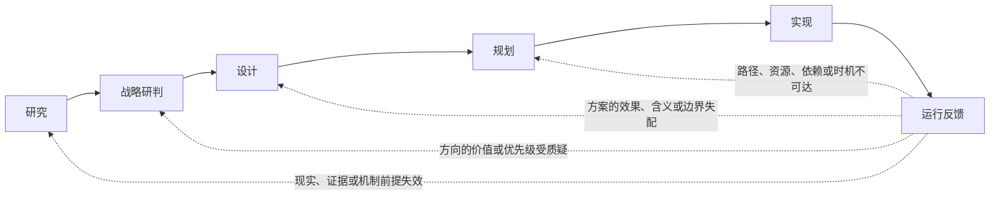

# 创造性工作的最基本模型

> 状态：研讨草案。本文只整理当前已经确认的最小默认模型，不证明它对所有领域都有效，也不展开每一节点的最佳实践。文中的结构判断属于当前讨论结论，未经重新推导不得直接当作跨语境前提。

创造性工作不是只有“想到一个好点子”或“把待办做完”。在一项工作尚不清楚现实条件、应去往什么方向、方案应当长什么样、怎样实施时，后面的工作必须使用前面已经形成的内容作为输入。

本文给出一条足以默认跑通的依赖链，帮助读者在讨论或实际工作中回答三类问题：

- 当前正在解决哪一种问题；
- 此刻的产出会交给下一步什么；
- 真实运行结果出现后，应当回到哪一处重新判断。

它不是组织架构、授权制度、协同协议或最佳实践集合。谁有权作决定、怎样审批、如何管理风险等，只有在实际问题需要时才作为附加的心智插件处理；它们不改变这里的基本形状。

图中的实线表示**内容依赖**，而不是“上一步必须彻底结束，下一步才能开始”的线性排期。设计可以在研究尚未结束时开始草拟，规划也可以提前暴露约束；但它们必须清楚标出自己正在依赖什么研究结果、方向结论或设计选择，不能把未知静默补成事实。

这条链有六个明确节点。下文按五个主节点展开：**研究、战略判断（即战略研判）、设计、规划、运行反馈**。实现仍是链上的独立节点——把规划转为现实结果——但不单列为主章节；其输入输出分别挂在规划与运行反馈下说明。若口语上仍想说“五阶段”，可以把运行反馈理解为对正向链的闭环与回开机制，而不计作正向阶段；在模型图中仍应显式保留它，避免把实现误当作终点。

横切整条链的思维方式（研讨心智、情境理解、最小充分性约束、工作流思维）不是新的流程节点；它们决定各节点应怎样思考。研讨心智、理论研究专用的概念升维重构、规划专用的推导认知工作流收在「最佳实践和方法论套件」；其余仍沉到各自最相关的节点下，避免与节点定义混层。

---

## 流程要素构成与关系

- 分为 5 个流程构成：研究、战略判断、设计、规划、实现
- 这 5 个流程的产物形成的依赖关系是：研究 -> 战略判断 -> 设计 -> 规划 -> 实现

### 研究

#### 它回答什么、交出什么

研究应对**认知层面**（什么为真）的不确定性：现实是什么；哪些关键命题能暂时相信；还缺什么。

- **主要输入**：当前任务情境、已有材料、待回答的关键命题
- **交给下一节点**：有条件的事实、机制理解、外部约束、可行性判断与未知

研究并不等于打开、搜索或阅读资料。研究的起点是：某个关键命题会影响后续判断，而当前知识还无法给出可靠答案。

#### 何时进入研究

不知道现实、外部条件或机制是否成立时，进入研究。

#### 现有上下文理解不是专门研究

项目已有文档、代码、数据、对话和约束，通常是工作一开始就能直接取得的材料。定位、阅读、提取和校准这些材料，是**现有上下文理解**：它建立当前基线，告诉我们已经知道什么、材料之间哪里冲突、什么尚未给出。

它不自动构成专门研究。只有现有上下文不足以回答一个会阻断后续判断的关键命题时，才进入研究。检索本身也只是手段：它既可以服务于上下文理解，也可以服务于外部调查研究。

#### 理论研究

理论研究处理的是机制、因果、可行性、权衡或概念一致性问题：为什么会这样、是否可能、需要哪些条件、哪种机制足以让方案成立。

它不应只被理解成技术研究。技术实现、人的行为、组织机制、概念结构都可能成为理论研究对象；但“我们更珍视什么”这类价值取舍属于战略判断，不能靠理论推导替代。

理论研究的结果不应只是一句“可行”或“不可行”，而应说明：当前认为成立的机制或路径、成立条件、主要反例或替代解释，以及仍需验证的部分。

当关键概念含混、近敌混淆或因果说法不清，正在阻断机制与可行性判断时，使用套件中的[理论研究专用套件 —— 认知概念升维重构](#理论研究专用套件--认知概念升维重构)。

#### 理论研究：最小充分性（在理论研究中）

**最小充分性约束**：理论研究应避免为了显得完整而堆叠机制或解释。但简约只在候选已经覆盖真实需求、约束与反例时才有意义。安全、法规、关键边界条件、异质人群或真实因果结构带来的复杂性，不能被奥卡姆剃刀随意削掉。

这条约束在理论研究中的执行形态是奥卡姆剃刀，精确用法如下。

**适用范围**：剃刀只作用于研究中的理论研究支路，不作用于外部调查研究。两者对"多"的态度相反：理论研究里，多余的假定是负担，能少则少；外部调查研究里，围绕关键命题的证据要更深、更广、更全面——多个独立来源对同一命题的交叉验证是取证质量，不是冗余，不得以简约为由砍掉。外调的收敛纪律不是剃刀，而是命题相关性：只约束"调研什么"（材料必须回答当前关键命题，不做无边界漫游），不压低"证据要多充分"。把剃刀反过来用到证据上是作弊——挑一组更简单的证据让某个解释显得简约，等于在下方闸门第 1 条的充分性前置上造假。

**要达到的状态目标**：理论研究交给下游的机制结论，应当每一条假定都在承担解释职责——删掉任何一条，对已知证据与反例的解释就会变差；同时附上被剃除的假定及各自的回开条件。到达这个状态，战略判断与设计消费的才是承重的机制理解，而不是为显得完整而堆出来的解释；被剃掉的内容也随时可以在现实反驳时回到候选池。

**剃刀首先是候选间的比较判据，不是无差别的删减指令**：奥卡姆剃刀的经典形态是——在解释力相同的竞争假设之间，选假定更少者。它有两个不可拆的构件：一个保持不变的维度（在理论研究中是对同一组已知证据、主要反例与成立条件的解释覆盖），和一类被比较的对象（假定的数量与强度）。解释得更少的候选不是"更简单"，而是"更弱"，按解释力不足淘汰，根本不进入简约比较——简约不向质量让步，机制就在这里：质量维度被锁进比较基线，剃刀无权触碰。候选间比较之后，还有候选内的第二步操作——对拟保留候选逐条修剪不承重的假定，见闸门第 3 条。

**剃的对象**是四类不增加解释力的假定：

- 多余机制假定：删掉后解释链仍然完整的中间环节；
- 多余实体：自造概念没有独立解释功能，只是给已有东西换名字；
- 多余自由参数：每遇到一个例外就加一个参数去吸收；
- ad hoc 补丁：专为救某一个反例而设、没有独立证据或独立可检验后果的假设。前三类确认后直接剃；ad hoc 补丁处置不同——降级而非直接剃，见闸门第 4 条。

**执行时点**：候选打开期禁用。研讨心智负责打开候选、比较解释，剃刀负责收敛，两者方向相反，必须错开：剃刀只在各候选已对照同一组证据之后、写研究结论之前执行。

**剃刀闸门**（可直接嵌入理论研究的收敛环节或 agent 提示词）：

1. 充分性前置：各候选是否已对照同一组已知证据、主要反例与成立条件（含安全、法规、关键边界条件、异质人群）？若否，禁止进入剃刀比较，先补证据或补候选。
2. 等价判定：解释得更少的候选按解释力不足淘汰，不得以"更简单"为由选它。
3. 逐假定删减测试：对拟保留候选的每一条假定问"删掉它，对证据与反例的解释是否变差？"不变差则剃；变差则保留，并写明它承担的解释职责。
4. ad hoc 检测：只为救某一个反例、无独立可检验后果的假定，不直接剃，降级记入"仍需验证的部分"。
5. 熟悉度自检：选这个候选，是因为它假定更少，还是因为我更熟悉它？把各候选的假定列成清单逐条数，以计数为准，不以顺手为准。
6. 已剃除项记录：被剃的假定记入研究结论，注明理由与回开条件；后续出现现有机制解释不了的观察时，已剃除项优先回到候选池。

**边界**：剃刀是押注效率判据，不是真理判据——被选中的候选不因更简单而更可信，结论的置信表述只能引用证据覆盖情况。它也不替下游做事："机制更简单"不等于"方向更值得投入"（那是战略判断的取舍），更不等于"方案该删模块"（那是设计中的剃刀，见「设计」节的最小充分性小节）。

#### 外部调查研究

外部调查研究处理的是当前上下文之外的证据缺口：市场需求、行业实践、学术论文、现行规则、平台现状、可用资源，或社交媒体与内容站中的高价值材料。

它的重点不是“找到了多少链接”，而是外部材料如何回答当前关键命题：来源是什么、反映哪个时间和范围、支持或反驳什么、哪些限制仍然存在。

外部调查研究的目标是：围绕关键命题的取证，方向是**在确实是讲这个关键命题的基础上**(这里调研时的判断是很容易踩坑的)更深、更广、更全面，独立来源的交叉验证是质量而不是冗余。它的收敛纪律是命题相关性（不做无边界漫游），不是简约；

外部调查研究不受奥卡姆剃刀约束。

理论研究和外部调查研究可以组合，不是互斥盒子。一个技术可行性问题可能先需要调查当前平台限制、论文或行业先例，再基于这些输入推导机制；理论研究也可能指出还缺哪条外部事实。

---

### 战略判断

本模型中的节点名亦称**战略研判**；二者指同一节点。

#### 它回答什么、交出什么

战略判断应对**押注层面**（什么值得投入到什么规格）的不确定性：在已知现实下，什么方向值得进入或保留。

- **主要输入**：理论研究、外部调研的情况结论；当前情境上下文
- **交给下一节点**：在各个现实条件下的方向性判断与取舍。比如：
  - 对于某个概念/实体/机会，应当以怎样的态度进行对待
  - 哪些方向是可以考虑接下来明确投入、可以考虑但暂缓投入、放弃投入、不可投入，等

#### 何时进入战略判断

不知道该往哪个未来走时，进入战略判断。

#### 最小充分性（在战略判断中）

**最小充分性约束**：战略判断应避免为了显得周全而堆叠方向承诺与保留选项。剃刀不先于研讨心智介入候选生成，也不替代价值取舍本身；因资源不足而不投入的，理由记作资源约束，不记作简约。

这条约束在战略判断中的执行形态是奥卡姆剃刀，精确用法如下。

**要达到的状态目标**：交给设计的方向承诺集合，应当每一条都写得出三件事——它背负哪些独立成立条件、它在什么场景里胜出、什么信号出现时需要重估。集合里没有把可分离押注捆绑在一起的承诺，没有获胜场景被其它保留方向完全覆盖的冗余方向，也没有写不出胜出场景与重估信号、却以"对冲"名义存续的空挂选项。到达这个状态，设计消费的才是可以各自独立被现实检验的承诺，运行反馈也才知道该回开哪一条。

**剃的对象随节点变化**：战略判断处理的不是"什么为真"而是"什么值得押注"，所以剃刀比较的不再是解释假定，而是**独立成立条件**——一个方向要兑现价值，有多少件彼此独立的事必须成立。说白了就是：这个押注要赢，需要几个"如果"同时兑现；"如果"越多，承诺越重。保持不变的维度是价值取舍完成后的排序：剃刀不改变"我们更珍视什么"的答案，只在价值打平后介入。

**执行时点**：候选集闭合、价值排序完成之后，向设计交付方向承诺之前。研讨心智在此节点要生成真正不同的候选、保留分歧；剃刀若提前介入，会以简约为名砍掉分歧——这是它在本节点最主要的误用。

**押注剃刀**（可直接嵌入战略判断的封口环节或 agent 提示词）：

1. 为每个拟承诺方向列出独立成立条件，逐条问"此条不成立，押注是否失败"；答"否"的删去——它不是承重前提。
2. 价值打平的候选之间，选独立成立条件更少者，条件数也相当时选更可验证者，并在产出中标注"此项由剃刀裁定"——让运行反馈知道该承诺的价值排序并未分出高下，重估门槛应更低。
3. 拆开被捆绑的押注：某个承诺若同时包含两个可独立成败、且没有机制要求同进同退的押注，拆成独立判断分别定态度——捆绑让各自继承对方的失败条件，增加前提而不增加价值。
4. 支配测试：某方向的获胜场景被另一保留方向完全覆盖、成本又不更低的，剃掉。
5. 每个"暂缓/保留"选项写明：它在什么场景胜出＋什么信号触发重估；两者都写不出的，改判放弃。
6. 理由标注纪律：因资源不足产生的"不投入"写"资源约束"，剃刀只署名于前提比较与承诺拆除——两者理由链不同，混写会让运行反馈回开时找错重审位置。

**边界**：理性对冲不是应剃除的冗余——并行押注若覆盖的是不同的失败场景，是正当冗余；剃的是被支配的、被捆绑的、写不出存在理由的承诺，不是承诺的个数。"这个方向的方案更简单"是设计层属性，不得上浮为方向偏好理由，除非方案复杂度确实转化为押注本身更多的成立条件。

---

### 设计

#### 它回答什么、交出什么

设计应对**结构层面**的不确定性：为服务该方向，方案应当如何成立。

- **主要输入**：方向判断、现实约束与可行性条件；当前情境上下文
- **交给下一节点**：方案的目标效果、关键边界与结构选择

#### 何时进入设计

不知道该把什么方案做成什么样时，进入设计。

#### 设计如何触发研究

设计默认使用已有的研究输入来塑造方案，不应常态化地变成无边界的外部搜集。但设计可以发现一个自己无权凭直觉补齐的缺口，并发出范围明确的研究问题：

- 缺少实现机制、技术路线或可行性解释时，触发理论研究；
- 缺少当前规则、市场事实、平台状态或可用资源时，触发外部调查研究；
- 缺少“究竟值得追求什么”的答案时，回到战略判断，而不是伪装成技术研究。

研究返回后，设计再消费更新后的结论继续推进。这样既不会把设计变成资料漫游，也不会强行用未经验证的假设填平方案空白。

#### 最小充分性（在设计中）

**最小充分性约束**：设计应避免为了显得完整而堆叠模块或机制。简约只在候选已经覆盖真实需求、约束与反例时才有意义；不能在充分性未确认前删掉必要复杂性，也不等于“越简单越正确”。

这条约束在设计中的执行形态是奥卡姆剃刀，精确用法如下。

**要达到的状态目标**：设计交出的结构选择，应当每一份复杂性都有**承重挂钩**——能指着已确认的需求、约束或反例清单说"我是为这一条服务的"。说白了就是：方案里每个模块、每个概念、每个可配置项，都答得出"你在为谁承重"。被剃掉的结构项留有剃除理由与回开条件；必要性拿不准的项不被静默删除，而是显式路由到研究或延后。到达这个状态，规划拿到的才是既没有虚胖、也没有暗坑的方案。

**剃刀是候选之间的比较裁决**：只有一个方案时"更简约"没有参照系，剃刀会退化成凭感觉砍东西。执行前提有两个：研讨心智已打开至少两个真实候选；已确认的需求、约束与反例有显式清单。比较时保持不变的维度是**等效基线**——目标效果、关键边界、清单覆盖三者都对齐的候选才进入简约比较。说白了就是：先保证大家交出的效果一样好，再比谁的结构负担小；砍掉了功能的方案不是"更简单"，是"没做到"，进不了比较池。

**剃的对象**是写不出承重挂钩的结构负担。清点时按五类提示查找：模块与机制；消费者需要新学的概念；自由度与配置项；为假想未来需求预埋的抽象；状态与依赖的耦合点。五类只是"到哪里找"的提示（设计不限于软件，各领域的具体项不同），判据始终只有一条：写不写得出承重挂钩。

**执行时点**：候选已打开、收敛为结构选择之前——这是结构承诺的最后可逆点。设计评审时可复核，但评审不能是主时点：那时结构承诺已经沉没，发现问题只能整体否决重来。

**结构简约裁决**（可直接嵌入设计的收敛环节或 agent 提示词）：

1. 前置闸门：真实候选是否 ≥2？只有一个方案时先以研讨心智补开候选。已确认的需求、约束与反例是否有显式清单？没有则先补清单或触发研究，不得凭印象裁决。
2. 等效基线核对：逐候选确认目标效果与关键边界都被覆盖、清单每条都有着落；未对齐的候选先出局。若目标效果本身承诺了某层简单（如低使用门槛），该指标列入基线，后续不作为可剃负担。
3. 结构负担清点：对每个存活候选按五类提示列出结构项，逐项写明它承载清单中的哪一条；写不出承重挂钩的，标记为剃除候选。
4. 裁决与记录：在等效基线内，选"写不出承重挂钩的项"更少的候选；相当时再比整体结构负担，选更小者。被剃的每一项记录剃除理由与回开条件。必要性无法确认也无法否证的项不剃：按「设计如何触发研究」发出范围明确的研究问题，或显式延后并记录回开条件。
5. 近敌自检：本次"更简单"指的是结构负担更小，还是只是实现更省事、或界面风格更极简？若是后两者，本次裁决无效——对制作者省事属于规划的可达性考量，极简美学属于风格偏好，都不是结构简约。

**边界**：设计的剃刀不向上越权——"干脆少做一点"是战略取舍，不是结构简约，剃刀不得用于压缩方向承诺；也不向下越权——实现成本在等效且结构负担相当的候选之间可作后续排序依据，但不是剃刀判据。裁决中暴露的事实或机制缺口，按「设计如何触发研究」回到研究，不在设计内硬判。

---

### 规划

#### 它回答什么、交出什么

规划应对**执行层面**的不确定性：从当前现实怎样抵达该方案。

- **主要输入**：设计方案、当前能力、资源、依赖与限制；当前情境上下文
- **交给下一节点**：可推进的路径、顺序、依赖、条件与检查点

#### 何时进入规划

不知道怎样从现在到达方案时，进入规划。

#### 为何特别强调脚踏实地

**情境理解**贯穿所有节点，但规划承担把方案接到现实上的责任，因此尤其需要看清当前能力、资源、依赖、时机和限制。它不应被误用为规划之前一次性的背景阅读。

规划的价值不是把目标改写成一长串待办，而是诚实地区分：现在能做什么、满足什么条件后才能做什么，以及哪些问题必须回到前面解决。

#### 工作流思维

**工作流思维**按依赖、条件、检查和回退，把行动拆到可以落实与回改的粒度；以规划和实现为主。它不应被误用为用流程结构替代事实判断、战略取舍或设计质量。需要把抽象工作流思维落实为可验证、可回改的认知路径时，使用套件中的[规划专用套件 —— 推导认知工作流](#规划专用套件--推导认知工作流)。

最小充分性约束在规划中也可用于减少无价值复杂度，但不能在充分性未确认前删掉必要步骤。

#### 交给实现什么

实现回答：怎样把规划转成一个现实中的具体结果。

- **主要输入**：工作流程程序；当前情境上下文
- **交出内容**：制品、动作结果、实际偏差与实现事实

已有路径、需要造出一个真实结果时，进入实现。实现本身成功，不等于方向正确；一次运行失败，也不自动否定整个方向——这些判断留给运行反馈。

---

### 运行反馈

#### 它回答什么、交出什么

运行反馈要回答：真实结果说明了什么，哪里需要回开。

- **主要输入**：实现结果、使用或运行中的观察
- **交出内容**：对研究、战略、设计或规划的具体回开信号

#### 何时进入运行反馈

已有真实结果，需要判断它推翻了什么时，进入运行反馈。

#### 如何回开

运行反馈不应只回答“做成了吗”。它要把观察到的问题归到最早的、真正需要重审的位置：

| 运行中发现的情况 | 默认回开位置 |
| --- | --- |
| 外部事实变了、原机制不成立、关键假设被反驳 | 研究 |
| 即使能做，仍不值得做，或优先级发生变化 | 战略判断 |
| 做出来的结果在含义、体验、效果或边界上不对 | 设计 |
| 方案并未改变，但路径、依赖、资源或时机不成立 | 规划 |

反馈的作用是让现实指出应当重审的内容，而不是把所有问题粗暴地退回到起点。

#### 使用模型时的定位检查

面对一个正在推进的创造性工作，先不要急着问“下一步做什么”。先问：当前阻塞的是哪一种内容？把问题放回正确节点，这条最小模型就能避免几种常见混淆：用资料堆积替代研究、用可实现性替代方向选择、用方案细节替代规划、或把实现结果误当作创造性工作的终点。

---

## 最佳实践和方法论套件

本节承接流程节点之外的工作方式：不改变依赖链形状，但决定各节点里怎样打开、比较与约束思考。产出格式、角色分工、权限、协作协议、验证强度或工具选择等，仍可按现实问题继续挂入；它们属于可替换套件，不是基本模型本身。

### 研讨心智

**研讨心智**（亦称研讨心态）不是流程节点，而是打开候选、比较真正差异、攻击看似顺口答案的思维方式。它主要服务于理论研究、战略判断与设计；不应被误用为任何阶段都无限发散，或替代外调取证。

- **在理论研究中**：打开候选、比较不同解释并攻击看似顺口的答案。在外部调查中只适合用于界定调研问题、形成待验证假设、解释冲突材料和复盘结论。外调的取证过程仍须由来源、样本、时效、独立性与可追溯性约束；开放讨论不能替代可靠证据。
- **在战略判断中**：生成真正不同的候选、保留分歧、寻找反例与被忽略变量。价值取舍（“我们更珍视什么”）在此节点处理，不能伪装成理论研究。
- **在设计中**：打开候选、比较结构选择并攻击看似顺口的方案。

### 理论研究专用套件 —— 认知概念升维重构

**认知概念升维重构**（Skill：`t-concept-refactor`，CCR-SOP）是理论研究专用的方法论套件：当模糊抽象概念、近敌边界或因果说法正在阻断机制理解、可行性或概念一致性判断时，用「输入—状态—输出」的功能建模，把字典式语义解释换成可压力测试的形式化理解。

它服务研究中的理论研究支路，产出通常进入研究主张中的概念边界、机制假设与待确认项；不代替外部取证，也不把形式化定义升级成现实事实、价值选择或产品规则。

- **绑定产物**：概念的函数签名与 IPO 模型、现实切片压力测试结果、近敌正交边界，以及可操作的客观定理 / 行动准则候选。
- **四阶段**：解剖与参数化 → 现实切片与压力测试 → 划定近敌防守边界 → 提取杠杆定律（描述性定理与规定性准则）。
- **合法触发**：关键术语、对象边界或因果关系不清，导致各节点说的是不同东西，或理论研究无法稳定比较替代解释。概念虽抽象但不影响当前下游判断时，不为形式化而形式化。
- **明确不能做**：把模型结论直接写成已证实的外部事实；用概念重构替代价值取舍或方向承诺；把行动准则误当成已授权的产品规则或实施计划。

可执行细则见工作区 Skill：`.codex/skills/t-concept-refactor/SKILL.md`；与其它能力的状态化接入边界见[现有 Skill 接入图](./现有%20Skill%20接入图.md)。

### 规划专用套件 —— 推导认知工作流

**推导认知工作流**（Skill：`derive-cognitive-workflow`）是规划侧的方法论套件：在方向与设计语义已有足够边界时，为当前任务或指定节点推导「从现状到下游可消费状态」的认知转换拓扑，而不是套用通用阶段、交付物模板或检查清单。

它服务规划中的工作流思维，产出通常成为路径、依赖、条件与检查点的候选骨架；不代替研究取证、战略取舍或设计选型。

- **绑定产物**：把当前根节点写成从输入认知状态到输出认知状态的有向图；直接子节点必须是认知状态转换，边须说明上下游语义如何守恒、细化、增加或退回。
- **单层封口**：一次默认只展开当前根的下一层；不在同一次调用中递归展开子节点内部。后续再选定节点、注入当时现实情境后继续下钻。
- **合法触发**：设计语义已定，但仍缺条件化可达路径，或担心该节点内部认知动作会漏项。方向、设计域或权限未封口时，先回开上游，而不是用本套件硬推路径。
- **明确不能做**：一次性展开全树；用模板替代任务特有拓扑；重选方向；跳过未确认的上游决定；在节点尚未达到可执行粒度时凭抽象主干直接执行内部工作。

可执行细则见工作区 Skill：`.codex/skills/derive-cognitive-workflow/SKILL.md`；与其它能力的状态化接入边界见[现有 Skill 接入图](./现有%20Skill%20接入图.md)。

---

本文刻意不把每一节点的详细方法、产出格式、角色分工、权限、协作协议、验证强度或工具选择写进基本模型。它们都可能重要，但属于本节这类下一层套件，按需挂入即可。唯一的例外是最小充分性约束的执行形态（理论研究、战略判断、设计三处的剃刀闸门）：它直接定义对应交付物的合格线，缺了它约束只是劝诫，因此写在节点正文里而不是套件里。

在进一步下钻之前，应先稳定使用这里的基本词汇和依赖关系：研究为战略判断提供现实输入，战略判断产出方向承诺，设计把方向变为方案，规划把方案变为路径，实现把路径变为结果，运行反馈把现实重新接回最需要重审的位置。
