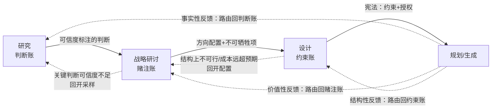

# 研究 · 战略研讨 · 设计：三流程能力与协同研讨

> 本文是一轮研讨产物，不是定稿方法论。研讨对象：开放性创新任务（如个人 agent 知识库系统、B 站/知乎/ChatGPT 抓取净化流水线）中，上游三个流程——研究、战略研讨、设计——各自做好需要什么能力，以及心智索引如何在它们之间分配、如何协同。非目标：本轮不产出可执行 skill、不做排期、不替代 derive-cognitive-workflow 对具体任务的逐层展开。

## 研讨定界

完整创造性工作流的概念链：

```text
研究：哪些判断可暂时相信？
→ 战略研讨：哪些未来值得进入、保留或放弃？
→ 设计：在该方向下，产物的可能性空间怎样被约束和授权？
→ 规划 → 生成/实现 → 运行反馈（反哺前四层）
```

普通编程执行任务中，前三层往往被外部给定（需求已定、方向已定、约束已定）。开放性创新任务中前三层必须自己长出来，而它们恰恰是 agent 最容易「完成形式、错过灵魂点」的地方。本轮研讨要回答的不是「每层写什么文档」，而是：每层的注意力应该落在哪里，才能让每一步 effort 都坚定地朝正确方向前进。

## 当前锋利判断

### 三层按「退休哪类不确定性」定义，不按活动类型定义

这是本轮最承重的判断，它直接来自概念链里三层各自的问句，只是形式化了：

| 层 | 退休的不确定性 | 输出状态（下游直接依赖的东西） |
| --- | --- | --- |
| 研究 | 认知不确定：世界怎样运作、什么为真 | 一组**标注了可信度和适用边界**的判断（事实/推断/假设/未知分层） |
| 战略研讨 | 押注不确定：什么值得投入、投入到什么规格 | 一份**带升级条件和停止条件**的方向配置（不是单个「选定方向」） |
| 设计 | 结构不确定：产物允许长成什么样 | 一部**生成空间的宪法**：不可违反项 + 显式授权的自由度 + 验收信号 |

按活动类型定义（「研究=查资料」「设计=写方案文档」）会立刻退化成载体填充。按退休的不确定性定义，每层的验收、近敌和能力清单都能自然推出来。

### 统一验收：下游能否不补做本层核心判断

三层共用同一个验收测试（来自 derive-cognitive-workflow 的消费者偷工测试）：

> 本层输出交付后，下游是否还需要重建概念、补判断、猜边界、发明验收口径？需要，就是本层未闭合。

- 研究不合格的信号：战略层引用某个结论时，还得自己判断「这个到底能不能信、适用到哪」。
- 战略不合格的信号：设计层动手时，还得自己决定「我们到底押不押这个方向、押多重」。
- 设计不合格的信号：生成层写代码/产内容时，还要现场即兴立法「这样做到底行不行」。

这个测试把「做好」从主观感受变成可观察信号，是 agent 自检的最小抓手。

### 三层是并发账本，不是时序阶段

概念链里的箭头是**依赖边（边契约）**，不是排期。开放任务中三层同时在场：战略的赌注决定研究的采样方向；设计遇到的结构困难是最强的研究信号；运行反馈按性质分别路由回三层。协同层的本体不是「按顺序推进阶段」，而是**维护三本账 + 一个路由器**（详见协同层一节）。

### Agent 能力不对称：战略层是人机接口最厚的地方

Agent 天然强在研究层（海量阅读、建模、结构化、来源追溯）和设计层（关系显式化、约束建模、一致性校验），天然弱在战略层——它没有 stakes、没有主体立场、倾向对称罗列选项而不下注。

对应的分工判断：

- 研究、设计：agent 高度自主，人只做抽查和方向纠偏。
- 战略：决定权按「可逆性 × 代价 × 是否触及主体珍视」分配。可逆、低成本、依据明确的赌注 agent 自决并记录；不可逆、高代价、或触及用户珍视/资源边界的赌注，agent 的职责是**把决策成本压到最低**（加工成带标签的机会卡），由用户下注。
- 这与「成长与人生决策」subject 的约束一同构：AI 理性是校准工具，不是主权替代物。

## 逐层展开

### 研究层

**输出状态**：一组可暂时相信的判断，每条判断标注可信度等级（事实/推断/假设/未知）、来源、适用边界、近敌消歧。

**心智索引（本层注意力落点）**：

- 这个判断的可信度等级是什么？依据什么来源？
- 它的适用边界在哪里？什么情况下失效？
- 它有没有近敌概念需要消歧？
- 下游谁消费它、用它做什么判断？
- 还缺什么采样才能把关键假设升级或证伪？
- 继续研究的边际收益是否已经低于进入下一层的收益？

**核心能力与已有素材映射**：

| 能力 | 说明 | 已有素材 |
| --- | --- | --- |
| 概念闭合 | 概念要能支持下一步判断才算研究产出：是什么、不是什么、谁维护、何时用、用后怎么判断 | info-purify 增量概念 |
| 函数化建模 | IPO 解剖、现实切片压力测试、近敌划界、杠杆定律提取 | t-concept-refactor（CCR-SOP） |
| 事实分层与来源追溯 | 事实/推断/假设/未知不混层，结论可回溯到来源 | info-purify、derive-cognitive-workflow 通用纪律 |
| 可证伪化 | 把直觉和整体感写成可验证假设，拆成子感觉分别验证 | 决策 subject 的直觉反馈回路（13.1/14.6）——它本来是人生尺度的直觉训练法，可直接移植为 agent 研究技法 |
| 采样设计 | 设计低成本高信息量的现实接触动作 | 决策 subject 的「轻触」动作雏形 |

**近敌**：资料囤积/综述感。收集很多、整理很漂亮，但没有形成敢于标注可信度的判断。观察信号：产出里全是「A 认为…B 认为…」，没有「我们暂时相信 X，置信中等，失效条件是 Y」。

**素材缺口**：主动采样策略（研究预算怎么分配到哪些未知上）和研究停止条件（决策 subject 8.2 的「继续思考的新增收益变低就进入建设」是雏形，但还没有可操作的判定信号）。

### 战略研讨层

**输出状态**：一份方向配置——哪些方向进入主线、哪些保留在池中、哪些明确放弃，每项带升级条件和停止条件；且每个判断都落入明确状态。

**心智索引**：

- 这个候选方向吸引我们的本质是什么？（结果/创造/理解/逃离/命运感——吸引力解剖防止把兴奋误判为价值）
- 上限是什么？成本会吃掉什么？可逆吗？有复利吗？适配当前结构吗？时机对吗？（机会八要素）
- 它该进哪个池：捕获/观察/轻触/验证/主线？（五级池，主线池必须少）
- 最小现实入口是什么？升级条件和停止条件是什么？
- 风险是有效风险吗？传导链几步？穿透冗余吗？（风险资格审查，防止 agent 无限风险分析）
- 本判断落入哪种明确状态：做/不做/暂缓至某条件/小实验/进入决策树/凭直觉赌/随机决定？

**核心能力与已有素材映射**：

| 能力 | 说明 | 已有素材 |
| --- | --- | --- |
| 吸引力解剖 | 区分候选方向的吸引来源，防止兴奋直接升级为承诺 | 决策 subject 5.2 |
| 组合配置 | 用分级池管理候选，而非二元取舍；筛选只筛到「值得小规模开始」 | 决策 subject 5.4/8.1、建设筛选循环 |
| 有效风险审查 | 风险传导链、冗余、报警器；只处理够格的风险 | 决策 subject 6 |
| 明确判断输出 | 判断必须落入七种确定状态之一，不许把「复杂」伪装成「成熟」 | 决策 subject 2.2 |
| 主体立场对齐 | 项目版的「珍视/资源/边界/主线」档案，即项目宪法与不可牺牲项 | 决策 subject 约束一（待移植） |
| 直觉与分析分工 | 直觉先发现方向信号，分析校验不可逆代价；低成本动作验证直觉 | 决策 subject 13.6 |

**近敌**：选项对称罗列。分析很全面、利弊很平衡，但没有落入任何明确判断状态，赌注被静默留给下游。观察信号：输出里找不到「做/不做/暂缓/小实验」中的任何一个词及其条件。

**素材缺口**：决策 subject 是人生尺度的原材料，需要移植到项目/任务尺度。结构高度同构（机会池→候选场景池；「主线池要少」→高 ROI 场景聚焦），移植是低风险高价值动作，但尚未做。

### 设计层

**输出状态**：生成空间的宪法——scope 划分及边界、不可违反的约束、**显式授权的自由度**、每个 scope 的验收信号、scope 间关系（归属/依赖/影响/协同/约束）。

**心智索引**：

- 这个信息/决定归属哪个 scope？会影响哪些别的 scope？
- 我此刻动的是三类命题中的哪一类：信息组织、内容表达、还是设计约束本身？
- 从战略层进来的什么必须守恒？设计允许原生新增什么判断？什么算越权改方向？
- 哪些锁死、哪些显式授权给生成层自由？授权的边界和验收信号是什么？
- 局部各 scope 合理之后，它们协同起来还支撑全局目标吗？

**核心能力与已有素材映射**：

| 能力 | 说明 | 已有素材 |
| --- | --- | --- |
| scope 划分与五关系 | 归属、依赖、影响、协同、约束的显式化 | 信息架构演进草稿 |
| 三类命题区分 | 知道自己在动组织、内容还是设计约束 | 信息架构演进草稿 |
| 边契约立法 | 守恒/原生增量/禁止静默决定/回开条件 | derive-cognitive-workflow 边契约 |
| 状态机式生成控制 | 从稳定信息到不稳定信息的生成顺序、阶段验收、过程总账 | 信息架构演进 3.2–3.4、i-spec-design |
| 授权粒度判断 | 哪些留给生成层自由、怎样声明自由度 | **最薄弱，几乎空白** |

**近敌**：文档完整感。章节都填满了，但可能性空间没有真正被立法——生成时仍要即兴决定关键取舍。观察信号：设计文档里全是「应该怎样」，没有「以下由实现自由决定，只要满足 X」。

**素材缺口（本轮发现的最锋利缺口）**：授权粒度方法论。现有材料几乎全部在讲「怎样约束」，很少讲「怎样正确地授权自由」。在生成层（agent 编码/产出）非常强大的现实下，设计层克制立法、精确授权，可能比事无巨细的约束更优——过度约束会杀死生成层创造力，且约束维护成本本身会成为熵源。这是「约束和授权」中「授权」一词长期被忽略的一半。

## 层间边契约



**研究 → 战略**：战略只能消费已标注可信度的判断，禁止把研究层的假设静默当事实押注。战略允许原生新增价值排序和赌注意愿（这是研究给不了的）。回开条件：押注所依赖的关键判断可信度不足，回研究层补采样，而不是硬赌。

**战略 → 设计**：设计必须守恒方向承诺和不可牺牲项，允许原生新增结构选择。禁止静默决定：设计不得借「细化」之名偷偷改方向（典型形态：被有趣的技术方案带偏、scope 悄悄膨胀）。回开条件：设计发现该方向结构上不可行或成本远超战略假设，回战略层重新配置，而不是自行降级目标。

**设计 → 生成**：生成只在授权空间内造实例，禁止重新立法。回开条件：授权空间内造不出合格实例，说明约束过紧或互相矛盾，回设计层修宪。

**反馈路由**：运行反馈不是一坨「经验教训」，要按性质拆开路由——「原来世界是这样的」进判断账；「原来这个方向不值/更值」进赌注账；「原来这个结构不行」进约束账。不路由的反馈只会变成局部修补。

## 协同层：agent 自主编排机制

这是「agent 如何自主安排好整个大开放任务」的核心。机制由四件东西组成：

**三本账**。判断账（研究层：判断+可信度+边界+来源）、赌注账（战略层：候选+池位+升级/停止条件+判断状态）、约束账（设计层：scope+约束+授权+验收信号）。这是信息架构演进「过程总账」思想的分层版。三本账混在一个上下文里，是开放任务混乱的头号来源。

**一个路由器**。任何新信号（用户输入、运行反馈、研究发现、灵感）进来先问：它改变的是哪本账？改判断、改赌注、还是改约束？路由错误的典型症状：把一个事实发现直接当成方向变更（判断账污染赌注账），或把一次实现挫折直接当成方向否定（该回设计层修宪的问题被升级成战略动摇）。

**处理规格分配（元判断，先于三层运转）**。不是所有开放任务都值得三层全开。任务/子任务先过一次规格判断：轻触级的候选直接「薄研究+快生成」跑一遍即可，强行走全流程是过度工程。这来自决策 subject 的核心洞察——机会不问「要不要抓」，问「值得进入哪一级处理规格」。

**门与决定权表**。层间放行统一用消费者偷工测试；回开边显式声明（见上节）。决定权表规定哪些判断 agent 可自决（可逆、低成本、依据明确——自决并记录）、哪些必须升级给用户（不可逆、高代价、触及主体珍视）。「每一步 effort 都坚定向正确方向前进」的可操作翻译是：**每步行动都能回答——我在为哪本账的哪个条目工作、该条目当前什么状态、本动作预期推进到什么状态、放行或回开信号是什么。** 答不出来的动作就是无头苍蝇动作。

## 回看诊断：chatgpt-subject-purify 流水线（假设，待确认）

用这套框架回看当时「折腾很久费很大劲」的过程，可以提出三个诊断假设：

- **赌注账缺失**：候选场景没有进池分级，每个想法要么全规格深入、要么凭当下热情随机推进。最终「几个超高 ROI 场景」本质是战略层筛选的结果，但这个筛选是靠大量试错事后浮现的；若早期就有候选场景池+轻触验证，同样的结论可能用小得多的成本到达。
- **约束账未立法**：每个场景的管线都在生成时即兴决定结构，没有一部跨场景的宪法（哪些结构守恒、哪些自由），导致重复发明和不一致。
- **反馈未路由**：跑出来的效果好坏多数变成了局部修补，较少回头更新「哪些判断可信」和「哪些方向该升降级」。

这三条是否符合当时实况，值得你确认——它们同时也是这套框架第一个现实切片压力测试。

## 反例与现实约束

- **三层全开的反例**：小任务强行走全流程是熵增不是熵减。处理规格分配必须先于三层运转，这是协同层的第一判断。
- **账本机制的现实成本**：三本账若做成重协议，维护成本会吃掉收益。现实约束是：账本形态必须从最轻可用开始（可能就是 drafts 里的三个文档），先验证路由行为本身有价值，再谈协议化。不要一上来就设计 .iteration 式的状态机。
- **战略层移植的风险**：人生决策模型带有强主体色彩（珍视、身份、生命展开空间），项目尺度移植时要剥离掉不适用的部分，否则会把项目决策过度人生化——这恰是那套体系自己警告过的错误（「小问题人生化」）。
- **授权方法论的近敌**：「授权」不等于「不管」。没有验收信号的自由不是授权，是弃权。授权声明必须带边界和验收，否则设计层近敌换了一件马甲。

## 本轮搜索质量判断

- 新命名：三层按「退休的不确定性种类」定义；输出物形态命名为判断层/配置层/宪法层；「三本账+路由器」作为协同机制本体。
- 被忽略变量：设计层的「授权」一半——现有全部素材都偏向约束，授权粒度是空白，这是本轮最有价值的发现之一。
- 主动攻击：给每层找了近敌和可观察失败信号；给账本机制标了过度工程风险；给战略移植标了过度人生化风险。
- 现实扣合：判断均能追溯到已有素材（决策 subject、信息架构演进、derive-cognitive-workflow、t-concept-refactor、info-purify），且用 chatgpt-subject-purify 案例做了一次回看压力测试（待确认）。
- 保留分支：没有把「先做哪个」压成单线，四个下一问题各自独立承重。

## 下一轮研讨接口

按独立承重保留，不预设优先级合并：

- **授权粒度方法论**：设计层怎样声明自由度而不只是约束？自由度的边界、验收信号、与生成层能力的匹配关系。这是现有素材完全空白的分支。
- **决策模型的项目尺度移植**：把机会八要素、五级池、明确判断状态、升级/停止条件移植成项目候选管理模型，并剥离人生尺度特有成分。
- **三本账最轻载体验证**：用下一个真实开放任务，以最轻形态（三个 drafts 文档）跑一次「路由+状态推进+门控」，观察路由行为本身是否产生可感知的方向稳定性收益，再决定是否协议化。
- **研究停止条件**：「继续研究边际收益递减」的可操作判定信号是什么？候选：关键假设覆盖率、新信息对赌注账的扰动率趋零、采样成本曲线拐点。

## 来源索引

- 三层问句与概念链：用户本轮输入（上游事实源）。
- 认知状态转换、边契约、消费者偷工测试、单层展开纪律：derive-cognitive-workflow 及其 references。
- 机会八要素、五级池、有效风险、明确判断状态、建设筛选循环、直觉分析分工、主体立场约束：`cpu-matrix/public/subjects/主体自我-成长与人生决策/核心上下文.md`。
- scope 五关系、三类命题、生成状态机、过程总账：`.codex/drafts/info-architecture-sop/信息架构演进.md`。
- 概念闭合、权威来源、事实分层：`.codex/drafts/info-purify/01-核心概念体系.md`。
- 概念解剖四阶段（参数化/现实切片/近敌/杠杆定律）：t-concept-refactor SKILL.md。
