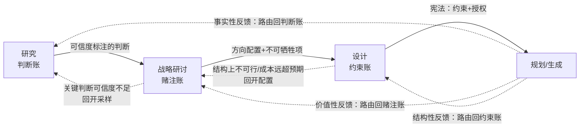

# 研究 · 战略研讨 · 设计：三流程能力与协同研讨

> 本文是一轮研讨产物，不是定稿方法论。研讨对象：开放性创新任务（如个人 agent 知识库系统、B 站/知乎/ChatGPT 抓取净化流水线）中，上游三个流程——研究、战略研讨、设计——各自做好需要什么能力，以及心智索引如何在它们之间分配、如何协同。非目标：本轮不产出可执行 skill、不做排期、不替代 derive-cognitive-workflow 对具体任务的逐层展开。

## 研讨定界

完整创造性工作流的概念链：

```text
研究：哪些判断可暂时相信？
→ 战略研讨：哪些未来值得进入、保留或放弃？
→ 设计：在该方向下，产物的可能性空间怎样被约束和授权？
→ 规划 → 生成/实现 → 运行反馈（反哺前四层）
```

普通编程执行任务中，前三层往往被外部给定（需求已定、方向已定、约束已定）。开放性创新任务中前三层必须自己长出来，而它们恰恰是 agent 最容易「完成形式、错过灵魂点」的地方。本轮研讨要回答的不是「每层写什么文档」，而是：每层的注意力应该落在哪里，才能让每一步 effort 都坚定地朝正确方向前进。

## 当前锋利判断

### 三层按「退休哪类不确定性」定义，不按活动类型定义

这是本轮最承重的判断，它直接来自概念链里三层各自的问句，只是形式化了：

| 层 | 退休的不确定性 | 输出状态（下游直接依赖的东西） |
| --- | --- | --- |
| 研究 | 认知不确定：世界怎样运作、什么为真 | 一组**标注了可信度和适用边界**的判断（事实/推断/假设/未知分层） |
| 战略研讨 | 押注不确定：什么值得投入、投入到什么规格 | 一份**带升级条件和停止条件**的方向配置（不是单个「选定方向」） |
| 设计 | 结构不确定：产物允许长成什么样 | 一部**生成空间的宪法**：不可违反项 + 显式授权的自由度 + 验收信号 |

按活动类型定义（「研究=查资料」「设计=写方案文档」）会立刻退化成载体填充。按退休的不确定性定义，每层的验收、近敌和能力清单都能自然推出来。

> **示例**：两个 agent 同时接到「为用户搭一套个人知识库系统」的启动任务。第一个按活动类型理解三层：「研究」就是查资料，于是花两天搜齐二十篇 RAG 架构与向量库对比文章；「设计」就是写方案文档，于是产出了带架构图的完整文档。流程走满，动手实现时才发现：「用户的检索习惯到底是关键词还是语义提问」没有人回答过，「先做哪个场景」没有人押注过——每个阶段都完成了活动，但所有不确定性原封不动地留到了写代码的那一刻。第二个按退休不确定性理解：研究层只处理一件事——「用户真实检索习惯」这条会决定架构的关键未知，用一天小采样把它变成可信判断；战略层押注「先做 subject 净化场景，全文检索暂缓」；设计层据此立法。它做的活动少得多，但每一步都让下游少赌一类东西。同样叫「做了研究和设计」，活动型走完流程留下全部不确定性，退休型每走一步就消掉一类——这就是两种定义方式的分水岭。

### 统一验收：下游能否不补做本层核心判断

三层共用同一个验收测试（来自 derive-cognitive-workflow 的消费者偷工测试）：

> 本层输出交付后，下游是否还需要重建概念、补判断、猜边界、发明验收口径？需要，就是本层未闭合。

- 研究不合格的信号：战略层引用某个结论时，还得自己判断「这个到底能不能信、适用到哪」。
- 战略不合格的信号：设计层动手时，还得自己决定「我们到底押不押这个方向、押多重」。
- 设计不合格的信号：生成层写代码/产内容时，还要现场即兴立法「这样做到底行不行」。

这个测试把「做好」从主观感受变成可观察信号，是 agent 自检的最小抓手。

> **示例**：为「长视频转文字稿」流水线选型，研究层调研开源 ASR 方案后向战略层交付结论。一种交付写着「whisper-large 效果最好，faster-whisper 更快」——战略层拿到后没法直接押注：「效果最好」是在英文基准还是中文访谈上测的？能信到什么程度？于是它只好自己翻测评、跑样本，等于把研究重做了一遍。这就是消费者偷工（说白了就是下游被迫补做了本层该完成的核心判断），它直接判定研究层未闭合。另一种交付写着「中文访谈语料下 faster-whisper large-v3 字错率约 8%，实测 3 段样本，置信中等；失效条件：强方言或多人声重叠」——战略层当场据此决定进入小规模验证，不用回头补任何判断。两份交付字数相仿，差别只在下游能否直接把它当地基用。

### 三层是并发账本，不是时序阶段

概念链里的箭头是**依赖边（边契约）**，不是排期。开放任务中三层同时在场：战略的赌注决定研究的采样方向；设计遇到的结构困难是最强的研究信号；运行反馈按性质分别路由回三层。协同层的本体不是「按顺序推进阶段」，而是**维护三本账 + 一个路由器**（详见协同层一节）。

> **示例**：做 B 站 UP 主字幕抓取流水线。一种跑法把三层当瀑布：先用一周把「研究阶段」做满——接口、字幕格式、风控全部调研完——才允许进战略和设计。设计进行到一半，B 站的 AI 字幕接口改版了，但「研究阶段已经结束」，没有人回去更新结论，后面的设计安静地建立在过期判断上，直到联调才崩。另一种跑法让三本账（研究的判断账、战略的赌注账、设计的约束账）并发在场：设计推进中撞到「多 P 视频的字幕结构未知」，立刻回判断账补一条定向采样；试运行发现某类视频根本没有 AI 字幕，这条事实路由回判断账，战略层据此把该类视频降出主线池。两种跑法看的是同一张流程图，差别在于把箭头读成排期还是读成依赖——瀑布会冻结账本、带着过期判断往前走，并发账本让每个新信号落到它该改的账上。

### Agent 能力不对称：战略层是人机接口最厚的地方

Agent 天然强在研究层（海量阅读、建模、结构化、来源追溯）和设计层（关系显式化、约束建模、一致性校验），天然弱在战略层——它没有 stakes、没有主体立场、倾向对称罗列选项而不下注。

对应的分工判断：

- 研究、设计：agent 高度自主，人只做抽查和方向纠偏。
- 战略：决定权按「可逆性 × 代价 × 是否触及主体珍视」分配。可逆、低成本、依据明确的赌注 agent 自决并记录；不可逆、高代价、或触及用户珍视/资源边界的赌注，agent 的职责是**把决策成本压到最低**（加工成带标签的机会卡），由用户下注。
- 这与「成长与人生决策」subject 的约束一同构：AI 理性是校准工具，不是主权替代物。

> **示例**：知识库项目推进中，agent 发现一个诱人的新机会：「把用户的微信聊天记录也接入知识库，私域语料一下就齐了。」一种走向是 agent 替用户下注——它评估价值很高，直接花三天实现了微信抓取管线。但聊天记录牵涉他人隐私和用户自己的敏感边界，数据一旦入库索引，清理成本很高；用户看到时既成事实已经造成，主线时间也被吃掉了。另一种走向是 agent 把它加工成机会卡（说白了就是把候选机会的上限、成本、可逆性、最小验证动作整理成一张可直接决策的卡片）：上限「补齐私域对话语料」，成本「约三天，且触及隐私面」，可逆性「入库后难清理」，最小验证动作「先只做本地统计、不入库」，建议池位「观察池」。用户扫一眼卡片，十秒钟决定暂缓；agent 转头把「给现有管线加重试」这类可逆、低成本的小赌注自决做掉并留下记录。两条走向里 agent 都很勤奋，差别在于：触及不可逆和主体珍视的赌注，agent 的职责是把决策成本压到最低，而不是代行决定权。

## 逐层展开

### 研究层

**输出状态**：一组可暂时相信的判断，每条判断标注可信度等级（事实/推断/假设/未知）、来源、适用边界、近敌消歧。

**心智索引（本层注意力落点）**：

- 这个判断的可信度等级是什么？依据什么来源？
- 它的适用边界在哪里？什么情况下失效？
- 它有没有近敌概念需要消歧？
- 下游谁消费它、用它做什么判断？
- 还缺什么采样才能把关键假设升级或证伪？
- 继续研究的边际收益是否已经低于进入下一层的收益？

**核心能力与已有素材映射**：

| 能力 | 说明 | 已有素材 |
| --- | --- | --- |
| 概念闭合 | 概念要能支持下一步判断才算研究产出：是什么、不是什么、谁维护、何时用、用后怎么判断 | info-purify 增量概念 |
| 函数化建模 | IPO 解剖、现实切片压力测试、近敌划界、杠杆定律提取 | t-concept-refactor（CCR-SOP） |
| 事实分层与来源追溯 | 事实/推断/假设/未知不混层，结论可回溯到来源 | info-purify、derive-cognitive-workflow 通用纪律 |
| 可证伪化 | 把直觉和整体感写成可验证假设，拆成子感觉分别验证 | 决策 subject 的直觉反馈回路（13.1/14.6）——它本来是人生尺度的直觉训练法，可直接移植为 agent 研究技法 |
| 采样设计 | 设计低成本高信息量的现实接触动作 | 决策 subject 的「轻触」动作雏形 |

**近敌**：资料囤积/综述感。收集很多、整理很漂亮，但没有形成敢于标注可信度的判断。观察信号：产出里全是「A 认为…B 认为…」，没有「我们暂时相信 X，置信中等，失效条件是 Y」。

> **示例**：战略层想知道「知乎抓取场景值不值得投入」，研究层去调研知乎反爬现状。一种产出是十五条来源的整齐罗列：「有文章说需要登录态，有开发者反馈 API 有频率风控，某仓库 README 提到风控在收紧……」——每条都有出处，排版也干净，但战略层拿着一堆「A 认为、B 认为」仍然无法押注，这个场景在候选池里悬置了一个月。另一种产出只有三行：「我们暂时相信：正文抓取需要登录态；低频访问下实测两天未触发风控（置信中等，样本小）；失效条件：官方接口改版。」战略层当场拍板：进验证池，给两天做小实验。前者是资料囤积——把判断责任连同材料一起推给了下游；后者才是研究层的合格产物：敢于标注可信度和失效条件的判断。

**素材缺口**：主动采样策略（研究预算怎么分配到哪些未知上）和研究停止条件（决策 subject 8.2 的「继续思考的新增收益变低就进入建设」是雏形，但还没有可操作的判定信号）。

### 战略研讨层

**输出状态**：一份方向配置——哪些方向进入主线、哪些保留在池中、哪些明确放弃，每项带升级条件和停止条件；且每个判断都落入明确状态。

**心智索引**：

- 这个候选方向吸引我们的本质是什么？（结果/创造/理解/逃离/命运感——吸引力解剖防止把兴奋误判为价值）
- 上限是什么？成本会吃掉什么？可逆吗？有复利吗？适配当前结构吗？时机对吗？（机会八要素）
- 它该进哪个池：捕获/观察/轻触/验证/主线？（五级池，主线池必须少）
- 最小现实入口是什么？升级条件和停止条件是什么？
- 风险是有效风险吗？传导链几步？穿透冗余吗？（风险资格审查，防止 agent 无限风险分析）
- 本判断落入哪种明确状态：做/不做/暂缓至某条件/小实验/进入决策树/凭直觉赌/随机决定？

**核心能力与已有素材映射**：

| 能力 | 说明 | 已有素材 |
| --- | --- | --- |
| 吸引力解剖 | 区分候选方向的吸引来源，防止兴奋直接升级为承诺 | 决策 subject 5.2 |
| 组合配置 | 用分级池管理候选，而非二元取舍；筛选只筛到「值得小规模开始」 | 决策 subject 5.4/8.1、建设筛选循环 |
| 有效风险审查 | 风险传导链、冗余、报警器；只处理够格的风险 | 决策 subject 6 |
| 明确判断输出 | 判断必须落入七种确定状态之一，不许把「复杂」伪装成「成熟」 | 决策 subject 2.2 |
| 主体立场对齐 | 项目版的「珍视/资源/边界/主线」档案，即项目宪法与不可牺牲项 | 决策 subject 约束一（待移植） |
| 直觉与分析分工 | 直觉先发现方向信号，分析校验不可逆代价；低成本动作验证直觉 | 决策 subject 13.6 |

**近敌**：选项对称罗列。分析很全面、利弊很平衡，但没有落入任何明确判断状态，赌注被静默留给下游。观察信号：输出里找不到「做/不做/暂缓/小实验」中的任何一个词及其条件。

> **示例**：subject 净化管线跑通了 ChatGPT 来源之后，出现候选方向「要不要扩展接入 Sider 对话」。一种战略产出是对称罗列：「扩展的好处：语料更完整、主题覆盖更全；风险：导出接口不稳定、维护成本上升；建议综合权衡。」下一个接手的 agent 会话拿到这段话，只能自己拍一个方向——拍对拍错都没有依据可追溯，赌注被静默转嫁给了最没有资格下注的环节。另一种战略产出落入明确状态：「暂缓至条件：ChatGPT 来源稳定跑通三个 subject 且维护成本可控后再扩展；停止条件：Sider 导出接口关闭则放弃。」两种产出承认的是同一份不确定，但后者把不确定装进了可执行的状态里——下游不用猜，复查有触发器。战略层的合格线从来不是分析全面，而是判断落入明确状态。

**素材缺口**：决策 subject 是人生尺度的原材料，需要移植到项目/任务尺度。结构高度同构（机会池→候选场景池；「主线池要少」→高 ROI 场景聚焦），移植是低风险高价值动作，但尚未做。

### 设计层

**输出状态**：生成空间的宪法——scope 划分及边界、不可违反的约束、**显式授权的自由度**、每个 scope 的验收信号、scope 间关系（归属/依赖/影响/协同/约束）。

**心智索引**：

- 这个信息/决定归属哪个 scope？会影响哪些别的 scope？
- 我此刻动的是三类命题中的哪一类：信息组织、内容表达、还是设计约束本身？
- 从战略层进来的什么必须守恒？设计允许原生新增什么判断？什么算越权改方向？
- 哪些锁死、哪些显式授权给生成层自由？授权的边界和验收信号是什么？
- 局部各 scope 合理之后，它们协同起来还支撑全局目标吗？

**核心能力与已有素材映射**：

| 能力 | 说明 | 已有素材 |
| --- | --- | --- |
| scope 划分与五关系 | 归属、依赖、影响、协同、约束的显式化 | 信息架构演进草稿 |
| 三类命题区分 | 知道自己在动组织、内容还是设计约束 | 信息架构演进草稿 |
| 边契约立法 | 守恒/原生增量/禁止静默决定/回开条件 | derive-cognitive-workflow 边契约 |
| 状态机式生成控制 | 从稳定信息到不稳定信息的生成顺序、阶段验收、过程总账 | 信息架构演进 3.2–3.4、i-spec-design |
| 授权粒度判断 | 哪些留给生成层自由、怎样声明自由度 | **最薄弱，几乎空白** |

**近敌**：文档完整感。章节都填满了，但可能性空间没有真正被立法——生成时仍要即兴决定关键取舍。观察信号：设计文档里全是「应该怎样」，没有「以下由实现自由决定，只要满足 X」。

**素材缺口（本轮发现的最锋利缺口）**：授权粒度方法论。现有材料几乎全部在讲「怎样约束」，很少讲「怎样正确地授权自由」。在生成层（agent 编码/产出）非常强大的现实下，设计层克制立法、精确授权，可能比事无巨细的约束更优——过度约束会杀死生成层创造力，且约束维护成本本身会成为熵源。这是「约束和授权」中「授权」一词长期被忽略的一半。

> **示例**：给「B 站字幕转中文整理稿」环节写设计，同一个任务有三种走向。第一种事无巨细：设计规定了小节标题格式、每类口播句式的改写模板，共四十条规则——生成 agent 被绑死，遇到规则没覆盖的视频类型就产出僵硬的错误文本，四十条规则本身也成了维护负担。第二种章节完整但未立法：设计文档背景、目标、流程、风险俱全，通篇是「应忠实原意、结构应清晰」这类「应该怎样」——生成时每个视频仍要现场即兴决定怎么分节、删不删口水话，可能性空间根本没被约束到。第三种精确授权：只锁三条不可违反项（不增删语义、保留时间锚点、禁忌类内容必须结构化表达），再显式授权「分节方式与语气顺滑由生成自由决定，验收信号：抽查三段与原字幕语义对齐」。第三种文档最短，生成却最快最稳。设计的合格产物是「约束＋授权＋验收信号」三件俱全的宪法（说白了就是给生成空间立的法：哪些不许动、哪些随便动、怎么验收）；前两种失败，一种是过度立法，一种是没有立法。

## 层间边契约


```mermaid
flowchart LR
    R[研究<br/>判断账] -->|可信度标注的判断| S[战略研讨<br/>赌注账]
    S -->|方向配置+不可牺牲项| D[设计<br/>约束账]
    D -->|宪法：约束+授权| G[规划/生成]
    G -.->|事实性反馈：路由回判断账| R
    G -.->|价值性反馈：路由回赌注账| S
    G -.->|结构性反馈：路由回约束账| D
    S -.->|关键判断可信度不足<br/>回开采样| R
    D -.->|结构上不可行/成本远超预期<br/>回开配置| S
```

**研究 → 战略**：战略只能消费已标注可信度的判断，禁止把研究层的假设静默当事实押注。战略允许原生新增价值排序和赌注意愿（这是研究给不了的）。回开条件：押注所依赖的关键判断可信度不足，回研究层补采样，而不是硬赌。

**战略 → 设计**：设计必须守恒方向承诺和不可牺牲项，允许原生新增结构选择。禁止静默决定：设计不得借「细化」之名偷偷改方向（典型形态：被有趣的技术方案带偏、scope 悄悄膨胀）。回开条件：设计发现该方向结构上不可行或成本远超战略假设，回战略层重新配置，而不是自行降级目标。

> **示例**：战略层给知识库定下承诺：「主产物是面向人阅读的主题核心上下文，可读性优先。」设计推进中发现可读文档的增量维护很麻烦。一种走向是静默偷改：设计 agent 觉得结构化 JSON 库加检索接口「技术上更漂亮」，借「细化存储方案」之名把主产物换成了 JSON 库，可读文档降级成附属导出——交付时用户要的可读入口没了，方向在「细化」的掩护下已被重定义，而账面上没有任何一处记录过这次改向。另一种走向是触发回开边：设计把冲突显式摆到桌面——「可读性优先的维护成本比战略假设高三倍，是否调整承诺或降低规格？」战略层重新配置：只对主线 subject 保持可读优先，长尾 subject 降为索引级。两种走向的设计遇到的是同一个真实困难，差别在于：下游可以细化、可以喊停，唯独不可以替上游悄悄改判——冲突走回开边，不走私改。

**设计 → 生成**：生成只在授权空间内造实例，禁止重新立法。回开条件：授权空间内造不出合格实例，说明约束过紧或互相矛盾，回设计层修宪。

**反馈路由**：运行反馈不是一坨「经验教训」，要按性质拆开路由——「原来世界是这样的」进判断账；「原来这个方向不值/更值」进赌注账；「原来这个结构不行」进约束账。不路由的反馈只会变成局部修补。

## 协同层：agent 自主编排机制

这是「agent 如何自主安排好整个大开放任务」的核心。机制由四件东西组成：

**三本账**。判断账（研究层：判断+可信度+边界+来源）、赌注账（战略层：候选+池位+升级/停止条件+判断状态）、约束账（设计层：scope+约束+授权+验收信号）。这是信息架构演进「过程总账」思想的分层版。三本账混在一个上下文里，是开放任务混乱的头号来源。

**一个路由器**。任何新信号（用户输入、运行反馈、研究发现、灵感）进来先问：它改变的是哪本账？改判断、改赌注、还是改约束？路由错误的典型症状：把一个事实发现直接当成方向变更（判断账污染赌注账），或把一次实现挫折直接当成方向否定（该回设计层修宪的问题被升级成战略动摇）。

> **示例**：抓取净化流水线运行一个月后，观察到「某几位 UP 主的整理稿质量明显差」。一种处理是不路由的局部修补：agent 每次都在生成 prompt 里打补丁，特例规则越积越多，同类问题换个场景照样复发，一个月后没人说得清 prompt 里哪些规则还成立、哪些在互相打架。另一种处理先问「这个反馈改哪本账」：排查发现根因是这几位 UP 主的视频多为多人对谈，B 站 AI 字幕不区分说话人——于是判断账修正「AI 字幕质量高」这条判断的适用边界（仅限单人口播）；赌注账据此把「对谈类视频」降入观察池；约束账新增一条条件分流「检测到多说话人时改走 ASR 加说话人分离管线」。同一个反馈，三本账各改一条，此后所有场景直接受益。反馈只有按性质路由回账本，才能从局部修补变成系统演进。

**处理规格分配（元判断，先于三层运转）**。不是所有开放任务都值得三层全开。任务/子任务先过一次规格判断：轻触级的候选直接「薄研究+快生成」跑一遍即可，强行走全流程是过度工程。这来自决策 subject 的核心洞察——机会不问「要不要抓」，问「值得进入哪一级处理规格」。

**门与决定权表**。层间放行统一用消费者偷工测试；回开边显式声明（见上节）。决定权表规定哪些判断 agent 可自决（可逆、低成本、依据明确——自决并记录）、哪些必须升级给用户（不可逆、高代价、触及主体珍视）。「每一步 effort 都坚定向正确方向前进」的可操作翻译是：**每步行动都能回答——我在为哪本账的哪个条目工作、该条目当前什么状态、本动作预期推进到什么状态、放行或回开信号是什么。** 答不出来的动作就是无头苍蝇动作。

## 回看诊断：chatgpt-subject-purify 流水线（假设，待确认）

用这套框架回看当时「折腾很久费很大劲」的过程，可以提出三个诊断假设：

- **赌注账缺失**：候选场景没有进池分级，每个想法要么全规格深入、要么凭当下热情随机推进。最终「几个超高 ROI 场景」本质是战略层筛选的结果，但这个筛选是靠大量试错事后浮现的；若早期就有候选场景池+轻触验证，同样的结论可能用小得多的成本到达。
- **约束账未立法**：每个场景的管线都在生成时即兴决定结构，没有一部跨场景的宪法（哪些结构守恒、哪些自由），导致重复发明和不一致。
- **反馈未路由**：跑出来的效果好坏多数变成了局部修补，较少回头更新「哪些判断可信」和「哪些方向该升降级」。

这三条是否符合当时实况，值得你确认——它们同时也是这套框架第一个现实切片压力测试。

## 反例与现实约束

- **三层全开的反例**：小任务强行走全流程是熵增不是熵减。处理规格分配必须先于三层运转，这是协同层的第一判断。
- **账本机制的现实成本**：三本账若做成重协议，维护成本会吃掉收益。现实约束是：账本形态必须从最轻可用开始（可能就是 drafts 里的三个文档），先验证路由行为本身有价值，再谈协议化。不要一上来就设计 .iteration 式的状态机。
- **战略层移植的风险**：人生决策模型带有强主体色彩（珍视、身份、生命展开空间），项目尺度移植时要剥离掉不适用的部分，否则会把项目决策过度人生化——这恰是那套体系自己警告过的错误（「小问题人生化」）。
- **授权方法论的近敌**：「授权」不等于「不管」。没有验收信号的自由不是授权，是弃权。授权声明必须带边界和验收，否则设计层近敌换了一件马甲。

## 本轮搜索质量判断

- 新命名：三层按「退休的不确定性种类」定义；输出物形态命名为判断层/配置层/宪法层；「三本账+路由器」作为协同机制本体。
- 被忽略变量：设计层的「授权」一半——现有全部素材都偏向约束，授权粒度是空白，这是本轮最有价值的发现之一。
- 主动攻击：给每层找了近敌和可观察失败信号；给账本机制标了过度工程风险；给战略移植标了过度人生化风险。
- 现实扣合：判断均能追溯到已有素材（决策 subject、信息架构演进、derive-cognitive-workflow、t-concept-refactor、info-purify），且用 chatgpt-subject-purify 案例做了一次回看压力测试（待确认）。
- 保留分支：没有把「先做哪个」压成单线，四个下一问题各自独立承重。

## 下一轮研讨接口

按独立承重保留，不预设优先级合并：

- **授权粒度方法论**：设计层怎样声明自由度而不只是约束？自由度的边界、验收信号、与生成层能力的匹配关系。这是现有素材完全空白的分支。
- **决策模型的项目尺度移植**：把机会八要素、五级池、明确判断状态、升级/停止条件移植成项目候选管理模型，并剥离人生尺度特有成分。
- **三本账最轻载体验证**：用下一个真实开放任务，以最轻形态（三个 drafts 文档）跑一次「路由+状态推进+门控」，观察路由行为本身是否产生可感知的方向稳定性收益，再决定是否协议化。
- **研究停止条件**：「继续研究边际收益递减」的可操作判定信号是什么？候选：关键假设覆盖率、新信息对赌注账的扰动率趋零、采样成本曲线拐点。

## 来源索引

- 三层问句与概念链：用户本轮输入（上游事实源）。
- 认知状态转换、边契约、消费者偷工测试、单层展开纪律：derive-cognitive-workflow 及其 references。
- 机会八要素、五级池、有效风险、明确判断状态、建设筛选循环、直觉分析分工、主体立场约束：`cpu-matrix/public/subjects/主体自我-成长与人生决策/核心上下文.md`。
- scope 五关系、三类命题、生成状态机、过程总账：`.codex/drafts/info-architecture-sop/信息架构演进.md`。
- 概念闭合、权威来源、事实分层：`.codex/drafts/info-purify/01-核心概念体系.md`。
- 概念解剖四阶段（参数化/现实切片/近敌/杠杆定律）：t-concept-refactor SKILL.md。
