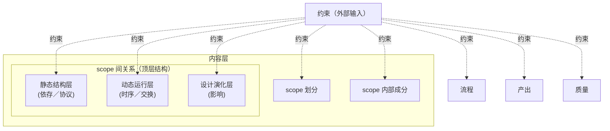

# 复杂系统设计中的信息架构：问题与结论

## 一、问题脉络

### 1. 总问题（方法论层）

在系统设计任务需要**持续阅读大量上下文**且**信息不断输入**时，如何保证最终形成的设计体系**结构清晰、边界明确、内容有序、结论稳定**——即建立一套**信息组织与系统设计推导**的方法论。

### 2. 更底层的命题表述

- **动态信息流与稳定结构之间的关系：** 如何在持续变化的信息输入中，维持可扩展、可校验的认知结构，使新信息被正确归位，并持续支持高质量决策与系统性输出。
- **一句话：** 动态信息如何被稳定结构持续吸收，并转化为有序系统认知。

### 3. 实践追问

- 若人或 AI **未做好**「动态输入下的结构维护」，产出的设计会出现哪些**可观测现象**？（局部合理、整体不稳；边界与归因失效等。）
- **上层结构**不展开全部细节时，对 scope 间关系的管理能否抽象为**通用、穷尽**的类型，使任意技术信息架构问题中的「关系内容」都能归入其中某一类的**精确定义**之下？

---

## 二、结论


### 顶层结构

> 这个解构层次，也是架构系统持续接受信息输入时，确认内容关系情况的确认顺序。

**[第 0 层] 元关系——「scope 自身的边界」**
- **0.1 归属（Belonging）**

**[第 1 层] 基本关系——「scope ↔ scope 的二元连接」（按时态三分）**

- **静态结构层（设计期／编译期事实）**
  - **1.1 依存（Dependency）**
  - **1.2 协议（Protocol）**
- **动态运行层（执行期事件）**
  - **1.3 时序（Sequencing）**
  - **1.4 交换（Exchange）**
- **设计演化层（演化期传播）**
  - **1.5 影响（Influence）**

**[第 2 层] 派生关系——「多个 scope 的合成视图」**
- **2.1 协同（Cooperation）**

### 每个关系的精确定义

#### 0.1 归属（Belonging）—— 元关系

> **某个事项（决策、责任、异常、信息、行为）与某个 scope 的隶属关系。它定义“什么属于这个 scope，什么不属于”——也就是 scope 自身的边界。**
>
> - 形式化：`Belong(item, scope) → {true, false}`
> - 关键提问：「这件事归谁管？」
> - 失效信号：item 同时归到多个 scope ⇒ 边界划错或这是关系层内容；item 归不到任何 scope ⇒ 缺 scope。

#### 1.1 依存（Dependency）—— 静态结构层

> **A scope 的成立、有效或意义需要 B scope 提供存在性条件。B 缺席则 A 不成立。**
>
> - 形式化：`Depend(A, B) → "A cannot exist/be-valid without B"`
> - 关键提问：「没有 B，A 能启动吗？」
> - 与近敌的边界：
>   - **vs 协议**：协议是双方契约（双向），依存是单方需求（单向）；二者可同时存在（A 依存 B 且 A、B 之间有协议）。
>   - **vs 外部约束**：外部约束可能以“A 必须依赖 B”形式打入设计（如「系统必须依赖 SSO」），但依存本身是 scope 间**静态结构事实**（属关系层），外部约束是**输入**（属 SOP 层）。

#### 1.2 协议（Protocol）—— 静态结构层

> **A scope 与 B scope 为了实现交换、依存、协同等运行时行为，共同遵守的、稳定的契约性约定。它定义“双方在交互时各自应满足的形式与规则”，是运行时交换的设计期前提。**
>
> - 形式化：`Protocol(A, B) → Contract(A's behavior ∩ B's expectations)`
> - 关键提问：「A 和 B 在交互时遵守的共同约定是什么？」
> - 可容纳子类（不细分以保持 MECE）：数据协议（payload 格式）、行为协议（同步／异步、幂等性、超时）、状态协议（状态机规则）、异常协议（错误码、重试、降级）。
> - 与近敌的边界：
>   - **vs 依存**：依存是“A 没 B 不能存在”（存在性绑定）；协议是“双方互动时的形式约定”（交互形式）。二者可同时存在：A 依存 B 且 A、B 之间有协议。
>   - **vs 交换**：协议是**静态契约**（设计期），交换是**基于契约的运行时事件**（先有协议、后有交换）。
>   - **vs 约束（外部）**：协议是 scope 间**双向协商**的契约（属本节关系层）；约束是**外部源**对设计的**单向限制**（属 SOP 输入维度，见末节）。协议本身可被外部约束修订（如“协议必须满足 GDPR”），这正是约束横切性的体现。

> **历史注**：原 1.2 名为“约束（Constraint）”。CCR-SOP 重构发现该定义混杂了两类语义不同的事物——**双向的协议**（scope 间关系层）和**单向的外部约束**（SOP 输入层）。本次将关系层的真实身份固化为“协议”，原“约束”语义剥离为 SOP 输入维度的元概念。

#### 1.3 时序（Sequencing）—— 动态运行层

> **A scope 与 B scope 的事件、阶段或状态变迁在时间轴上存在偏序关系（先于、后于、并发、互斥）。**
>
> - 形式化：`Order(eventA, eventB) → t(eventA) R t(eventB), R ∈ {<, ≤, ‖, ⊥}`
> - 关键提问：「它们以什么顺序发生？」
> - 与近敌的边界：纯时序不携带 payload；带 payload 的时序就是交换。

#### 1.4 交换（Exchange）—— 动态运行层

> **A scope 与 B scope 在运行时主动传递携带语义内容（数据、消息、控制信号、能力调用）的 payload。它是“携带 payload 的时序”。**
>
> - 形式化：`Exchange(A, B, payload, t) → Event`
> - 关键提问：「A 给了 B 什么？」
> - 与近敌的边界：与影响的差异在“是否有契约”——交换是有协议的显式传递，影响是无契约的隐式传播。

#### 1.5 影响（Influence）—— 设计演化层

> **A scope 的状态变化（变更、故障、决策修改、版本演进）通过显式或隐式路径传播到 B scope，改变其状态或行为。**
>
> - 形式化：`Influence(ΔA, ΔB) → CausalLink`
> - 关键提问：「动 A 会动哪里？」
> - 与近敌的边界：影响 ≈ 结构关系（依存／协议）在变化时态的投影 + 共享资源／隐式契约带来的额外副作用。

#### 2.1 协同（Cooperation）—— 派生关系

> **N 个 scope 通过若干基本关系（依存 + 协议 + 时序 + 交换 + 影响）组合，共同实现一个上层目标 T。它不是新的关系类型，而是“以目标为索引的关系组合视图”。**
>
> - 形式化：`Cooperate({S₁,...,Sₙ}, T) = ⋃ {basic relations among Sᵢ} subject to T`
> - 关键提问：「这些 scope 合在一起完成了什么目标？」
> - 与近敌的边界：协同必须可分解为基本关系；不可分解的“协同”是空概念。

### 一对 scope 的结构性扫描清单

给定一对 scope (A, B)，要完整理解它们的关系，必须按以下顺序扫描：

```
[ ] 0.1 归属：A 是什么 scope？B 是什么 scope？它们的边界各包含/排除什么？
[ ] 1.1 依存：A 依存 B 吗？B 依存 A 吗？
[ ] 1.2 协议：A 与 B 之间共同遵守的契约（接口／数据格式／状态机／异常约定）是什么？
[ ] 1.3 时序：A 与 B 的事件有偏序吗？
[ ] 1.4 交换：A 与 B 之间传递了什么 payload？
[ ] 1.5 影响：动 A 会动 B 吗？反之？
[ ] 2.1 协同：A 和 B（可能加上其他 scope）共同完成了什么上层目标？
```

每一项都问“是 / 否 / 如何”。任何一项被跳过，分析就有盲点。

---

## SOP 维度盘点

上述「关系层」是完整「信息架构 SOP」的内容部分之一。完整 SOP 还应覆盖以下维度（✓ 已深入 / ◐ 部分讨论 / ○ 待讨论）：

### 内容维度

- ◐ scope 划分准则
- ✓ scope 间关系（顶层结构所在层）
- ○ scope 内部成分

### 输入维度

- ○ 客户需求
- ◐ **约束（Constraint）—— 元概念**：详见下节
- ◐ 上下文材料
- ○ 历史经验／模式

### 流程维度

- ○ 设计步骤序列
- ○ 演进／修正机制（一次跑不出正确结论时的诊断与修正）
- ○ 决策机制

### 产出维度

- ○ 文档形态
- ○ 接口契约
- ○ 决策记录

### 质量维度

- ◐ 完整性 / 一致性 / 可归因 / 可扩展 / 可递归 / 可运行
- ◐ 可演化性
- ○ 可校验性

> **核心认知**：当前文档主要回答了「scope 间是什么关系」（内容层的一部分），但完整的「信息架构 SOP」还需要回答「如何完整地做好一次设计」——包括如何吸收输入、如何走完流程、如何修正错误、如何校验产出。这些维度的深入展开属于后续工作。

---

## 约束（Constraint）—— SOP 输入维度的元概念

**定义**：由外部源（客户需求、合规法规、行业规范、设计原则、历史经验等）对信息架构任何部分施加的限定。它**不是 scope 间的关系**，而是设计的输入边界条件。

### 5 维参数空间

| 维度 | 取值集合 |
|---|---|
| **来源** | 客户需求 / 合规 / 行业规范 / 上下游协议 / 设计原则 / 技术债 / 历史决策 |
| **作用对象** | scope 划分准则 / scope 内部成分 / scope 间关系（含协议本身）/ 流程步骤 / 产出形态 / 质量指标 |
| **时态** | 设计期 / 实现期 / 运行期 / 演进期 |
| **形式** | 显式（白纸黑字）/ 隐式（默认／文化）/ 参考（先例／模式）|
| **强度** | 硬约束（must）/ 软约束（should）/ 偏好（may）|

### 心智模型

> **在通过顶层结构定义 scope 划分、scope 间关系（含协议）、scope 内部成分时，每一层、每一部分都可能被外部输入引入对应的约束。约束横切整个内容结构，它是设计的「输入边界」，不是关系层的成员。**



虚线 = 约束的施加路径。**约束本身不是任何一层的「成员」，而是横切所有层的「输入」**。

### 与协议（1.2）的边界（强提醒）

- **协议（Protocol）**：scope 间**双向**契约，属于内容层 → scope 间关系 → 静态结构层。
- **约束（Constraint）**：外部对设计**任何部分**的**单向**限定，属于 SOP 层 → 输入维度。
- 协议本身可以**被约束**修订（如「协议必须满足 GDPR」「协议必须使用 HTTPS」），这正是约束横切性的体现。

### 约束识别扫描清单

针对一个待设计的信息架构，约束的识别流程：

```
[ ] 列举所有外部源（客户需求／合规／规范／历史／设计原则等）
[ ] 对每个来源，识别其作用对象（划分／内部／关系／流程／产出／质量）
[ ] 标注时态（设计期／实现期／运行期／演进期）
[ ] 标注形式（显式／隐式／参考）
[ ] 标注强度（硬／软／偏好）
[ ] 在内容设计中验证是否满足所有 must 约束
[ ] 软约束与偏好的取舍记录归档至决策记录
```

---