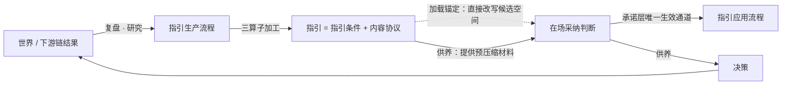

# 指引的质量：它是什么、什么值得写、怎么采纳、该有多大权力、怎么退役

## 这份文档在讲什么

前一份文档《[判断的质量](./判断的质量.md)》确立了一个坐标系：判断是「重写主体接下来计算图」的认知调度实体。但重写计算图的东西不只有判断——**指引**是另一大类：当我们处在特定情境下，加载以**条件为索引**的可复用内容——经验教训、教科书方法论、临床指南、检查单、SOP、AI agent 的 skill/rule 文件。

指引带着一个天生的张力：它有质量，但它是**在具体经历那个情境之前**就产出的。复用性让它没办法完全站在实际情境里做好所有决定，所以很多时候它不能越俎代庖、充当控制其它思维走向的最高层。这份文档把这个张力拆开，回答五个问题：

- 指引在概念层是什么，它和判断、判断质量、指引条件、生产流程、应用流程之间是什么关系。
- 为什么指引不能越俎代庖——以及什么时候恰恰应该由它压过临场判断。
- 什么样的经验值得做成指引，什么样的原则上做不成（条件写不出来）。
- 拿起一份指引时，「采纳」这个动作本身的质量怎么保证。
- 指引失去了判断天然的死亡机制，靠什么退役，才不会烂在库里继续误导人。

讨论范围限定在**明确的理性思考**之内：指引被显式加载、显式采纳的场景。内化成直觉后自动触发的部分不在本文范围（在相关处会标注边界）。

每一节都配叙事例子。例子不是装饰：它把「同一个起点，换一种做法，走向完全不同的结局」这个分叉在具体情境里显形出来——读者是通过看到不同可能性的差别，才理解这个点在管什么。

---

## 指引是什么

### 三算子定义

> **指引 = 对一次或多次昂贵计算（复盘、研究、推导）施加三个算子后落盘的可复用认知制品：去承诺化（剥离押注，变为惰性）、条件显式化（把私有缓存键换成公共寻址键，即触发条件）、脱主体化（脱离原主体的计算图，可移植给任何人）。**

说白了：判断是活在某个人计算图上的「结果缓存 + 押注」；指引是把缓存值抠出来、贴上「何时可用」的标签、放上货架的罐头——货架上的罐头不喂养任何人，直到有人在场拿起它、并决定吃。

对照判断的三个成分，可以看清三个算子各自动了什么：

| 成分 | 在判断里 | 在指引里 |
| --- | --- | --- |
| 压缩索引 | 私有缓存键（那句结论），指向自己曾做过的推导 | 公共寻址键（触发条件），显式写给没做过那次计算的人 |
| 承诺 | 有——押注后续认知资源，主体承接下游链 | 无——惰性；教科书作者对你的案例零押注 |
| 折叠前提栈 | 同主体曾持有，原则上可展开复检 | 异主体、异时折叠；应用者从未持有，无法自行展开 |

> **例｜一次复盘，两种归宿**
>
> 老赵排查完一次线上事故，得出判断：「这类超时问题，先查连接池配置再查网络。」
>
> **归宿一：留在他自己脑里。** 下次再遇到超时，他直接照此行动——这是判断：带着押注（错了他自己扛），缓存键是私有的（他知道这条结论来自哪次排查、排除过哪些备选），前提栈他自己可以展开。
>
> **归宿二：写进团队 wiki。** 这一写，三个算子同时生效——他必须补一句「适用于使用连接池的 Java 服务」（**条件显式化**：自用时从来不需要写这个，因为他在场就能认出来）；新同事照着做出了问题，老赵不担这个锅（**去承诺化**：wiki 条目对读者的案例零押注，所以临床指南首页都印着「本指南不能替代临床判断」）；新同事读到的只有那两行字，读不到老赵脑里排除过的五种备选和当时的排查现场（**脱主体化**：前提栈折叠在作者那里，读者展不开）。
>
> **这个例子在讲什么：** 同一句话，自用是判断、落盘给别人就是指引。三个算子不是修辞——每个算子都真实地拿走或改造了一样东西，而后面所有的麻烦（怎么采纳、给多大权力、怎么退役）都是这三次改造的账单。

### 七个概念怎么连起来

关系要点：

- **三层供养链**：指引供养判断、判断供养决策、决策改变世界。指引存在的经济学理由，就是让在场判断不必重做那次昂贵计算（医生开药时不重推药理学）。
- **指引由判断外化而来**：生产流程的本质就是把某次判断及其下游结局改写成「下次遇到 X 就 Y」。
- **指引条件 + 内容协议 = 指引，两条独立的质量轴**：条件写歪造成误触发、漏触发，与内容好坏无关。混在一起记账会把「误触发」错算成「内容坏」，毁掉维护信号。
- **指引条件是生产与应用之间唯一的契约接口**：生产者不在场（缺当下情境），应用者没做过那次计算（缺折叠前提栈），双重信息缺失之间唯一的桥，就是这句显式声明「我的折叠计算适用于何处」。
- **判断的适用边界，在指引里被前置外化成了条件**：同一份「何时成立 / 何时失效」的信息，判断里封存起来供事后并置，指引里显式化为事前的寻址键——时间位置正好相反。

### 两个容易漏看的关系

**加载锚定**：指引一经载入注意力，就直接改写了候选空间和注意力分布——**不需要任何采纳**。这是对「指引只经判断生效」的必要修正：那个命题只在承诺层成立，加载层承认直接作用。

**题型转移**：采纳指引不会减少在场判断，而是把判断的题型从**对象层**（这个问题的答案是什么）转移到**适配层**（条件命中吗、来源可信吗、有例外迹象吗、押上下游链值不值）。所以「这次按老规矩办」是一次真判断——它押注资源、关闭审议分支、折叠了「此情境属常规」的前提，三成分俱全，只是前提栈薄。

> **例｜没被采纳的指南，改写了什么**
>
> 一个 agent 接到任务，触发条件命中，加载了一个数据迁移 skill。它评估后判定「本任务不适用这个 skill」，没有采纳。
>
> 对比另一个平行世界：同一个任务，这个 skill 从未被加载。
>
> 两个世界里 agent 都「没有用这个 skill」，但它们的后续计算图**不一样**：加载过的那个，规划时的候选方案列表已经被 skill 的框架塑形——它考虑过、然后排除了 skill 里的方案，而未加载的那个根本没往那个方向想。医生版本完全同构：读到指南推荐后即使判定不适用，鉴别诊断列表已经被锚定了。
>
> **这个例子在讲什么：** 「拒绝采纳」不等于「没有影响」。加载本身就是一次对候选空间的改写，这就是加载锚定——它意味着「加载哪些指引」这个上游决定，比看起来重要得多（这也是后文「触发条件写多宽」成为真问题的原因）。

---

## 为什么指引不能越俎代庖——以及什么时候恰恰相反

这是全文的枢纽，你带着的那个原始张力，在这里有一个干净的结构答案：

> **指引质量是分布性质：在其条件命中的情境总体上、相对主体裸奔的期望提升量。判断质量是点性质：这一次下游链的质量。分布最优 ≠ 点最优。**

说白了：指引是为「这一类情境的平均」优化的，在场判断是为「眼前这一个」优化的。指引不能越俎代庖，不是因为它不够好，而是**它按定义就不为这一个点优化**——再高质量的指引，在分布的尾部（生产者没见过的非典型情境）也会给出错误答案。

同一个变量立刻给出**反转条件**：当在场计算退化——应激、疲劳、新手、时间压力、被对抗性操纵——使「这一个点」的期望质量跌破分布均值时，指引**合法地**压过在场判断。

> **例｜同一份检查单，两种权力**
>
> **情境一：** 资深医生面对一个带罕见禁忌症的患者。指南说「此类症状用 A 药」，但医生在场看到了指南生产分布之外的特征。这时让指南压过医生，就是「照章办坏事」——点判断优于分布判断，指南应该让位。
>
> **情境二：** 同一位医生，连续值班二十小时后的深夜急诊。此时他的在场判断已经系统性退化（应激与疲劳损害复杂判断，这是实证结论），「我觉得这次不用走核对流程」这个念头本身就不可信。这时检查单强制执行是合法的——分布均值高于退化后的点期望。
>
> **这个例子在讲什么：** 「指引该不该压过临场判断」没有固定答案，它取决于一个可以变化的量：此刻在场计算的可靠程度。同一份指引，对状态良好的专家是参考，对退化状态的同一个专家是强制——这个反转条件是后文整个「权力分档」体系的地基。
>
> 附带一个诚实的补偿性发现：复用会生成使用样本，所以指引质量拥有判断质量在结构上不具备的**统计可评性**——单个判断没法统计，一份被用过一百次的指引可以。

---

## 什么值得做成指引：条件的表达力上界

生产端的第一个问题不是「内容怎么写好」，而是「这条经验的适用边界，写得成事前触发条件吗」。写不出条件的经验做成指引，就是在制造误触发。

### 四环链：条件要工作，必须四环都不断

> **一条指引条件要能工作，须依次满足：生产者在事前能命名出判别特征 → 该特征在触发时点能被便宜地观察 → 相关特征空间足够封闭、可枚举 → 特征与适用性的映射在发布后保持稳定。四环各自的断裂互不还原，断哪环，决定哪一类「写不成」。**

**类一：不可命名（命名环断裂）。** 判别信息不是某个可指认的属性，而是大量弱线索的联合构型——生产者能在场识别，却写不出谓词。用判断坐标系的话说：这类经验的适用边界在生产者脑内就从未以命题形式存在过，「条件显式化」算子没有输入可作用。对策不是硬写，而是换**识别者信号指引**：条件不再索引世界特征，改为索引「有训练的识别者报告了识别」这个事件——它是可命名、可观察的。另一条出路是训练/学徒制（把感知本身迁移过去），它在指引生产的范围之外，但要诚实承认它才是正解。

> **例｜写不出的「不对劲」**
>
> 一位资深护士看一眼病人就说「他不太对」——生命体征都在正常范围内，但两小时后病人恶化。医院想把这份能力做成制度。
>
> **做法一：硬写成谓词。** 分析她的判断，提炼成「呼吸频率 > X 且皮肤色度 < Y 时上报」。结果漏报一片：她识别的是几十条弱线索的**构型**，任何谓词子集都在判别维度上有损。
>
> **做法二：识别者信号条款。** 英国 NEWS2 早期预警体系的真实做法——评分表照用，但**额外保留「临床担忧」为独立升级触发项**：分数不高但护士觉得不对，照样合法升级。丰田安灯绳同构：任何工人的异常感即合法停线触发。
>
> **这个例子在讲什么：** 类一的正确对策不是把默会知识硬压成条件（必然有损），而是把「识别者本人」变成条件——世界特征写不出，「识别者报告了识别」这个事件写得出。

**类二：触发时点不可及（观察环断裂）。** 特征可命名，但在需要触发的那一刻观察不到。两个子型：**时点型**——条件索引的是潜变量、未来态，或者恰好是指引所引导的那次调查的*结论*；**成本型**——条件可查，但核实成本吃掉了指引本来要省下的计算，等于用规则的句法写了一个标准。对策：把条件**降维到症状层，做两段式指引**——触发条件只索引便宜可观察的前兆代理，指引正文的第一步是强制的在场核实。连便宜代理都找不到的，改做事后形态（复盘检查单、审计准则——特征在事后是可观察的），或者不生产。

> **例｜把答案当钥匙的触发条件**
>
> 有人写了一个排查竞态 bug 的 skill，触发条件写成：「当 bug 是竞态条件时使用本 skill。」
>
> 问题：「是不是竞态」正是用了这个 skill 排查完**才知道**的事。这个条件把答案当成了钥匙——按字面永远无法在需要它的时刻触发；实际发生的是 agent 靠别的线索猜「可能是竞态」，条件形同虚设。
>
> **改法：** 触发条件降维到症状层——「测试间歇性失败、不可稳定复现、与执行时序或负载相关时使用」；skill 正文第一步写「先用以下手段确认是否竞态，不是则退出」。触发管「像」，正文第一步管「是」。
>
> **这个例子在讲什么：** 类二的失败在临床决策规则那里有个反衬样板：Ottawa 踝关节规则之所以被真实采纳，正因为每个谓词都是床旁数秒可查的。条件里的每个词，都要问一句「触发那一刻，这个信息在场吗、查它贵吗」。

**类三：不可枚举（封闭环断裂）。** 每个个案的边界特征事后都说得清，但特征类是开放的——异质情形下事前枚举要么组合爆炸、要么系统性漏项。这是法理学两百年的老问题（规则 vs 标准之辨：行为高频同质 → 明线规则划算；情形异质 → 事后个案标准划算），法律的解法不是写更细的规则，而是**标准 + 判例库**：制品形态变为「评价目标 + 权衡因素 + 已裁决案例集」，靠在场的类比推理完成匹配。AI 环境对应：skill 正文写成原则 + 对照工作例，而不是触发谓词表。

**类四：自反消耗（稳定环断裂）。** 发布条件这个动作本身改变了它所索引的分布——对手读了条件就贴线规避或伪装特征。税法的百年经验：精确规则诚邀贴线安排，各法域最终都以「主要目的是获取税收利益」这类**意图级标准**兜底（一般反避税条款）；prompt injection 对着写死的防护规则精准绕行，同构。对策：规则可以有（处理善意常态流量），但边界必须由一条不可贴线的意图级标准守着，永远不指望精确线。

### 维特根斯坦地板：残差不可归零，但不是均匀的

规则遵循回归说：任何条件都不能自我应用，「此情境算不算一个实例」永远留一笔在场解释残差。说白了：条件写得再好，「这算不算命中」仍然要有人当场判。这个结论把「采纳判断必经」从经验观察**升格为逻辑必然**——它是「指引不能越俎代庖」的第二个、更深的结构原因。

但要拒绝强读法：由此推不出「所有条件同等不确定」。残差是连续量，被共享实践压低——检查单可验证地降低了执行方差就是直接反驳。所以它是全部四类之下的**地板**，不是第五类。

### LLM 语义匹配改变了什么

指引条件不再必须是机械谓词，可以是自然语言语义描述、由 LLM 在场解释——这是你的 skill 触发描述的现状。逐类判定：

- **类三被大幅收编**：规则 vs 标准权衡的前提是「事后个案裁决昂贵」，LLM 等于在每个应用时点配了一个廉价常驻裁决者——标准形态的条件（「当任务涉及不可逆外部副作用时」）第一次可以被机器触发。这是真实升级。
- **类二纹丝不动**：触发时点不在场的信息，匹配器再聪明也变不出来。这是信息论约束，不是表达技巧问题。
- **类四可能恶化**：对手改攻匹配器的解释过程，语义条件反而扩大攻击面。
- **类一部分松动，但代价隐蔽**：若判别构型恰在匹配器训练分布内，它能用自己的默会感知补上生产者写不出的部分——代价是引入一个不可审计、不可逐域验证的新依赖。

同时**误触发的形态变质了**：机械谓词的失效是边界清晰、可单测、可定位的硬漏判/硬误判；语义条件的失效是**软误判**——没有可检边界，触发面无法单元测试，契约接口失去了可测试性。瓶颈从「条件表达力」迁移到「匹配器解释质量 × 条件可测试性」，随之产生一项**新生产义务：语义触发条件必须内嵌正反对照例**——等于在条件里内联一个微型判例库。

> **例｜一句触发描述的两种写法**
>
> 写法一：「本 skill 用于网页自动化操作。」——三个月后发现它被加载进各种只沾边的任务：用户提到一个 URL 就触发、要抓一个 API 就触发。每次误载都锚定了 agent 的候选空间（加载锚定），而你**找不到一条清晰的边界**去修——语义匹配的失效没有可检边界，这就是软误判。
>
> 写法二：「用于需要操作浏览器完成的页面交互、表单填写、截图验证（use when）；不用于纯 HTTP 请求可完成的数据获取、不用于只需读取页面源码的任务（not for）。」——正反对照例把判别力预置进了条件本身，匹配器有了可对齐的锚点，你也有了事后排查误触发的参照。
>
> **这个例子在讲什么：** LLM 把「能不能触发」的上界抬高了，把「触发得准不准」的责任转嫁给了写条件的人。正反对照例不是文档美德，是语义条件时代的生产义务。

### 生产边界四问

落笔前依次问：

- **判别特征能命名吗？** 且：付过提取成本了吗（见下方反例）。不能 → 识别者信号指引，或承认该走训练，不做情境指引。
- **触发时点便宜可观察吗？** 不可 → 症状代理 + 两段式；连代理都没有 → 事后形态或不生产。
- **特征空间封闭吗？** 不封闭 → 无语义匹配器则做标准 + 判例库；有语义匹配器可做 skill，但必须附正反对照例。
- **发布后会被对抗性消费吗？** 会 → 意图级标准兜底，不写精确线。

四问全过 → 经典规则型指引，这是唯一「便宜且高保真」的甜区。

**本节自带的强反例（诚实声明）**：类一可能大面积是「没付提取成本」的伪装。小鸡性别鉴定曾是默会知识的教科书案例（专家说不出、只能学徒制），后来研究者通过专家-新手对照分析提取出了简单判别特征，一页说明书让新手接近专家水平——「不可命名」在那里被证明是言说努力的偶然状态，不是信息的内在属性。这个框架因此有一种失败方式：把一切难写的边界顺手扔进类一，为「写不出所以不写了」提供体面出口。补丁（本身未经验证）：归入类一必须附「提取尝试已做且失败」的证据，否则默认按类三处理。

---

## 拿起一份指引时：采纳判断的质量

《判断的质量》给出的五个先于验证信号（扰动重算、判别性失效条件、对手胜出区、前提独立性、校准历史），预设「主体持有那次计算」。采纳者恰恰没做过指引背后那次计算——对着他做扰动重算必然卡壳，但这不代表他采纳得差。信号失灵了吗？

**没有失灵，是瞄准错了层。** 采纳判断本身——条件命中吗、来源可信吗、有例外吗、押上下游值不值——是采纳者**自己当场做的一次计算**，他对这次计算是持有者。把信号重新瞄准到适配层，就全部评得动：扰动重算不再问「去掉指引的前提 X 结论怎么动」（评不动），而问「**如果你情境里的事实 Y 反过来，你还采纳吗**」（评得动——真做过条件核对的人结论会移动，模式匹配采纳的人会说「反正这是最佳实践」）。

### 采纳层五信号（按伪造成本比排序）

**S1 条件—事实映射件。** 采纳者能否产出一份映射：指引的每个条件 → 当前情境中满足它的**那个具体事实**（可循迹引用：文件路径、读数、用户原话、患者指标）。它与「打勾过检」的分界是双条件的：①**对照物异源**——条件由指引作者在见到你的情境之前写死，不是采纳者自产的测试；②**裁定项外部可读**——条件必须是「读外部事实」（样本量 ≥ N、端口被占用），不能是「要我裁定」（"适用于复杂场景"——「算不算复杂」仍由想通过的当事人自愿裁定）。缺①退化为融贯回填，缺②退化为打勾过检。

> **例｜两位新同事，同一条 wiki**
>
> 老赵那条 wiki（「这类超时问题先查连接池，适用于使用连接池的 Java 服务」）迎来两位读者。
>
> **新同事甲**：「我们这个服务也是超时，跟 wiki 说的很像。」——照做。他做的是整体模式匹配，「像」这个裁定是他自己发出的，没有任何外部事实被读过。
>
> **新同事乙**：逐条映射——「使用连接池？查了部署配置，这个服务用的是短连接直连，**没有连接池**。」映射件在第一条就断了。他退出这条指引，改走通用排查。
>
> 事后：这个服务的超时根因是 DNS，甲照 wiki 折腾连接池折腾了半天。
>
> **这个例子在讲什么：** 甲和乙的差别不是聪明，是**裁定权在谁手里**。甲的「很像」由想直接照做的自己裁定；乙读的是部署配置这个外部事实——事实说没有，他不需要「自愿承认不适用」，不适用自己显形了。这就是映射件的双条件在管的事。

**S2 判别性例外扫描。** 不问「适用吗」（裁定形提问，答案必然是「适用」），问「**这个情境有什么指引生产者当时没见过的特征**」（生成形提问）。质量读数：能否说出至少一个具体的、在场与否可查的击破特征。硬约束：**新手结构性不可用**——他不知道什么算例外。制度化的外包形态：药品说明书的禁忌症列表，就是生产者把例外扫描预制成条件核对交付给采纳者。

**S3 来源结构事实。** 内容评不动（折叠前提栈展不开），但制品的**履历**是无需领域能力就能读的外部事实：有无区分性证据、样本量、修订史、存活时长。关键辨析：只有**时间累积性**的履历项承重（修订史、存活史没法当场伪造），「引用了文献」这类表面形态可以廉价堆砌。循证医学 GRADE 体系的做法就是给证据质量而非结论本身分级。

**S4 机制—条件咬合度。** 裸命令式指引（只说做什么）完全评不动；带机制说明的指引允许降级版扰动测试（「这一步依赖的条件在我这在场吗」）。但注意：机制叙事本身的伪造成本在 LLM 时代已趋近零——真正承重的是**咬合度**：机制说依赖 X，条件栏是否恰好列了 X。跨两处编出互相咬合的假象，成本才逼近真做一遍推导。

**S5 撤出通道经济学。** 采纳质量不只关于「对不对」，还关于「错了拦不拦得住」。可观察特征：采纳当刻能否说出一条具体的**撤出通道**——错了会先在哪冒头、多久冒头、撤出要花多少（撤出通道：采纳出错后的检测与退出路径；说白了就是「这罐头要是坏的，我第一口就尝得出来吗，还是要吃完才知道」）。检测快、撤回便宜的场景，理性采纳阈值本来就该低。这是五个信号里**唯一完全不依赖信任任何人**的——不信生产者、不信制度、不需要领域能力——因此是对抗性场景和新手场景的兜底。

> 命名说明：本轮研讨的原始记录里，「撤出通道」和下一节的「偏离门」都曾被叫作「逃生门」，但它们是两个不同的东西——撤出通道管「采纳错了怎么退出」，偏离门管「在场判断想不服从指引时怎么合法偏离」。本文按一概念一名拆开命名；回查研讨原始记录时请注意这个用词差异。

### 新手悖论：信号层无解，解在结构层

最需要指引的人，恰恰最没能力做例外扫描和来源评估——这个悖论在「找更好的信号」方向上**无解**，必须承认。现实系统的解分三层：

- **制度代评**：监管、认证、平台准入把 S3 外包给有能力的第三方（处方药制度是极端形态：患者不做采纳判断，由医生 + 药监代做）。
- **外包失效后的残余排序**：权威失灵、利益污染时，按新手可及性还剩 S5（完全可及）＞ S1（条件若是可观察事实则可及）＞ S4（读咬合比生成例外门槛低）＞ S2/S3 的分布距离项（阻断）。
- **改问题结构**：新手的理性动作往往不是更好的事前评估，而是**把验证变便宜**——让 S5 的检测通道人为提前。

> **例｜新手采纳部署教程的两种姿势**
>
> 一个没碰过数据库运维的开发者，照网上教程给生产库做参数调优。
>
> **姿势一：** 评估教程质量（他评不动）、然后全量照抄到生产库。例外扫描？他不知道自己的库有什么教程作者没见过的特征。这是把自己评不动的采纳判断硬做了一遍，然后押上了不可逆的下游。
>
> **姿势二：** 承认评不动，改动结构——先在测试库上跑、开启回滚快照、只调一个参数观察一天。教程还是那个教程，他的采纳判断质量并没有提高；**但错误的代价被他改小了**，撤出通道被人为提前到了第一天。
>
> **这个例子在讲什么：** 新手悖论的正解不是「新手要学会鉴别」（劝诫），而是换问题：评估能力短期不可得时，把「采纳对不对」这个答不出的问题，换成「错了多快能发现、多便宜能退出」这个答得出的问题。

### AI agent 采纳 skill 的具体化

- **可机械化**：S1——要求 agent 调用 skill 前产出引用式条件映射（WHEN 子句逐条 → 当前任务的具体事实引用），引用的存在性可程序校验，这是对 LLM 事后虚构映射的结构性防御；S5——按任务可逆性（有无 dry-run、git 可回滚、有无外部副作用）自动设采纳阈值；**校准台账**——agent 环境的独有优势：每次 skill 触发与任务结局都有日志，skill 级命中率可自动积累，而且反馈以小时计，天然满足「校准历史只在快反馈领域顶用」的前提。
- **可制度化**：S2——LLM 自生成例外受同语料限制，解法是前移给作者：skill 携带 WHEN-NOT 负条件清单，把例外扫描转化为条件核对（这与上一节的「正反对照例义务」是同一件事，两个单元独立推出，互为佐证）。
- **不可机械化**：分布距离（任务是否落在 skill 生成分布内，agent 缺乏所需的分布知识）；以及一个元问题——agent 的采纳推理由「想继续执行」的同一网络生成，测试同源在适配层原样复发，解法同判断层：采纳推理必须落成日志工件供事后归因，不能只是内部激活。

**本节自带的强反例（诚实声明）**：**校准采纳者假阴性**。老练医生看一眼就说「这指南不适合这个病人」，五个信号全挂——没有显式映射、说不出例外推导、没查过修订史——但采纳质量极高，因为他的模式匹配器被十年快反馈校准过。本信号体系与校准历史是**互替品**：有可查校准台账的领域，过程信号应让位（这与判断层「隐性专家假阴性」是同一条边界的采纳版）。

---

## 指引该有多大权力：冷热分权三件套

现在回到你的原始张力的操作面：指引既然不能越俎代庖、又存在合法反转，那权力到底怎么分？

先立两个术语：**冷态** = 不在情境压力中、按分布思考的时刻（写规则、复盘的你）；**热态** = 指引条件命中的当下、在场判断正在运行的时刻（起飞滑跑中的你）。

> **正确的权威关系不是给每条指引选一个固定强度，而是一套结构：冷态设定档位 + 热态只留有限的偏离门 + 强制事后审计把热态行为变回冷态数据。**

为什么必须是结构而不是档位：指引面临两个方向相反的失败——情境非典型时锁死会**照章办坏事**，在场退化时放开会**裸奔**——单一档位无法同时应对。航空业的成熟组合（检查单强制 + 机长紧急权限这个狭窄通道 + 不问结局好坏的强制事后审查）三者并存、缺一即出事故史。

### 五档谱系

档位按「指引占据结论槽位的程度」排序：

| 档 | 名称 | 对在场计算图做什么 | 个人 + AI 环境的例子 |
| --- | --- | --- | --- |
| T0 | 注意力导向 | 只改写「检查什么」，不给答案 | 「改并发代码须检查取消与超时路径」——照此检查，结论自己算 |
| T1 | 默认值 | 无在场计算时占位；有计算时零成本偏离 | 「新组件默认放 `src/components/`」 |
| T2 | 先验 | 必须进入权衡并计权重，但可静默偏离 | 「优先复用现有工具函数」——权衡后可不说明地新写 |
| T3 | 举证责任转移 | 可偏离，但须在行动时留下不可重写的书面理由 | 「不得跳过失败测试；确需 skip 须在提交信息写明原因与恢复条件」 |
| T4 | 硬约束 | 禁止热态偏离，只能冷态修订；**必须机械执行**（hook/CI/lint） | 「禁止把密钥写入任何输出」由 hook 拦截 |

一条要紧的实话：**纯文本宣告的 T4 必然静默降级为 T2**——没有机械执行的「禁止」只是措辞比较重的建议。个人环境里那不是低配 T4，是错标。

定档由四个变量决定：**在场退化的类层证据**（含对抗性操纵通道——提示词注入是对 AI 在场判断的对抗性退化，文本规则防不住，这类必须 T4）；**错误代价的不对称性**——偏离出错是灾难侧 → 抬档，但**顺从出错是灾难侧**（非典型情境照做会坏事）→ 封顶 T3，必须保留在场偏离权；**情境典型性**（离指引生产分布远 → 封顶低档或退到 T0）；**反馈环质量**（错误快速廉价显形 → 降档让现实管教）。

### 死循环怎么斩断：偏离门与单向棘轮

递归难题：档位由谁定？如果在场判断有权决定指引的权威档位，那指引恰恰约束不了在场判断的坏状态——应激时你会「判断」自己不需要检查单。如果档位完全事前锁死，又回到越俎代庖。

斩断靠**时间分权**：档位旋钮只在冷态可转，热态拿不到旋钮，只有**偏离门**——热态偏离指引的唯一合法通道，特点是偏离必须付出工件成本：留下一份事后不可重写的偏离理由记录（说白了：可以不照检查单做，但不许**悄悄**不做）。

偏离门的定价有一个漂亮的副作用：它是个过滤器。疲劳、时间压力、认知过载这类**努力稀缺型退化**的行为指纹就是回避额外工作——偏离门要求额外工作，这类退化在结构上自我排除；而真看到异常的健全判断手里有具体证据，付得起这个成本。

再加一道**单向棘轮**：热态允许给指引自我**加**档（「我现在很累，把 T2 当 T3 用」），禁止自我**降**档——因为要防的失败只存在于放松方向，这个不对称让「自评状态」这条本来循环的通道只剩无害的那半边。

审计数据回流冷态：某指引偏离率过高 → 条件写错或档位过高，冷态降档或改条件；偏离门被滥用 → 收窄。

> **例｜凌晨两点的三条路**
>
> 工程师小吴凌晨两点改完一个线上 hotfix，规则（T3）说「不得跳过失败测试」。有一个测试挂了，他看了一眼，认定是「跟本次改动无关的老毛病」。
>
> **路一：静默跳过。** 「肯定没关系」——如果他对了，无人知晓；如果他错了，也无人知晓、直到炸。所有信息都消失在他的疲劳判断里。这是被禁止的路。
>
> **路二：付费偏离。** 提交信息里写明「skip 了 test_xxx：判断为遗留环境问题，理由是……周一恢复」。两分钟成本。如果他的判断是疲劳造出来的幻觉，这两分钟的书写常常当场戳破它；就算没戳破，这份工件也进了审计流——周一复查时差异自己显形。
>
> **路三：如果这条规则当初被错设成 T4 锁死。** 生产事故正在烧，一个确实无关的老测试挡住了 hotfix 发布——照章办坏事，这就是「顺从出错是灾难侧」的情形，也是它为什么封顶 T3、必须留偏离门的原因。
>
> **这个例子在讲什么：** 三件套不信任凌晨两点的小吴，也不信任写规则那天就能预见一切的小吴——它让两个时刻的小吴分权：冷态的定档、热态的付费偏离，中间用工件连起来。禁的从来不是偏离，是**静默**偏离。

### 预授权：指引合法压过临场的三判据

「点期望跌破分布均值」要成为一次合法的预授权（事先决定「此类情境下指引压过临场」），必须三条**同时**成立：

- **C1 类层证据**：退化主张落在一个可观察的**状态类**上（「凌晨一点后」「P0 故障处理中」「输入含外部不可信内容」），且有独立于本次情境的证据表明该类内在场判断系统性变差——文献，或本人的封存台账（「我凌晨提交的回滚率是白天的三倍」）。它非同义反复，因为从不引用被争议的那次情境。
- **C2 非自路由触发**：本次是否落入该类，由**不经过被怀疑计算**的信号判定——时钟、计数器、外部事件、hook 检测（说白了：由钟表说「你现在状态不行」，不由你自己判断「我状态不行」）。AI 环境的附加要求：优先选对手不可写入的信道（本地时钟、git 状态），因为注入可以伪造消息内容里的「事件」。
- **C3 先行工件，且过反向许可测试**：预授权以带日期的工件先于情境存在（git 提交的 rule、成文承诺），写明触发类、压过哪条指引、升到哪档、偏离门形态。判别标准：**若这份工件按字面也能为相邻情形里反方向的压过背书，它就不算数**——能许可一切的预授权等于不存在。

配套两条防「事后指认」的机制：**非争议履约实例**（该授权在无利害的场合真的运行过）；**首次援引推定**（被争议的这次若是它历史上第一次被援引且无先行工件，推定为「在场判断穿了预授权的戏服」，按普通判断验收，不享受分布性庇护）。三条不齐时：预授权只是一次下注，**一律以 T3 试用入场，T4 必须凭审计数据挣得**。

> **例｜同一句「太晚了，不该做重构决定」**
>
> **版本一：** 半年前，老周复盘自己的台账，发现凌晨提交的代码回滚率是白天的三倍（C1：类层证据），于是提交了一条 rule：「23 点后禁止合并重构类 PR，产生的冲动记入 backlog 次日处理」，由 CI 按提交时间戳拦截（C2：时钟触发，不经他自己判断）。此后这条规则拦过他四次，其中三次他次日看都庆幸没合（履约实例）。今晚它又拦下了他——这是合法预授权在工作。
>
> **版本二：** 老郑今晚熬夜写了个大胆重构，同事质疑，他说：「其实我一直有个原则，深夜的激进想法要放一放……不过今晚这个我想清楚了，是例外。」——没有先行工件（C3 失败）、「落不落入状态类」由他自己现场裁定（C2 失败）、「我一直有」无法独立指认（首次援引推定生效）。这不是预授权，是在场判断给自己穿了件预授权的戏服。
>
> **这个例子在讲什么：** 预授权的全部效力来自「它先于诱惑存在、且触发不经过被诱惑的那颗头脑」。事后能被随口援引的原则，恰恰因为随口，什么也压不住。

预授权本身按判断杠杆定律是最危险的一类实体（压缩比极高——整类未来情境压成一条规则；反馈被**反事实遮蔽**——约束一生效，你就永远观察不到在场判断本来会怎么做，正常运行攒不出命中率；评分内生）。所以它无豁免资格，强制档 2 待遇：封存（触发类与证据来源、预期偏离率区间、带时限的失效条件、复查日）+ 复查日并置；用偏离门工件和**顺从摩擦笔记**（热态想偏离而没偏离时留一行记录，复查日由 AI 以生成形任务盲评「若当时偏离会怎样」）补偿反事实遮蔽；对罕见触发的硬约束做**机制演练**（实测 hook 还拦不拦得住——机制静默失效等于预授权已死而无人裁决）。

**本节自带的强反例（诚实声明）**：**雄辩型退化穿透成本过滤器**。偏离门过滤的前提是「退化 = 不愿付额外努力」；但动机性推理型退化恰恰以廉价量产理由为本职——亏损中的交易员**乐意**写长篇偏离备忘录去加仓。对这类退化，三件套从「过滤器」降级为「延迟 + 留痕」：挡不住坏偏离，只保证模式在复查日显形。航空靠他人审计和职业后果兜底；个人 + AI 环境缺这一层，部分补救是偏离工件强制走封存-并置、预先承诺机械后果（「三次复查判坏 → hook 自动收窄偏离门」），但后果的执行最终仍系于同一个人——这正是判断层「外生锚点的递归只能被第二方截断」在指引层的重现。

---

## 指引怎么退役：死亡机制

### 不死性腐烂：落盘的账单

判断有个天然的清理器：闲置退化定理——没人再引用它，它自动消亡。指引落盘的设计目的恰恰是对抗这个定理（让结论跨时间、跨主体存活），代价是**失去自动死亡机制**：腐烂的指引不会自己消失，会带着执行协议的权威性继续存活、继续被条件索引命中。这个风险形态叫**不死性腐烂**（说白了：判断过时了会被遗忘，指引过时了还在值班）。

> **例｜三年前的部署文档**
>
> 三年前老赵口头跟团队说过「部署前要手动清一次缓存」（当时的架构确实需要）。架构改造后没人再提，这个判断自然死了——闲置退化，无声无息，也无害。
>
> 同一句话如果当年写进了部署 SOP：三年后新人入职，照着文档认真地手动清缓存——在新架构下这一步不但无用，还会引发一次不必要的服务抖动。新人不会怀疑文档：**它带着 SOP 的权威**。没有任何机制通知这份文档「你依赖的世界已经不在了」。
>
> **这个例子在讲什么：** 同一个结论，不落盘会良性死亡，落盘就获得了不死性——而不死性和腐烂叠加，比遗忘更糟。落盘不是免费的保鲜，是签下了一份维护义务。

病因可以定位得很精确：落盘切断的不是「死亡」，而是**「引用 = 再背书」这条通道**。判断每次被引用，都是主体当下的一次再背书；指引被条件索引自动加载后，「被引用」退化成机械命中——加载量再高，也证明不了它还该活着。所以替代机制的合格线是：**凡不携带背书信息的信号（存在时长、加载次数）一律不合格**。

### 核心倒置：死亡自动，复活才是判断

「谁来判定一份指引该死」是个陷阱问题——设一个法官，就踩回「自愿裁定」的坑。正确做法是消解它：**不设裁定死亡的法官，死亡一律由可观察事件自动降级；被判断的只有复活**。复活作为判断是合法的：复活者恰好是此刻真实要用它、承接下游后果的在场主体，且决定做在 AI 呈上的证据（前提 diff、否决日志、演练报告）之上——那是一次微型并置，不是空白背书。

现实的对照实验早就做完了：TLS 证书过期由基础设施强制执行（握手直接失败），**续期才是人的行为**，所以它真的在工作；美国州立法的日落条款只是「到期提醒」、没有强制力，结果常年例行续期成橡皮图章。**有牙的自动降级 + 人工复活**，对上**无牙的提醒 + 人工确认**——前者活着，后者名存实亡。

死亡的对象是**权威，不是存在**。降级走阶梯：**活跃**（自动加载 + 协议权威）→ **留观**（还在库里、还查得到，但不再自动生效，附着触发降级的证据）→ **归档**（不加载、可检索、版本链保留）→ 删除（几乎不用）。所有机制只自动下推一级，一切上移都是人的复活行为。解耦之后，「腐烂存活」与「有效被误杀」两类错误的代价可以分开优化——误杀变成可逆的。

### 第零机制与五个探测器

**第零机制：最小化无条件加载层。** 不死性腐烂的烈度正比于加载的无条件性。把 always-on 资格当稀缺品，大多数指引放进按需索引——此时「被选中加载」重新成为使用现场的背书行为，闲置退化定理对这一层**自然恢复生效**。最好的死亡机制，是少去杀死天然的死亡机制。

| 机制 | 探测哪类腐烂 | 触发什么 | 自身怎么失效 |
| --- | --- | --- | --- |
| **否决记账** | 条件轴：被加载但被在场判断否决的比率升高 = 条件失准的领先信号（采纳现场即产生，不用等下游结果） | 否决率越线 → 自动降留观 | 静默遵从的坏指引全盲（照做了但内容烂，否决不发生）；低频件无样本 |
| **前提哨兵** | 前提轴：落盘时显式列出依赖的可观察世界前提（工具版本、路径、组织事实），AI 监视 | 前提变化 → 降留观 + 附 diff | 瞄准漂移——学会挂永不触发的漂亮前提；软前提（职责、市场）不可监视 |
| **有牙日落** | 兜底轴：为一切未被探测的腐烂设最大存活时限 | 到期无干净使用 → 自动摘出加载索引，生成复活卡 | 复活卡积压 → 批量橡皮图章（打勾过检还魂） |
| **替代链** | 内容轴（活跃领域）：新指引落盘强制声明取代/冲突关系 | 替代成立 → 旧件即时归档留回链 | 只在还在耕作的领域生效，弃耕角落永不触发 |
| **演练** | 执行轴（零样本件）：低频高价值件按周期由 AI 干跑，核对每步可执行性 | 断步 → 降留观 + 断点报告 | 演练仪式化——学会写永远通过的演练 |
| **容量上限** | 不探测腐烂，是成本闸：活跃层设硬预算（always-on 的 token 成本是天然物理量） | 超限 → 留观层最久滞留者归档 | **禁止按使用频次驱逐**——那会精准误杀低频高价值件 |

**假死问题**（还有效的指引被误杀）靠三件事叠加压住：分类前置（落盘时给「低频高价值」件打标签，改走前提哨兵 + 演练轨，不入使用信号轨）、权威/可得解耦（误杀可逆）、合成样本（演练制造现实不肯提供的使用证据）。

> **例｜没演练过的预案**
>
> 一家公司的灾难恢复预案躺在 wiki 里两年，按「使用信号」它早该被日落——但它是典型的低频高价值件，真实使用样本天然为零，误杀它的代价是灾难级的。
>
> **路一：不演练，留着。** 事故夜到来，照预案执行到第三步：备份恢复命令依赖的工具两年前已升级换名。GitLab 2017 年的真实事故正是这个形状——事发当夜发现多重备份机制没有一个真正可用。预案「存在」了两年，「可执行」早就死了，没人知道。
>
> **路二：周期干跑。** AI 每季度把预案的每一步核对一遍可执行性（命令还在吗、路径还在吗、权限还在吗），第三步断了 → 降留观 + 断点报告 → 有人修复后复活。演练制造了现实不肯提供的使用样本。
>
> **这个例子在讲什么：** 对零样本的指引，「没出过问题」和「能用」是两回事——未演练过恢复的备份不算备份。演练是给这类件专设的死亡探测器：不等真实使用，主动制造一次「引用」。

### 人和 AI 的分工边界

AI 可承担全部「探测与显形」：记账、前提监视、diff 生成、到期簿记、演练执行、重叠扫描。人有三件**不可转移**：落盘时的瞄准（挂哪些前提、打什么标签——这次选择在机器保护范围之外）、复活背书（背书必须来自承接下游链者；让 AI 裁定复活是裁定形任务，给顺从性供能，且 AI 是不承接后果的评审者）、容量预算。

与《判断的质量》那套机器的对接：**指引 ≈ 自带触发条件的封存件的推广**——复查日推广为事件驱动的多触发器（哨兵、日落、替代、演练都是广义复查日），失效条件推广为可监视前提链，并置裂成两种（使用现场「在场判断 vs 指引指令」的微型并置 = 否决记账免费获得的 P2，和复活卡上的证据并置）。三处不同：指引无限复用，机器必须事件驱动 + 高度自动化否则成本崩盘；指引有权威，多出权威阶梯；瞄准问题原样迁移。

**本节自带的两个强反例（诚实声明）**：其一，权威/可得解耦假设「留观件降了权威危害就大减」，但对 LLM 消费者，进了上下文的文本即使带着「前提已失效、仅供参考」的横幅，仍可能照常锚定生成——LLM 对降权标注的实际折扣率未知且经验上偏弱；若折扣近零，阶梯在 AI 消费场景塌缩成「加载/不加载」二值，假死权衡全额回归。其二，**软启发式指引整族逃出死亡机制**——「先判断阅读任务再动笔」这类认知姿态规则：前提不可监视、遵从是程度量记不了否决、无法干跑演练，五个探测器全失效，只剩必然退化的裸日落。对这一族，替代死亡机制**不存在**，只有第零机制一条路：按需加载，恢复自然死亡。

---

## 这一轮拼起来才看见的东西

**三处独立汇合**（不同单元、不同路径推出同一结论，置信互相增强）：

- 仲裁单元的「偏离审计数据」与死亡单元的「否决记账」是**同一份工件**——每次在场判断对指引的偏离/否决，同时喂两个机制：给档位调整供数据，给条件腐烂供领先信号。
- 采纳单元的 WHEN-NOT 子句与表达力单元的正反对照例义务，**独立汇合**于「触发描述必须携带负例」。
- 仲裁（档位在冷态定）、死亡（复活判断做在证据之上）与判断层方法论**共享同一设计哲学**：把人的判断从热态/自动层移到冷态/证据之上——热态和自动层只做显形，不做裁定。

**一个上层发现**：三个单元各自独立撞到了同一堵墙——仲裁单元的雄辩型退化穿透成本过滤、采纳单元的咬合度对同源流畅虚构失效、表达力单元的类四对抗恶化。合并后的形状：

> **在对抗性或流畅生成的环境下，一切「合作性信号」集体塌缩；最后站着的永远是三样东西：时间累积的外部事实（修订史、台账——无法当场伪造）、非自路由的机械通道（时钟、hook——不经过被怀疑的头脑）、经济学结构（撤出通道成本、偏离门定价——不依赖任何人的诚实）。**

**瞄准问题第三次现身**：判断层是「封存瞄准」（失效条件封在哪个面上），指引层变成「哨兵瞄准」（前提哨兵挂哪些前提）和「演练仪式化」（演练场景写什么）——都是同一个头脑在机器保护范围之外做的选择，按内生腐蚀定理必然漂移。三轮研讨里这个洞以三种形态出现，已知的唯一部分缓解始终是同一个：让 AI 以生成形任务盲提（失效条件、前提链、演练场景），把瞄准移出同源网络。它还没有被正面攻坚过。

---

## 边界、置信与未知

### 适用边界（哪些地方这套结论不管用或未覆盖）

- **只覆盖明确理性思考**：指引内化成直觉后，采纳判断作为显式行为消失，本文全部机制不适用。
- **强制合规场景解释力弱**：制度制裁下照章办事的「采纳判断」稀薄到只剩「服从或退出」，三算子模型在这里接近可证伪边缘。
- **多人组织环境未推导**：全部结论以个人 + AI 协作环境为锚定域；航空、临床的制度锚点移植过来时，其纪律来自职业后果，个人环境强度降级。
- **软启发式指引**：死亡机制整族失效（见上文），只有按需加载一条路。
- **指引相互引用的级联**：A 依赖 B、B 被自动降级后 A 静默残废——需要依赖链登记，本轮未展开。

### 置信分层

- **实证支撑**（有制度实存、文献或真实事故）：指南免责句的制度化；应激下检查单优于临场推导；锚定与议程设置效应；GRADE 给证据而非结论分级；临床告警按否决率退役；指南库对超期未复审件摘牌；证书过期 vs 立法日落的有牙/无牙对照；RFC 替代链；GitLab 备份事故；规则 vs 标准的法学判据；反避税的意图级标准兜底；Ottawa 规则因床旁可查而被采纳；小鸡性别鉴定的特征提取成功；NEWS2 保留临床担忧触发。
- **推断**（本轮推导，未独立验证）：三算子本体；分布/点对偶及反转条件；五档谱系与四定档变量；单向棘轮；预授权三判据；采纳五信号的重瞄准及排序；死亡自动/复活判断的倒置；四环链与四类划分；LLM 三向影响与对照例义务；「对抗环境三硬通货」的上层归纳。
- **未知**：LLM 对降权横幅的实际折扣率；否决率、日落周期、容量上限的健康数值；演练仪式化的漂移速度；偏离门留痕对雄辩型退化「显形之后行为是否被修正」；顺从摩擦笔记在热态的真实留存率；S1 映射件强制执行会否退化为合规表演；类一中「可提取比例」的总体分布；语义触发面可测试性丧失有无工程补救；个人级审计（AI + 机制充当第二方）能否实际管教行为。

---

## 对 skill/rule 体系的直接含义

这轮结论几乎可以直接当作 AI 协作指引体系的设计规格：

- **alwaysApply 是稀缺品**：按 T4 判据保留（存在对抗通道、错误灾难不可逆、可机械检测），其余降为按需加载——这同时是权力问题（第零机制之前先问「它配 T4 吗」）和寿命问题（always-on 杀死自然死亡）。
- **触发描述带正反对照例**：use when X / not for Y 是语义条件时代的生产义务，不是文档美德。
- **心态类 skill 的正确形态**：它们属软启发式族——按表达力上界该写成「标准 + 判例库」（原则 + 对照工作例），按死亡机制该走按需加载靠自然选择维持生命，不给 always-on。
- **agent 侧三件可机械化**：调用 skill 前产出引用式条件映射；按任务可逆性自动设采纳阈值；从日志自动积累 skill 级校准台账（同时就是否决记账的数据源）。

---

## 下一轮接口

- **触发宽窄的代价函数**：宽触发多加载、多锚定、多供养，窄触发少误触发——真实代价函数是什么、加载锚定的净值符号何时翻转。这是本轮五个候选问题中唯一未派发的，直接决定 skill 触发描述写多宽。
- **软误判的工程补救**：语义触发面能否建回归测试集，把「可测试性丧失」部分赎回。
- **瞄准问题的正面攻坚**：AI 盲提已三次作为部分缓解出现（失效条件、前提链、演练场景），值得单独研讨它的成立条件和失效方式，而不是继续当补丁用。

---

## 一页速览

- **指引 = 判断的罐头**：去承诺、条件显式化、脱主体三算子加工后的落盘制品。惰性、可复用、须采纳——后面所有麻烦都是这三次改造的账单。
- **不能越俎代庖的结构原因**：指引质量是分布性质，判断质量是点性质，分布最优≠点最优；在场计算退化到点期望跌破分布均值时**合法反转**（应激下的检查单）。
- **什么值得写成指引，看四环**：判别特征能命名、触发时点便宜可观察、特征空间可枚举、发布后稳定。断哪环有哪环的替代形态（识别者信号 / 症状代理两段式 / 标准+判例库 / 意图级标准兜底）；LLM 抬高了上界但把误触发变成软误判——触发描述必须带正反对照例。
- **采纳是一次自己持有的判断**：把五信号瞄准适配层——条件逐条映射到可引用的本地事实、生成形地问「什么情况下它不适用」、只信时间累积的履历、查机制与条件咬不咬合、采纳当刻说出撤出通道。新手评不动时，改结构：把验证变便宜。
- **权力靠冷热分权三件套**：冷态定档（T0–T4，纯文本 T4 必然降级）、热态只留付费的偏离门（禁的是静默偏离）、审计回流调档；热态只许加档不许降档；指引压过临场须预授权三判据齐备（类层证据、非自路由触发、先行工件），否则 T3 试用。
- **死亡自动、复活才是判断**：否决记账、前提哨兵、有牙日落、替代链、演练在可观察事件上自动降级（先撤权威后撤可得，几乎不删）；人只做三件——瞄准、复活背书、定预算。最好的死亡机制是少用 always-on，让自然死亡活着。
- **对抗环境下的硬通货只有三样**：时间累积的外部事实、非自路由的机械通道、经济学结构。一切依赖诚意的信号，在流畅生成面前都会塌缩。
