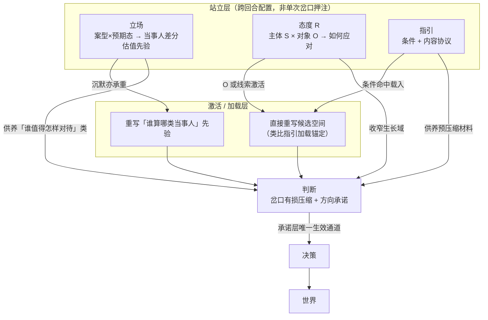

# 立场与态度：定义，以及它们和判断怎么连

## 这份文档在讲什么

《判断的质量》把判断定为「重写主体接下来计算图」的认知调度实体；《指引的质量》补了另一类可复用制品。继续往下，还有两类与判断关联极密、但不是判断本身的东西：**立场**与**态度**。

用户给出的种子定义是起点，不是终点：

- 立场：类似的事情和预期状态应用于不同主体，会有不同。
- 态度：主体持续生效的、对于其它特定主体和客体如何应对的配置，会影响后续思维、决策与行动。

本文按 CCR-SOP 压测后给出排他定义、近敌边界、客观定理，以及三者（加必要限度内的指引）之间**有类型、可对错**的关系。讨论范围限定在**明确的理性思考**语境——与判断/指引文档同域。

---

## 一、立场是什么

### 排他定义

> **立场 = 持立场者在明确的理性思考语境下，对「同类事情 × 同类预期状态」持有的一份可陈述的主体间差分估值配置：同一案型落到不同对象主体时，系统性地导向不同的对待、评价或资源分配。它重写的是「谁在此类事上算哪一类当事人」的计算先验，而非对世界的单次事实断言，也不是判断的对外社会投影。**

说白了：立场不是「我对 X 的看法」，而是「同一类 X，落到甲和乙头上时，我预先就准备不一样」。

### 函数签名

\[
\mathrm{Stance}(H,\, C,\, \tau,\, S,\, \pi)
\]

| 参数 | 含义 |
| --- | --- |
| \(H\) | 持立场者（人、团队、agent、制度代理人） |
| \(C\) | 事情类（案型） |
| \(\tau\) | 预期状态类（算搞好 / 算失败的状态类型） |
| \(S = \{s_i\}\) | 对象主体槽：案型可能落到的不同当事人 |
| \(\pi\) | 差分估值映射：\((C,\tau,s_i) \mapsto\) 对待/评价/资源权重 |

### 和近敌的绝对岔路口

| 近敌 | 绝对岔路口 |
| --- | --- |
| **观点 / 对外主张** | 朝向不同。观点是主张的对外社会投影，评价在听众接受；立场是 \(\pi\) 配置，可从不说出仍承重。 |
| **偏见** | 可陈述性。本域立场要求可陈述、可被失效条件探测；偏见常无意识、对抗证据时加固。 |
| **原则 / 价值观** | 抽象层级。原则是跨情境评价母本；立场是母本落到「谁 × 哪类事」的实例化。同一「公平」可生成互斥的两套立场。 |
| **偏好** | 参数维。偏好可不含主体槽；立场的承重维是「对谁」。 |
| **角色职责** | 规范来源。角色职责是制度规定的差异对待；立场是持立场者持有的、可修订的配置。仅「因角色必须不同」而自己无配置承诺时，是角色执行，不是立场持有。 |
| **态度** | 索引轴不同（见第三节）。 |

### 客观定理（摘）

1. **主体维不可消去**：去掉「同案型异主体可不同对待」，剩余物至多是原则、偏好或判断，不再是立场。
2. **沉默承重**：立场的存在不依赖对外说出；公开声明是可选外显。
3. **母本多实例**：同一原则可实例化为互斥立场；原则层一致不保证立场层一致。

### 对《判断的质量》近敌表的冲突（禁止静默改写）

《判断的质量》近敌表有一行「观点 / 立场」，把立场写成「判断对外表达的社会投影」。经本轮压测，那是**同名异义**——用户种子与服务立场文档所指向的，是差分估值配置，不是社会投影。

**修订建议（本文件不代改判断文档）：** 将近敌行改称「**观点 / 对外主张**」，废除该行对「立场」的捆绑；立场另立为与判断正交的配置实体。

> **例｜沉默的资源立场**
>
> 两名工程师出现同类技能缺口，预期状态相同。经理把 mentorship 与难题名额系统性地倾向正式编制新人，外包同事只给文档。半年后编制新人达标，外包被标「成长慢」。经理从未发表「我的立场演讲」——差异是 \(\pi\) 配置，不是偶发心情。
>
> **这个例子在讲什么：** 常态立场可以完全沉默；用「有没有表态」检验立场，会系统性假阴性。

> **例｜服务立场不是对外表演**
>
> 健康 agent 文档写明「用户是唯一委托方」。同一医疗情境下，对用户目标/连续性的权重系统性高于对机构流程顺畅的权重。这是当事人差分配置，不是「把某个判断讲给别人听」。
>
> **这个例子在讲什么：** 若把立场读成社会投影，会把服务坐标系的真正承重处看丢。

**强反例：** 谈判桌上纯战术性的「公开立场」——发言人按稿站边，私下资源分配完全另一套。日常仍叫「立场」，但本定义判它为观点/表演性对外主张（有其名、无 \(\pi\)）。这正是必须改近敌表措辞的理由。

---

## 二、态度是什么

### 排他定义

> **态度 = 主体 \(S\) 对其可指称对象（或对象类）\(O\) 所持有的、跨回合站立的「如何应对」配置 \(R\)；当 \(O\) 再临或相关线索激活时，\(R\) 重写 \(S\) 后续思维、决策与行动的计算图——它不是当场有损压缩的一次性押注，也不因当下未激活而自动消亡。**

说白了：态度是「对这个人 / 这类对象，我默认怎么应对」的站立配置；对方一出场它就加载，不必当场再做一次判断。

### 函数签名

\[
\mathrm{Attitude}(S,\, O,\, D,\, R,\, H)
\]

| 参数 | 含义 |
| --- | --- |
| \(S\) | 主体（态度主体绑定，不可脱主体移植） |
| \(O\) | 可指称对象或对象类（**必填**；可宽不可空） |
| \(D\) | 域/情境族（弱参数） |
| \(R\) | 「如何应对」站立核：默认审议深度、信任/戒备、协作松紧、解释框架 |
| \(H\) | 效力视界：跨回合站立直至被修订——不是意识上持续在线 |

### 「持续生效」压测结论

- 「持续」＝跨回合仍有效力，≠时刻被意识到。
- **闲置的态度仍可以是态度**：长期未激活，但 \(O\) 再临时仍自动加载 \(R\)。
- 与判断的**闲置退化定理异构**：判断闲置即失去「当前前提」身份；态度的存在锚在「再临时是否仍加载」，不锚在「此刻是否被引用」。
- 态度另有死法：**空壳退化**——\(O\) 多次出场而 \(R\) 从不塑形思维/行动 → 退化为自我叙事/表态信念。死于「激活失败」，不是死于「闲置」。

### 和近敌的绝对岔路口

| 近敌 | 绝对岔路口 |
| --- | --- |
| **情绪** | 时间形态：情绪是状态脉冲；态度跨回合站立，情绪走了 \(R\) 仍可在。 |
| **习惯** | 输出通道：习惯偏刺激→行为自动链；态度调度思维/决策/行动整包。 |
| **信念** | 承重形态：信念可闲置永不调度；态度在 \(O\) 出场时默认尝试加载 \(R\)。 |
| **判断** | 生成与存在条件：判断＝单次有损压缩＋押注，闲置→信念；态度＝跨回合站立 \(R\)，闲置≠消亡。 |
| **性格 / 气质** | 对象绑定：气质无特定 \(O\)；态度必须有可指称 \(O\)。「悲观气质」≠「对供应商的戒备态度」。 |
| **意图 / 动机** | 终点结构：意图指向可结算结局；态度无单一终点，是可服务多个意图的站立应对核。 |
| **立场** | 索引轴不同（见第三节）。 |

### 客观定理（摘）

1. **站立加载**：存在判据是「\(O\) 再临时是否仍加载 \(R\)」，不是「此刻是否被引用」。
2. **对象绑定**：无 \(O\) 的全局偏向不属于态度，属于气质通道。
3. **判断生成收窄**：\(\lVert R\rVert\) 越强，对 \(O\) 的替代应对审议越先被关掉——态度不取消判断，但改变判断的生长域。
4. **残差击穿**：稳定修订 \(R\) 的主通道是下游「解释不掉」的残差，不是对态度语句的命题反驳。

> **例｜常态：对产品经理的谨慎配合**
>
> 小王对产品经理小李持「谨慎配合」：需求先核边界、少扩 scope、沟通偏书面。三个月没有新的「我对小李如何」判断，但每次需求互动的审议深度都被 \(R\) 塑形。
>
> **这个例子在讲什么：** 态度不靠连续重判维持，却稳定重写对特定对象的计算图。

> **例｜极化：谈判中的假设欺诈**
>
> 买方对某供应商持「假设欺诈、绝不让步」。对方善意让步也被读成诱饵；试探性信任的审议分支几乎不开。
>
> **这个例子在讲什么：** 极值态度会先锁死判断能长在哪片地上——不是多做了几个判断，而是生长域被收窄。

**强反例：** 「我们的态度是零容忍」若只承担对外信号、从不改写内部审议，本定义判为非态度（社交表态用法）。本建模在理性调度承重范围内有意排除它。

---

## 三、立场、态度、判断怎么连

### 关系图

链上位置（可对错）：

> **立场（先验）+ 态度/指引（激活锚定）→ 判断（承诺）→ 决策 → 世界**

### 六条有类型关系

**1. 立场供养判断（上游先验，非近敌、非特例）**

立场重写「谁算哪类当事人」的计算先验，供养「谁值得怎样对待」类判断。它不是判断的特殊形态（缺单次岔口有损压缩＋方向承诺），也不是旧近敌表里的「对外社会投影」。

禁止：把「立场文档里的句子」直接等同「已采纳判断」；用「对外说出口」检验立场是否成立。

服务立场文档按**指引类外化**接：加载产生锚定，承诺层仍须经在场采纳判断。

**2. 态度收窄判断生长域；激活可直接改图**

态度 \(R\) 越强，关于 \(O\) 的判断生长域越窄。激活时态度可**直接**重写计算图（类比指引的加载锚定）；**资源押注式承重**仍须经判断——态度不必须经判断才开始承重，但关闭审议分支、押上下游资源须经判断。

禁止：「态度只通过判断才有效」；「态度激活＝已做判断」。

**3. 判断可沉淀 / 修订态度**

一次（或一族）关于 \(O\) 的判断，可沉淀为态度 \(R\)，或在激活冲突时修订 \(R\)。这是态度层的状态转移，不是判断「变成」态度后必然消亡。

**4. 立场 ∥ 态度：主轴正交，可独立，可叠合**

| | 立场 | 态度 |
| --- | --- | --- |
| 索引 | 案型 × 预期态 → 当事人差分 | \(S\) × 可指称 \(O\) → 如何应对 \(R\) |
| 管什么 | 这类事上谁算哪类人 | 对此人/此类对象怎么应对 |

可互相独立：HR 政策层「绩效优先于司龄」无对张三的态度亦可运作；对李四「见面先寒暄」未必有案型级差分母本。

**典型叠合**：立场「高潜新人＝可托付支付类模块的当事人」落到小林 → 态度 \(R\)≈「难任务默认派、review 松一档」。\(R\) 是实例，不是立场本身。

**5. 决策仍只消耗判断**

改变世界的决策仍走 `判断 → 决策 → 世界`。立场/态度插入在判断之前的站立与激活层：改的是计算图，不是世界。禁止「立场/态度 → 决策」跳过判断。

**6. 死亡机制三异构，不可死亡模态互换**

| 实体 | 怎么死 / 怎么重构 |
| --- | --- |
| 判断 | 失去承接（闲置→信念；或前提击穿后弃用） |
| 态度 | 闲置≠死；死于**激活空壳**（\(O\) 再临而 \(R\) 无法重写计算图） |
| 立场 | 不因沉默而死；死/重构于差分估值母本被显式替换、案型坐标系崩解、或当事人分类被系统性改写 |

允许的是**内容向**沉淀/实例化/上提修订，不是死亡类型互换。

> **例｜组织人事里的三层**
>
> 立场：「支付模块托付类事项上，已验证交付力的新人 > 司龄资深但未验证者。」
> 态度（对小林）：难任务默认派、review 松一档。
> 判断：「这次支付重构可以少盯小林」——岔口压缩押注，供养后续分派决策。
>
> **这个例子在讲什么：** 立场定当事人坐标系，态度定对具体人的默认应对，判断完成这次押注；决策「派给小林」只消耗判断。

---

## 四、对既有文档的回写建议

| 文档 | 建议 | 状态 |
| --- | --- | --- |
| 《判断的质量》近敌表「观点 / 立场」 | 改称「观点 / 对外主张」；立场另立为本文件定义的配置实体 | **待回写**（本轮不代改） |
| 《指引的质量》 | 服务立场文档可作为「指引类外化」的实例锚点；加载/承诺二分已够用，无需改定义 | 可选补一句交叉引用 |

---

## 五、置信、边界与未知

**适用：** 明确理性思考语境；组织资源/人事、谈判、AI 服务立场、对工具/方法论的应对配置。  
**不适用：** 纯情绪现象学；纯社交表态且零内部调度；无意识刻板印象（形状像 \(\pi\) 但缺可陈述性）；完全弥散的「对生活的态度」（\(O\) 过糊，塌向气质）。

| 分层 | 内容 |
| --- | --- |
| **实证** | 种子与旧近敌表同名异义；沉默配置可承重；服务立场文档是差分配置；态度激活改写对特定对象的审议；判断≠决策 |
| **推断** | 立场/态度诸定理的普遍性；立场∥态度正交；死亡三机制异构；立场文档≅指引类外化接法 |
| **未知** | 态度与立场的最小叠合阈值；沉默立场的操作化审计指标；态度沉淀→立场是否存在不可逆阈值；多立场/多态度冲突的仲裁层 |

---

## 一页速览

| | 立场 | 态度 | 判断 |
| --- | --- | --- | --- |
| 一句话 | 同案型异主体的差分估值配置 | 对特定对象的跨回合应对配置 | 岔口上的有损压缩＋方向承诺 |
| 索引 | 案型 × 当事人槽 | 主体 × 对象 | 单次岔口 |
| 改图方式 | 重写「谁算哪类人」先验（可沉默） | 对象激活时直接锚定候选空间 | 押注后开/关分支、设默认 |
| 与决策 | 不直接→决策 | 不直接→决策 | 决策唯一消耗它 |
| 怎么死 | 母本重构 / 坐标系崩解 | 激活空壳（闲置≠死） | 失去承接（闲置→信念） |
| 和另两者 | 可实例化为态度；供养对待类判断 | 收窄判断生长域；可沉淀自判断 | 承诺层枢纽 |
