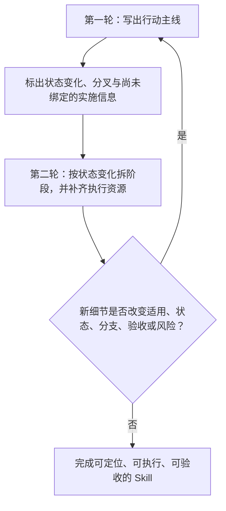

# Skill 的两轮编写：先定行动主线，再组织执行资源

> 作为编写时的检查顺序，先让 Agent 知道自己为什么、在什么条件下、沿哪条路径行动；再让它能够在当前环境中精确地完成行动。第二轮的新信息若推翻前者，必须回写主线。

[《Skill 的体裁：以认知叙事组织指导层》](Skill的体裁：以认知叙事组织指导层.md)已经区分了 Skill 的指导、执行和资源职责，但仍留下一个实际写作问题：同一份 Skill 既有路径判断，也会有参数、字段、错误码、兼容性说明、脚本和校验资料。作者究竟先写什么，又怎样把它们拆开，才不会让组织形式反过来决定 Agent 的思路？

若一开始就按目录组织，作者很容易先建 `workflow/`、`references/` 和表格，再把内容塞进去。结果看似整齐，却可能没有人回答：为什么此刻要查这张表，什么结果才允许进入下一阶段，失败后是否还应继续。反过来，若把所有细节都顺着主线解释，正确的行动关系又会被命令手册和版本差异淹没。

需要解决的不是“叙事还是资料”，而是写作顺序。先建立当前已知、可回写的行动路径，再把已经不改变路径的实施信息绑定到这条路径上，才使精确性服务于方向，而不是让精确的细节把错误方向固定下来。

## 先建立一个不会被细节带偏的主线

这里的第一轮，不是先写一篇比较顺的草稿、承诺日后补全。它要完成的是 **行动路径的语义模型**：把 Skill 对执行者承担的指导关系，完整地写成认知叙事。

进入第一轮时，读者可能把“补齐命令、参数和说明”当作完成 Skill 的主要工作。第一轮要让他先看到这个模型的缺口：即使每条命令和每个字段都准确，执行者仍可能不知道该不该用这份 Skill、当前处于何种状态、何时不应继续，以及技术成功是否已构成任务成功。

因此，第一轮主线必须使执行者能恢复下面这条路径：

```text
触发与适用范围
→ 当前对象、状态和不可越过的边界
→ 为什么此刻要做这一动作，而不是另一条路径
→ 动作预期带来的状态变化
→ 什么证据允许进入下一状态
→ 证据不足、失败或条件变化时的暂停、交回或改走
```

这就是“完全按照认知叙事写主线”的含义：每一次会改变注意力、动作选择或停止条件的转移，都先以读者能理解和质疑的方式显露。它不要求先写出每个参数的字面量；它要求先写清参数将来要为哪一次状态识别、动作执行或验证服务。

第一轮特别不能后置四类内容：适用与非适用条件、不可逆或越权风险、成功的最低证据，以及会改变动作选择的异常分叉。它们不是“异常说明”，而是执行路径本身。把它们留到第二轮，会得到一条只适用于理想环境的伪主线。

## 用“是否改变路径”划开两轮，而不是用“抽象或具体”划开

参数、字段和错误码看似总是细节，但这种直觉并不可靠。一个字段可能是确认目标身份的唯一证据；一个兼容性差异可能决定是否允许迁移；一个校验的阈值可能改变通过与停止的分叉。它们一旦承担这些作用，就不能被当作第二轮的普通补充。

两轮之间只用一个判断来划线：**删去该信息的具体名称、值和格式后，执行者是否仍能安全地判断适用性、识别对象或状态、选择动作和分支、证明成功，并在失败时改走？**

若仍能判断，这项信息是实施绑定，可以在第二轮补齐。若不能判断，它已经改变行动路径：第一轮至少要保留它的语义作用；若精确写法本身决定安全或分支，精确写法也必须立即进入主线。

| 轮次 | 负责让执行者获得什么 | 可以暂不写到什么粒度 | 不能假装已经完成什么 |
| --- | --- | --- | --- |
| 第一轮：行动主线 | 能判断何时适用、当前状态、为何行动、何为证据、何时停止或改走 | 命令字面量、完整参数表、版本矩阵、所有错误码、机械步骤的实现细节 | 不能把“语义主线成立”说成“已经可直接执行” |
| 第二轮：实施绑定与组织 | 能从已确认的进入状态精确执行、定位所需资料、处理已知的路径分叉并留下验收证据 | 与当前路径无关的知识库存 | 不能悄悄新增会改变主线的范围、权限、状态或验收结论 |

这一区分让“叙事完整”和“操作完整”各自有了含义。叙事完整，是每一次状态判断、动作选择和改走都有可重建的理由；操作完整，是合格执行者不必临场发明关键命令、字段含义或恢复措施，就能从已确认的进入状态走到验收。前者先成立，后者才有正确的落点；两者都成立，Skill 才能交付使用。

## 第二轮不是装饰主线，而是把主线变成可调用的系统

第一轮完成后，第二轮才开始组织。它的任务不是把正文切成几个目录，而是让每一段实施信息在**恰好需要它的状态**被加载，并把它的返回结果接回主线。



这不是一条单向流水线。第二轮发现某个版本差异使原动作不安全、某个脚本没有可靠的状态证据、或某项校验改变了通过标准时，不能在引用页末尾加一条备注了事；必须回到第一轮，重建受影响的入口、桥、分支和终态。否则“补细节”实际在静默改写指导责任。

`s-workflow-sop` 可借用的不是它固定的七个阶段，而是它的组织原则：把不同的状态变化和职责分开，让每个阶段能说明为什么现在进入、消费什么、完成什么、如何判断完成，并把强依赖的细节下沉为可定位的资源。阶段数和名称必须由当前 Skill 的真实行动路径决定，不能因为存在“调研、表格、技术说明”这些主题就硬拆阶段。

一个内容值得成为独立阶段，前提是它本身有可识别的进入状态、退出证据和不满足时的改走条件；在此前提下，完成它会改变允许的下一步、所需对象或权限、下一状态所需的退出证据，或失败去向。独立复用、审计或替换只能支持把这样的状态变化拆成阶段，不能单独制造一个阶段；否则它应是 workflow、reference 或其他资源。仅因篇幅长、主题相近或资料类型不同而拆分，不会产生真正的阶段，只会让执行者失去自己走到哪里的判断。

## 让每一种资源回到它该承担的位置

第二轮可以使用多个载体，但归位标准始终是：移走这段内容后，执行者是否还能可靠回答“现在是否该做、要做什么、凭什么通过、失败会怎样”。只要任一答案是否定的，这段内容就不能只被埋进 reference、template 或 script。

| 载体 | 它应承担的内容 | 主线仍须保留的接口 |
| --- | --- | --- |
| 调度主线 | 入口、状态判断、关键动作、授权与风险、验收结论、失败分流 | 指向下一阶段或资源的理由、调用时机与返回含义 |
| 阶段文件 | 从一个可识别进入状态到可检查退出状态的局部指导 | 输入状态、产物、退出证据和不满足时的改走条件 |
| Workflow | 已决定做什么以后，可稳定复用的多步操作与交接契约 | 谁触发它、它不能替代什么当次取舍、结果交回哪里 |
| Reference | 原理、CLI 完整帮助、字段释义、版本矩阵、兼容性、固定查表资料 | 什么问题或状态触发查阅；查到的结果会影响哪个既有分支 |
| Template | 重复产物的结构、必填字段和最小示例 | 何时使用；哪些字段取值仍须由主线或阶段判断 |
| Script | 确定性检查、生成、格式化、采集证据，以及明确的输入、输出和退出码 | 是否允许调用；技术输出在任务层面意味着通过、失败还是未知 |

这里最容易放错的是校验或测试。它的执行方法可以是一个插件式 reference、一张断言表或一个脚本；但“此刻必须校验什么”“什么证据才允许后续消费产物”“通过、未通过、无法执行各自把路径带向哪里”，仍是主线或阶段的责任。脚本退出码为零只说明技术动作成功，不自动说明任务已经被验收。

因此，一份能独立查阅的 reference 至少要有可识别的调用契约：在什么前提或问题下使用，它需要什么输入，会产出什么事实、结果或证据，以及它不替执行者决定什么。主线在调用点说明为什么现在调用、怎样解释返回值、下一步到哪里；reference 只把技术细节说准。这样，Agent 不必先通读所有资料，也不会在查表后不知道怎样继续。

## 把第一轮主线组织成可逐步进入的 Skill

最终文件不必保留一篇未经拆分的长文章。第一轮的成果应保留为一个可追溯的**行动主线**：它可以在 `SKILL.md` 中作为短入口和路由，也可以分布在若干阶段文件的开头；关键是执行者无论从哪个入口进入，都能找回自己正在解决什么状态、为何加载当前资源、以及资源返回后怎样继续。

这意味着第二轮的拆分不是把认知叙事拿掉，而是把它局部化：

- `SKILL.md` 先建立适用性、全局目标、主要状态和路由入口。
- 每个阶段文件保留该阶段自己的短认知叙事：为什么此刻处理这个问题、什么改变才允许退出、什么会使它改走。
- `workflow/`、`references/`、`templates/` 和脚本只承担被明确调用的细节，不悄悄拥有新的行动权、风险接受权或验收解释权。

这样做既保留第一次阅读时的正确注意力分配，也允许重复执行时从当前状态直接跳到所需模块。顺读路径与检索路径不是竞争关系：前者建立行动模型，后者减少执行时的上下文负担。

## 两轮各自在什么地方停下

第一轮可以结束，只有当作者已能画出从入口到验收的路径，并为每个关键转移说明前提、目的、预期状态变化、最低证据和改走条件；凡已知的入口条件、边界、动作结果或资源返回值会改变继续、暂停、交回或改走，都必须有显式路径，或明确标为未知／范围外并给出停止与交回动作。所有尚未给出精确写法的地方，也必须标明它只是待绑定的实施信息，并说明可定位的取得方式及它能支持到哪种判断。第一轮不能把未知的状态含义、授权或安全边界伪装成“以后补的参数”。

第二轮可以结束，只有当这条路径已经被组织成执行时可定位的入口、阶段和资源；每个关键动作都有所需的精确输入或查找路径、预期输出、错误识别、恢复边界和验收记录方式；并且至少能从合法起点走通正常路径和每条显式路径。这里的“合法起点”，指已确认适用范围、目标对象或状态、必要授权与安全前置条件的可进入状态。凡已知会改变继续、暂停、交回或改走的入口条件、边界、动作结果或资源返回值，都必须已进入这些显式路径，或明确标为未知／范围外并带有停止与交回动作；不能只覆盖作者自行挑选的分叉。任何第二轮新增内容都应能映射回第一轮的对象、状态、动作、验收或分支；映射不了的内容不是补细节，而是新的模型判断。

对于单一、可逆、对象明确、没有实质分支且验收直接的极简 Skill，两轮可以在一段短写作中连续完成，不必制造两篇文档的仪式。这里保留的是两种责任的检查顺序，而不是格式上的二分。

## 这是一项设计规范，不是已经证明的效率定律

目前能够成立的是一项面向鲁棒执行的设计判断：先定行动主线，能防止实施资料在未确认方向时替代路径判断；将稳定细节按调用位置下沉，能避免主线被查表信息淹没。这个判断来自 Skill 的指导责任、内容职责之间的可分离性，以及上述反例压力测试。

尚不能声称的是：两轮法在所有模型、团队、任务风险和 token 预算下都比一次成稿更高效。它需要用实际 Skill 做对照：比较首次执行成功率、危险分支遗漏数、第二轮触发主线回写的比例、资料定位时间和维护成本。若结果显示某类极简任务没有收益，应压缩轮次，而不是保留流程仪式。

## 结论：先让每个细节有正确的归宿

Skill 的第一轮不是“先不管细节”，而是先让每个未来细节有正确的归宿：它究竟证明哪种状态、实现哪次动作、支持哪条分叉，还是只是一个可检索的事实。第二轮才把这些归宿落为阶段、workflow、reference、template 和脚本。

因此，最简而足够确定的写法不是“全文都写成叙事”，也不是“先搭目录再填内容”。它是：**先以认知叙事确定行动主线；再用最适合的执行和参考载体，把不改变主线的细节绑定到恰当的调用点；一旦细节改变路径，就回写主线。**
