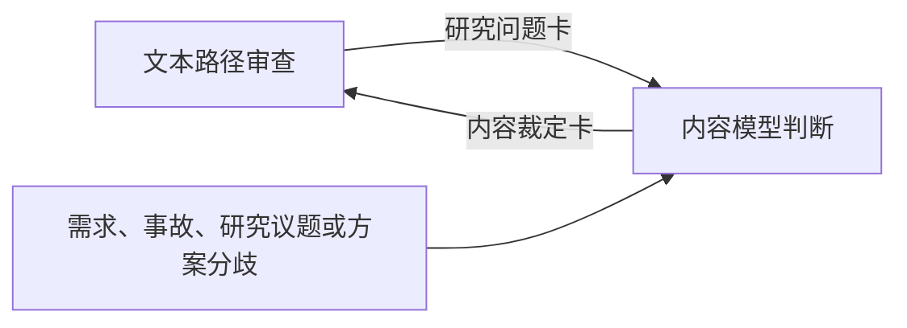

# 认知叙事双层审查：迁移索引

> 本文件保留“为什么要分层”的入口，不再定义任何可执行的审查流程或裁定标准。

认知叙事既可能把不成立的内容讲得很顺，也可能拥有较好的内容模型却没有让读者正确取得它。两种失败互不推出，因此不应由一份混合流程同时裁定。

## 现在应使用的两份主文档

- [《如何鉴别认知叙事的文本引导是否带偏读者》](认知叙事-如何鉴别影响读者走向的判断质量.md)是**文本路径审查**的唯一方法入口。它审读者如何被带过文本，产出文本问题、研究问题卡与文本修复。
- [《研究性内容判断：从真实约束到竞争模型》](研究性内容判断：从真实约束到竞争模型.md)是**内容模型判断**的唯一方法入口。它不依赖文章，研究定义、节点、关系、必要性、价值取舍与授权边界，产出内容裁定卡。

与写作有关的入口仍是[《认知叙事：如何编写》](认知叙事-如何编写.md)。它帮助作者构造并自查可理解、可质疑、可回开的叙事；正式文本审查和内容裁定分别回到上面两份主文档。

## 两个职责怎样交接

文本路径审查发现一个承重关系的范围、现实依据、价值取舍或权源不明时，提交**研究问题卡**。这张卡只描述文本为什么在这里需要内容判断；原文主张、读者误解和作者偏好都不能自动成为事实或硬约束。

内容模型判断独立建立研究对象、比较保约束竞争模型并形成**内容裁定卡**。它可以直接从需求、事故、研究议题或方案分歧启动，不必先有一篇文章。

文本审查收到裁定卡后，才用裁定后的关系重跑受影响的入口、桥、分支与终态；它不把裁定卡改写成另一份内容结论。

“入口、桥、分支与终态”仅指向文本路径主文档中的阅读对象；本索引不为这些词另行定义方法或状态。

## 为什么旧的合并版不再适用

旧版把路径定位、现实研究、竞争模型、裁定状态和 Subagent 验证写在同一条流程中，容易出现三种混淆：把读者能否重建当作内容成立；把内容有依据当作读者必然理解；或让同一个 Subagent 同时发现问题、提供事实和裁定结论。

分离后，Subagent 在文本审查中只验证读者能从已给文本取得什么；在内容研究中才针对冻结的研究对象生成或攻击竞争模型。两侧的输入、状态与结论不混用。

这份索引不应再被扩写为第三套方法。流程、术语和状态以两份主文档为准。
