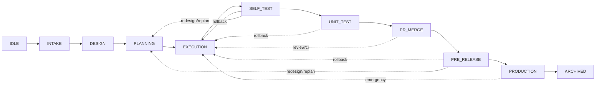

# 自动化迭代框架设计

## 目标与边界

本框架面向企业级、生产级仓库的 **AI 驱动迭代**：从需求研判到设计、规划、编码、测试、合并与发布，尽量由流程与工具驱动完成。

核心原则是 **「机制优先于意志」**：正确性、可恢复性和可审计性必须由状态机、制品契约、执行记录与阻塞状态保证，而不是依赖「模型更小心」这类不可执行的承诺。

### 能力目标

- **全流程驱动**：支持从工单到生产交付的端到端自动化编排；各阶段由约定 skill 与 worker 执行，产物落盘到 **工作区根目录**下的 `.iteration/` 等约定位置。
- **需求类型覆盖**：支持 BUG、功能需求、大型 RFC 等路径：研判 -> 必要时设计 / 规划 -> 实现 -> 验证 -> 合并与发布；配套 **迭代流程工具链** 与 **需求处理工具链** 可扩展、可组合、对仓库侧约定清晰。
- **需求来源统一入轨**：支持 dima 远端工单和本地直接需求（todo）。所有需求最终统一转为 todo：远端工单经研判后落位到 todo，再由 `i-todo` skill 按类型（bug / feature / rfc）路由到真正的执行 skill（如 `i-bug`、`i-spec-design`、`i-spec-feature`）。不保留 dima 直接 execute 的链路。

### 质量与运行目标

- **健壮性**：编排状态持久化到工作区约定文件；进程中断、重试、阻塞恢复后，能从最近一致点恢复，而不是依赖「从头再来」或隐含内存态。
- **幂等性**：同一阶段多次执行或断点重跑，在语义上安全；已完成的步骤可跳过或幂等覆盖，不产生重复提交、重复发布或矛盾的制品版本。
- **契约化交接**：阶段间传递的是 **可校验的制品**；结构、字段、版本约定明确。校验失败则 **拒绝流转**，由编排层记录原因并进入修复或阻塞状态。
- **仓库协议按需消费**：仓库协议目前由 `i-verify` 在验证与交付链路中消费；当执行到对应环节并发现必要仓库指引缺失时，由 `i-verify` 提示缺失内容并阻塞该验证/交付流程。
- **可观测与可审计**：关键决策、状态迁移、外部命令结果有结构化记录；「全自动」不等于黑盒，人类应能随时看清当前卡在哪、为何卡住。
- **阻塞可见性**：当某个 skill 或工具判定当前流程无法继续时，框架记录阻塞原因与上下文摘要。具体恢复方式由对应 skill 或工具决定。

### 工具链属性

- **迭代流程工具链**：用统一流程框架驱动迭代，插件化接入各 skill；兼顾扩展性、对仓库差异的适应能力，以及接入成本可控。
- **需求处理工具链**：覆盖从描述到方案、变更清单再到具体改造动作的路径；各步输入输出符合契约，便于自动化与回放。

### 概念与规则的权威来源

本文档只定义自动化迭代框架的全局事实源、统一入口、阶段枚举、制品命名与流转关系。具体环节的细节规则由对应 skill 或工具维护。

| 概念 / 规则 | 权威来源 | 本文档只约定 |
| --- | --- | --- |
| 统一 todo 需求信息 | `i-todo` skill | dima 来源和直接需求都必须经过 `i-todo` 形成统一 todo，并以 todo 作为后续派发入口 |
| 需求类型路由（bug / feature / rfc） | `i-todo` skill | 需求由 `i-todo` 路由到对应执行 skill |
| 各阶段产物契约 | 对应 stage-bound skill 的设计资料，通常是该 skill 下的 `skill.design.md` | 阶段产物落盘到 `.iteration/recordings-*`，并遵守全局命名规则 |
| skill 运行时行为 | 对应 skill 的可执行正文 | `skill.design.md` 是维护和设计依据，实际执行 skill 不应在运行时参考它；若设计资料过时，需要维护者同步 |
| 仓库协议消费 | `i-verify` skill | 仓库协议缺失不由框架启动前统一拦截，而是在 `i-verify` 执行发现缺少指引时提示并阻塞 |
| 阶段状态机与 CLI 行为 | `iteration-ctl` 与 `.iteration/recordings-plan/iteration-stage-machine/` 下规划文档 | 全局状态由 `iteration-context.json` 表达，阶段推进由 `iteration-ctl` 维护 |

## 全局约定与事实来源

本节集中定义后文反复依赖的路径、状态文件、编号和完成判定。其他章节不得重新定义这些公共约束。

### 路径解析根

凡本文档与各迭代 skill 中出现的 `.iteration/`、`.archive-iterations/` 等路径，**一律相对于 Cursor 工作区根目录**解析：即打开本 studio 多仓工作区时，**含根级 `AGENTS.md` 与 `.cursor/` 的顶层目录**，**不是**各子项目 Git 仓库根目录。

报告、状态 JSON、自测与发布记录等制品须写入该校准后的 `.iteration/`，避免误落在子仓内同名目录。

### 单一事实来源

- **全局迭代状态**：`{workspaceRoot}/.iteration/iteration-context.json` 是迭代框架全局状态的唯一事实源，至少维护 `nextReqIdSeq`、`currentRoundId` / `roundHistory`（运行过测试的轮数与每一轮对应的 reqId 起点）、`currentStage`。
- **需求元数据**：接受的 dima 项与用户直接提出的需求，是两种来源的同类输入；进入统一迭代后，都以统一的 todo 形式承载其需求信息。dima 来源的 todo 会额外保留来源关联信息，如 workItemId、source 等。
- **单需求阶段完成状态**：不单独记录在 `iteration-context.json` 中，由 `scanStageCompletion` 对 `.iteration/recordings-*/` 下符合前缀规则的产物文件进行推断。
- **全局字段最小化**：`iteration-context.json` 只保留 `iterationId`、`currentStage`、`currentRoundId`、`nextReqIdSeq`、`roundHistory`、`stageHistory`、`config.stageConcurrency`、`blockedReason`、`updatedAt` 等全局集合；**不含** `requirements` 字段。`stageHistory` 用于审计与恢复辅助，不作为当前阶段的另一事实源。

具体字段以 `.iteration/recordings-plan/iteration-stage-machine/change-plan.md` C1 为准。

### 制品目录与归档位置

`.iteration/` 承载当前迭代生命周期；迭代完成后，所属内容移动归档到 **工作区根目录**下的 `.archive-iterations/迭代名`。

| 位置 | 内容 | 命名或关联规则 |
| --- | --- | --- |
| `.iteration/dima/` | dima 工作项的 resolve 状态与来源关联信息 | 原始 resolve 文件命名可按 `${stateEmoji}${workItemId}.json`；接受状态会分配 reqId，并在 dima 记录内容中维护该 reqId 与远端 workItemId 的关联；不通过改名表达关联 |
| `.iteration/todo/` | 统一 todo 需求信息 | 承载直接需求与已接受 dima 需求；单需求文件命名形如 `[<reqId>]需求名称.md`，dima 来源的 todo 额外包含来源关联信息 |
| `.iteration/recordings-design/` | 设计方案 | 目录或文件带 `[<reqId>]` 前缀 |
| `.iteration/recordings-plan/` | 变更计划表 | 路径约定含 `[<reqId>]` 前缀 |
| `.iteration/recordings-execute/` | 代码实际变更报告 | 记录 `i-spec-feature` 和 `i-bug` 的代码修改输出，伴随 commit id |
| `.iteration/recordings-test/` | 自测 / 单测等测试类报告 | 测试阶段产物使用 `[R<roundId>]` 前缀；非测试子项可用 `[<reqId>]` |
| `.iteration/recordings-publish/` | 发布计划书与发布执行报告 | 预发验证等测试向段落用 `[R<roundId>]`；PR 合入 / 生产发布按需求用 `[<reqId>]` |

代码变更提交须符合根目录 `AGENTS.md` 中的 **Git Commit Message 规范**，message 第一行为 `reqId: <iterationId>-<reqId>`，例如 `reqId: sprint-2026-04-25-042`。

### reqId 与 roundId

- **reqId**：每条需求在当前 iteration 内唯一的 **3 位数字**标识，如 `001`、`042`；已接受 dima 需求与直接 todo 需求共用同一编号池，数值大表示创建更晚；迭代归档后，下一迭代从 `001` 重新计数。
- **单需求制品**：与某条统一 todo 需求对应的报告与 JSON 等文件，文件名须以 `[<reqId>]` 为前缀，名称其余部分完整放在后面，例如 `[042]需求名称.json`。
- **roundId**：测试阶段整轮产物使用 `[R<roundId>]` 前缀；`roundId` 从 1 起算，因测试失败从测试阶段回退到更早阶段并再次进入测试时递增。
- **测试阶段例外**：`SELF_TEST`、`UNIT_TEST`、`PRE_RELEASE` 中与整轮测试绑定的产物不带 reqId 前缀；`PR_MERGE`、`PRODUCTION` 等仍按单需求使用 `[<reqId>]` 前缀。

### 阶段完成判定

- 单阶段是否完成，由全局扫描规则与对应 skill 的产物设计共同决定：框架负责按约定目录和前缀扫描制品是否落盘，产物应具备什么内容由对应 stage-bound skill 的设计资料决定。
- 非测试阶段扫描 `[<reqId>]*`，测试阶段扫描 `[R<currentRoundId>]*`。
- Agent 在阶段末尾一次性写出报告即可；默认不为「阶段完成标记」引入分布式锁或双写协议。
- 迭代框架全局状态由 `iteration-ctl` 命令统一维护。
- 人工或脚本反查使用 `iteration-ctl query <reqId> <stage> [-a] [--round <N>] [--all]`；默认仅查当前轮，`--round <N>` 查指定轮，`--all` 跨轮查询。具体见 `change-plan.md` C31。

## 基础框架设计

本节描述与具体工单内容无关的 **横切架构**：把「迭代能持续跑、状态不脏、可恢复」落到三层：**基础设施层、技能层、编排层**。

### 分层概览

| 层级 | 职责 | 要点 |
| --- | --- | --- |
| **基础设施层** | 状态、制品、事件、执行工具 | 有限状态机与持久化、制品命名与归档、审计日志、执行工具集 |
| **技能层** | 单阶段「输入契约 -> 处理 -> 输出契约」 | 幂等、可中断、超时与重试上限、失败分类与阻塞上报 |
| **编排层** | 迭代生命周期与跨工单协调 | 依赖排序、并发与分支策略、检查点恢复、阻塞记录 |

### 基础设施层

- **迭代全局状态**：调度层保存完整状态流转上下文；技能层按契约将设计文档、变更计划、测试报告等阶段产物落盘到 `.iteration/`。
- **执行工具集**：为拉取 dima、创建 PR、轮询 CI 状态、部署等操作提供 CLI 等工具，供调度层和技能层调用。
- **事件与审计**：状态迁移、技能起止、外部命令退出码、阻塞与恢复节点等写入结构化日志，支撑排障与「为何停在这里」的可解释性。
- **阻塞状态记录**：当 skill 或工具在执行中发现无法继续的条件时，框架记录 `blockedReason` 与上下文摘要；具体阻塞条件由对应 skill 或工具定义。

### 技能层

每个 skill 对外表现为：**typed 输入 -> 确定性边界内的处理 -> typed 输出**；同一输入在「已完成」语义下重跑不产生副作用扩大化。

典型 skill 与上下游：

- **研判类**：`i-dima-resolve`，将工单转为研判结果文件，随后转为 todo 项；调度侧为 `i-dima-resolve` worker/CLI。
- **路由派发类**：`i-todo`，负责本地 todo 项创建与类型路由，统一派发真正的执行 skill，如 `i-bug`、`i-spec-design`、`i-spec-feature`。
- **设计 / 规划类**：`i-spec-design`、`i-spec-plan`、`i-spec-feature`、`i-bug`，完成编码前需要做的设计和变更规划。
- **实现类**：`i-spec-feature`、`i-bug`，把变更任务落到代码提交，粒度为任务级。
- **验证与交付类**：`i-verify`，负责自测、单测、PR 与 CI、非代码资产变更、预发、生产发布；仓库协议目前由 `i-verify` 在执行中按需消费，缺少必要指引时由 `i-verify` 提示并阻塞。

### 编排层

- **迭代编排**：拉起迭代、驱动阶段推进、满足完成条件后归档。
- **依赖与顺序**：多工单并存时按依赖关系排序；避免在无定义的情况下并行写同一主干或同一状态文件。
- **并发与隔离**：推荐工单级分支或等价隔离策略，合并通过队列或约定顺序降低冲突；具体以仓库 **仓库迭代合并指引** 为准。
- **恢复与检查点**：长流程在阶段边界与关键外部调用后落检查点；崩溃或 kill 后从最近一致点继续。
- **阻塞与恢复**：当阶段执行方报告阻塞时，编排层记录阻塞原因；阻塞后如何自动恢复或转人工处理，由对应 skill 或工具的执行逻辑决定。

### 与仓库协议的衔接

仓库协议目前只由 `i-verify` 消费。框架不在迭代启动前统一校验仓库协议完备性，也不把协议缺失作为全局阶段进入门控。

当流程执行到验证或交付相关环节时，`i-verify` 按自身逻辑读取仓库指引；若发现缺少必需指引，则由 `i-verify` 输出缺失项并阻塞该验证/交付流程。

### 演进取向

先实现 **状态持久化 + 制品契约 + 幂等执行 + 阻塞记录**，再逐步加强并发、自愈循环与度量反馈。不要用「全自动」口号替代可验证的里程碑。

## 工作区迭代阶段状态机

本节约定工作区根目录下迭代的显式阶段状态、与单条需求进度的关系、以及回滚和断点执行规则。

实现细节与 CLI 行为以规划文档为准：`.iteration/recordings-plan/iteration-stage-machine/change-plan.md` 及同目录下 `design-D001`～`design-D003`、`skill-author-onboarding.md`。

### 显式状态

- **全局阶段**：`currentStage` 表示当前「时钟」所在的全局迭代阶段；由 `iteration-ctl advance` 或 `iteration-ctl rollback` 显式修改；**`iteration-ctl tick` 不自动改 currentStage**。
- **单条需求阶段**：不单独记录。某条需求在某阶段是否完成，由 `scanStageCompletion` 对 `.iteration/recordings-*/` 下符合前缀规则的产物文件的存在性推断。
- **需求派发信息**：tick 每轮扫描 `.iteration/todo/` 文件，拿到派发所需的 reqId、skillName、needName、source 等信息；dima 来源需求的远端关联信息由 todo 内容承载，必要时可回查 `.iteration/dima/` 中的 resolve 记录。

### IterationStage 枚举

工作区级阶段枚举共 11 个，字符串值与正向主干顺序一致：

1. `IDLE` — 迭代已创建、尚未注册需求
2. `INTAKE` — 受理与路由（如 `i-dima-resolve` / `i-todo`）
3. `DESIGN` — 方案设计（如 `i-spec-design`）
4. `PLANNING` — 变更规划（如 `i-spec-feature`、bug 路径下的规划节）
5. `EXECUTION` — 编码实现（如 `i-spec-feature` / `i-bug` 编码段）
6. `SELF_TEST` — 本地自测
7. `UNIT_TEST` — 单测与 CI 相关验证
8. `PR_MERGE` — PR 与合入
9. `PRE_RELEASE` — 预发部署与验证
10. `PRODUCTION` — 生产发布
11. `ARCHIVED` — 归档

### 回滚规则

回滚是**全局动作**：`currentStage` 整体回到当前阶段之前的合法目标，作用于全部当前轮需求。

若属「测试 -> 编码」方向，即由 `SELF_TEST` / `UNIT_TEST` / `PRE_RELEASE` 任一回到更早的非测试阶段，`currentRoundId` 递增，并在 `roundHistory` 追加新一轮记录。记录中包含 `startReqId`，用于通过 reqId 数值区间反推需求归属。

**回滚不清理任何产物文件**：历史 `[<reqId>]*` / `[R<N>]*` 全部保留作为审计。完整回滚矩阵与门控见 `design-D003-stage-enum-and-rollback.md`。

| 触发阶段 | 典型原因 | 回退到 | 是否切新轮 |
| --- | --- | --- | --- |
| `SELF_TEST` | 自测发现 bug | `EXECUTION` | 是 |
| `UNIT_TEST` | 单测发现行为 bug | `EXECUTION` | 是 |
| `PR_MERGE` | Review / CI 退回 | `EXECUTION` 或 `PLANNING` | 否 |
| `PRE_RELEASE` | 预发验证失败 | `EXECUTION` 或 `PLANNING` | 是 |
| `PRODUCTION` | 生产紧急回退 | `EXECUTION` | 否 |

### Skill 与阶段的绑定方式

- 参与编排的 skill 在 `SKILL.md` frontmatter 中声明 `iterationStages` 与 `skillKind: stage-bound`。
- Skill 正文用 `### When stage == <STAGE_NAME>` 分节。
- 调度器按**当前注入的阶段**只执行对应一节，执行完即 yield，从而支持「同一 skill 端到端编写、按阶段横向批量派发」。
- 协议细则：`.cursor/skills/s-auto-dev/references/skill-stage-hooks-spec.md`；调度与 `iteration-ctl`：`design-D002-iteration-ctl.md`；Skill 作者清单：`skill-author-onboarding.md`。

### 阻塞状态记录

当某个 skill 或工具判定当前流程无法继续时，框架记录当前阶段、阻塞原因与上下文摘要；恢复后从 `iteration-ctl status` 展示的阶段继续。

具体阻塞判定和恢复策略由对应 skill 或工具维护。

## 生命周期流程

### 迭代管理

1. 拉起迭代。
2. 系统将已受理处理的远端工单标记完成。
3. 系统将整个迭代涉及到的状态内容，移动归档到 **工作区根目录**下 `.archive-iterations/迭代名` 文件夹。

### 完整执行流程

1. `i-dima-resolve` cli-worker 持续收集远端 dima 情况。
2. 远端工单经研判接受后，统一转为 todo 工作项。
3. `i-todo` skill 统一派发工作项，根据需求类型路由到 `i-spec-feature` / `i-bug` / `i-spec-design`。
4. 设计与规划路径按需求类型进入 `i-spec-design`、`i-spec-plan`、`i-spec-feature` 或 `i-bug`。
5. 代码修改由 `i-spec-feature` 或 `i-bug` 执行，并产出代码变更报告与 commit。
6. `i-verify` 负责自测、单测、PR 与 CI、非代码资产变更、预发、生产发布；失败时分类上报编排层。

## 结构校验清单

- 路径是否都相对于工作区根目录，而不是子项目 Git 根目录。
- 全局迭代状态是否只由 `iteration-context.json` 表达，包括 `nextReqIdSeq`、`currentRoundId` / `roundHistory`、`currentStage`。
- 单需求阶段完成状态是否只由制品扫描推断，而不是写入 `iteration-context.json`。
- dima 与 todo 是否统一进入 todo 派发路径，不存在 dima 直接 execute 链路。
- 非测试阶段制品是否使用 `[<reqId>]` 前缀，测试整轮产物是否使用 `[R<roundId>]` 前缀。
- 阶段推进、回滚、归档是否只通过 `iteration-ctl` 维护全局状态。
- 阻塞原因是否记录到全局上下文；具体阻塞判定是否交由对应 skill 或工具维护。
