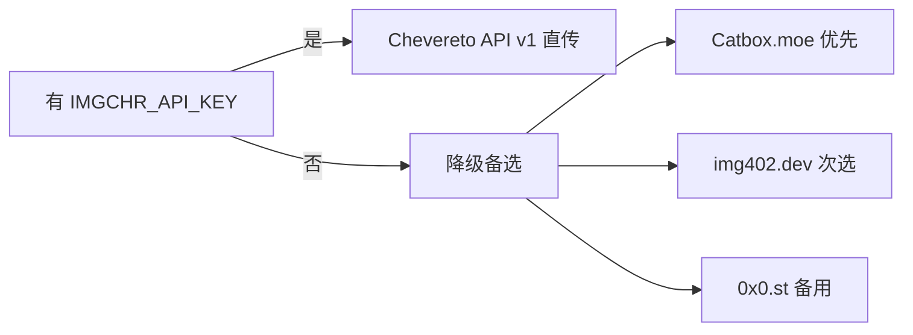

# imgchr.com 图床上传（imgchr）

面向「把本地截图或远端图片上传到 imgchr.com（路过图床），拿到可嵌入的公网 URL」。

## 当前约束（重要）

- **公开 API 已关闭**：imgchr.com 已关闭公开 API key，不再对外提供匿名 API 访问。
- **Cloudflare WAF**：自动化 POST 请求（curl/requests）会被 Cloudflare 防火墙拦截（403）。
- **浏览器上传仍可用**：通过真实浏览器访问，reCAPTCHA 自动解决后可正常上传。
- **API key 方式**：站点已声明**不再对外提供**公开 API；普通注册用户一般**无法**在后台自行生成 Chevereto API key（与 Chevereto 4 的「用户个人 API」不同；imgchr 为较老版本程序）。需程序化上传请用文末降级图床或咨询站方是否对付费/合作伙伴单独开通。

## 选用策略



> **国内网络说明**：0x0.st 封禁了部分中国 IP 段；Catbox.moe 和 img402.dev 在国内网络下通常可用。

---

## 方式一：Chevereto API v1（需要 API key）

> 将 API key 设置为环境变量 `IMGCHR_API_KEY`。imgchr.com **当前不对外发放**该 key；此节适用于你**自有** Chevereto 站或站方书面提供的 key。

### 本地文件上传

```bash
curl -sS -X POST 'https://imgchr.com/api/1/upload' \
  -F "key=${IMGCHR_API_KEY}" \
  -F 'source=@/path/to/image.png' \
  -F 'format=json' | python3 -c "import sys,json; d=json.load(sys.stdin); print(d['image']['url'])"
```

### HTTPS 远端图片上传

```bash
curl -sS -X POST 'https://imgchr.com/api/1/upload' \
  -F "key=${IMGCHR_API_KEY}" \
  -F 'source=https://example.com/image.png' \
  -F 'type=url' \
  -F 'format=json' | python3 -c "import sys,json; d=json.load(sys.stdin); print(d['image']['url'])"
```

### Python 实现（推荐，可处理大文件）

```python
import os, sys, requests, base64

IMGCHR_API_KEY = os.environ.get("IMGCHR_API_KEY", "")
IMGCHR_API_URL = "https://imgchr.com/api/1/upload"

def upload_local(path: str) -> str:
    """上传本地文件到 imgchr.com，返回图片直链 URL"""
    with open(path, "rb") as f:
        resp = requests.post(
            IMGCHR_API_URL,
            data={"key": IMGCHR_API_KEY, "format": "json"},
            files={"source": (os.path.basename(path), f, "image/png")},
            timeout=30,
        )
    resp.raise_for_status()
    data = resp.json()
    if data.get("status_code") != 200:
        raise RuntimeError(f"上传失败: {data}")
    return data["image"]["url"]

def upload_url(image_url: str) -> str:
    """上传远端 HTTPS 图片到 imgchr.com，返回图片直链 URL"""
    resp = requests.post(
        IMGCHR_API_URL,
        data={"key": IMGCHR_API_KEY, "format": "json", "source": image_url, "type": "url"},
        timeout=30,
    )
    resp.raise_for_status()
    data = resp.json()
    if data.get("status_code") != 200:
        raise RuntimeError(f"上传失败: {data}")
    return data["image"]["url"]

if __name__ == "__main__":
    target = sys.argv[1] if len(sys.argv) > 1 else ""
    if target.startswith("http"):
        print(upload_url(target))
    else:
        print(upload_local(target))
```

### 响应格式（成功时）

```json
{
  "status_code": 200,
  "success": {"message": "image uploaded", "code": 200},
  "image": {
    "url": "https://imgchr.com/images/2024/xx/xx/example.png",
    "url_viewer": "https://imgchr.com/image/XXXXX",
    "display_url": "https://imgchr.com/images/2024/xx/xx/example.md.png",
    "thumb": {"url": "..."},
    ...
  }
}
```

---

## 方式二：降级备选（无需注册）

当 `IMGCHR_API_KEY` 未设置，或 imgchr.com 不可访问时，使用以下备选。

### 0x0.st（本地文件）

```bash
curl -sS -F 'file=@/path/to/image.png' -A 'CursorAgent/1.0' 'https://0x0.st'
```

### 0x0.st（HTTPS 远端 URL）

```bash
curl -sS -F 'url=https://example.com/image.png' -A 'CursorAgent/1.0' 'https://0x0.st'
```

### Catbox.moe（备用）

```bash
curl -sS -F 'reqtype=fileupload' -F 'fileToUpload=@/path/to/image.png' 'https://catbox.moe/user/api.php'
```

---

## Agent 执行逻辑

```bash
# 自动选择上传方式（含降级）
imgchr_upload() {
  local src="$1"
  local url=""

  if [ -n "$IMGCHR_API_KEY" ]; then
    echo "[imgchr] 使用 imgchr.com API..." >&2
    url=$(curl -sS -X POST 'https://imgchr.com/api/1/upload' \
      -F "key=${IMGCHR_API_KEY}" \
      -F "source=@${src}" \
      -F 'format=json' | python3 -c "import sys,json; print(json.load(sys.stdin)['image']['url'])" 2>/dev/null)
  fi

  # 降级链：Catbox → img402.dev → 0x0.st
  if [ -z "$url" ]; then
    echo "[imgchr] 降级到 Catbox.moe..." >&2
    url=$(curl -sS -F 'reqtype=fileupload' -F "fileToUpload=@${src}" 'https://catbox.moe/user/api.php')
  fi
  if echo "$url" | grep -qv '^https://'; then
    echo "[imgchr] 降级到 img402.dev..." >&2
    url=$(curl -sS -X POST 'https://img402.dev/api/free' -F "image=@${src}" | python3 -c "import sys,json; print(json.load(sys.stdin)['url'])")
  fi

  echo "$url"
}

imgchr_upload "/path/to/image.png"
```

## 注意事项

- **API key 获取（imgchr.com）**：官方客户端页写明「[已经关闭公共API, 不再对外提供](https://imgchr.com/page/client)」——**注册账号并不能保证获得 API key**。若使用自建 Chevereto：**V3** 多为管理后台 **Dashboard → Settings → API** 的全局 key；**V4** 才有用户侧 **Settings → API**（个人 key）。imgchr 为 Chevereto 3.x，勿套用 V4 文档路径。
- **文件大小限制**：imgchr.com 单张最大 5MB；0x0.st 不限，保留约 30 天。
- **图片格式**：imgchr.com 支持 jpg / png / webp / jpeg。
- **Cloudflare 保护**：imgchr.com 已开启 Cloudflare WAF，非浏览器的 POST 请求默认被拦截；API key 方式通常不受此限制（走白名单规则）。
- **敏感内容**：不要上传个人隐私或违法图片到公共图床。
