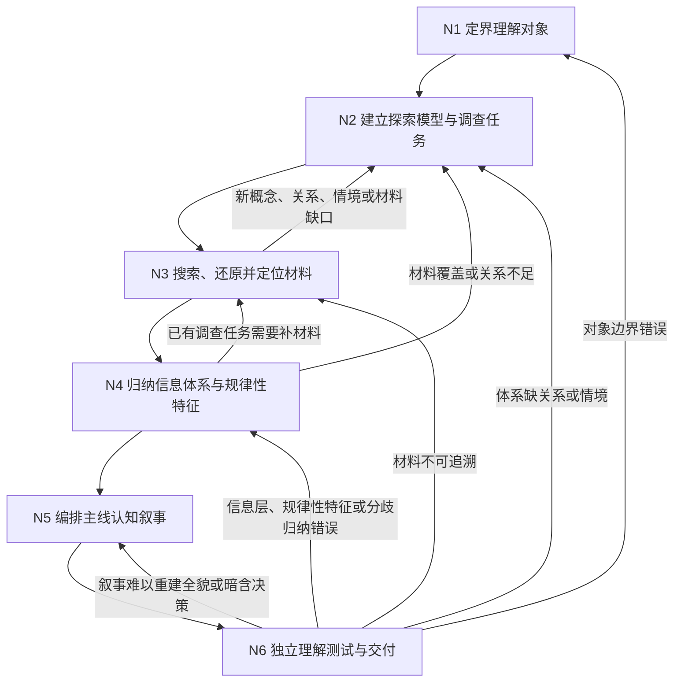

# 调查研究

我面对的不是一个等待堆资料的关键词，而是一个尚未形成清晰全貌的研究对象。直接搜索用户原词，常会只得到最常见定义、营销说法或同质转述；逐篇摘要又会把理解关系的工作留给用户。

因此，我先界定究竟要理解什么，再建立能沿概念、机制、因果主张、职责、情境、差异和失败关系外展的探索模型。搜索结果先被还原为“谁在什么范围内观察或主张了什么”，再跨材料归纳对象骨架、材料共同呈现的范围内基线、关键分化情境、差异与争议、条件性模式和未知。最后用一条最短的主线认知叙事把全貌串起来。

归纳不是裁决。这个 Skill 可以核对来源身份、原文内容、方法、样本、材料直接覆盖范围，以及材料之间是否在同一轴上呈现一致、差异或冲突；不得把材料中的经验性、解释性、效果性或因果性主张改写成本 Skill 确认的现实事实，不得宣布某方法客观有效、值得采用或适合当前对象，也不得生成或排序解决问题的方案。若用户之后需要作决定，后续流程消费这里的信息体系，自行承担真假裁决、价值权衡、现实适用和行动授权。

## 全局执行契约

- 第一项动作必须使用 `TodoWrite` 创建六个阶段待办；若环境将该能力命名为 `update_plan`，使用等价工具。阶段名称和顺序必须与本文一致，只允许因回开重复，不允许跳过或合并。
- 主控维护研究对象契约、探索模型、调查任务账、材料账、归纳体系、叙事版本和行为日志。可将输入完整、彼此独立的单项搜索委派给 Subagent；跨材料关系识别、规律归纳和叙事组织由主控承接。
- 每个查询必须绑定一个理解缺口：它要补足对象骨架、范围内基线、关键分化情境、差异/争议、规律性特征（结构性关系或条件性模式）或未知边界中的哪一处。不得以“是否改变方案选择”作为搜索准入标准。
- 区分来源身份事实、材料主张/观察、跨材料一致呈现、条件性模式、研究者推断、争议和未知。材料只被描述到其来源、方法、样本、情境与时间直接覆盖的范围。
- “材料报告某结果”不等于“该结果客观有效”；“多个材料方向一致”不等于“该命题无条件为真”；“经验与用户相似”不等于“经验适用于用户”。
- 研究过程不得生成、纳入/排除、决策性比较、排序或推荐实际解决方案；不得写“应当采用”“优先尝试”“最佳方案”“值得做”等应用结论。允许为理解研究对象作描述性对照，例如不同实现分别包含哪些模块、材料各自报告了什么；不得建立以好坏、效用、优先级或选择为目的的评价轴。材料中已有的方案或建议可作为研究对象如实呈现，但只能说明谁提出、依据和边界是什么。
- 高风险、强时效或专业领域按 [风险与权限门](references/risk-and-authority.md) 执行停止、隐私和表达边界；风险等级不授权本 Skill 在低风险任务中替用户决策。
- 当前外部事实、产品、政策、价格或精确来源是承重内容时，必须实际检索和追溯；不得依赖模型记忆伪装已查证。
- 调研报告写入用户指定位置；用户未指定但需要持久制品时，写入 `{workspaceRoot}/.skill-artifacts/investigation-research/yyyy-mm-dd/<任务标题slug>-report.md`。行为日志不得复制报告正文。

## 行为日志执行协议

- **规范引用**：[behavior-log/v1 契约](../behavior-log-audit/references/behavior-log-v1-contract.md)；日志骨架：[behavior-log-skeleton.md](../behavior-log-audit/templates/behavior-log-skeleton.md)
- **路径**：`{workspaceRoot}/.skill-logs/investigation-research/yyyy-mm-dd/hhmm-<任务标题slug>.md`
- **初始化**：在首次搜索、委派、创建研究制品或其它材料性行为前初始化。任务标题取研究对象的简短稳定表述；所有时间读取实际系统时钟，不得估计或填写未来时间
- **增量更新触发点**：
  - 研究对象契约确认、换版、拆分或分流后
  - 探索模型或调查任务账形成、换版后
  - 一轮承重搜索结束、调用子 Skill/Subagent 或材料改变探索模型后
  - 六层信息体系、规律性特征账或主线认知叙事形成/换版后
  - 独立理解测试完成、失败回开或最终交付后
- **子 Skill / Subagent 契约**：显式 Skill 子调用返回 `{交付物, behaviorLogPath, 材料性影响摘要}`，父日志登记子日志；纯搜索 Task 返回材料卡、检索记录、缺失材料和材料性影响摘要，并在父日志「关键行为」记录一行
- **封口**：独立理解测试通过后，以交付状态封口。N6 报告未通过是正常验证结果，不是执行失败：记录问题、精确回开并复测，期间不封口。工具调用故障先安全重试或更换独立执行者；只有环境最终不存在独立执行者时，才以 `部分成功—待独立理解测试` 封口并保留恢复入口。任一阶段被用户取消、因权限/安全阻断，或发生无法安全恢复的执行故障时立即按 behavior-log/v1 封口，写明已到达阶段、未完成内容和现有制品状态。任何封口均清除进行态；时间满足开始≤更新≤完成
- **与交付物边界**：研究报告和中间账写入各自 canonical 路径；行为日志只记录过程审计，通过「资源索引」链接交付物，不复制正文

运行时质量标准见 [references/audit-quality-standards.md](references/audit-quality-standards.md)。

## 工作流程（主控 Agent 调度模式）

### 定界理解对象（N1）

**执行模式**：主控执行。

**输入**：用户原话、当前认知缺口、希望理解的对象、受众与已知边界。

**目标**：形成版本化的研究对象契约；明确对象、范围、情境、时间、用户已经知道什么、希望理解到何种粒度、后续用途边界和完成标准。后续用途只帮助确定解释深度，不授权本 Skill 形成应用方案。

**Guidance**：研究对象不是用户最终要选什么，而是需要获得怎样的现实全貌。若用户问题含“哪个好/该怎么做”，把它改写为需要理解的构成、范围内基线、情境差异、争议和规律性特征；将实际选择明确留给后续流程。

**实际执行**：完整阅读并执行 [workflow/define-research-object.md](workflow/define-research-object.md)。

**Audit Hook**：更新日志「依据与关键输入」「关键行为」；换版、拆分或分流时更新「影响清单」「偏离、异常与未决事项」。

### 建立探索模型与调查任务（N2）

**执行模式**：主控执行。

**输入**：N1 的研究对象契约、已有材料与已知未知。

**目标**：形成暂定探索模型和调查任务账；覆盖对象骨架、范围内基线、关键分化情境、差异/争议、归纳规律性特征所需关系和未知边界。

**Guidance**：沿指称、构成、机制主张、因果主张、职责、情境、异质性、失败、职责性权威和时效关系外展。只有能解释对象、补足六层信息体系或界定规律性特征边界的关系才准入；不得以它是否帮助选择方案作为准入理由。

**实际执行**：完整阅读并执行 [workflow/model-and-plan-inquiry.md](workflow/model-and-plan-inquiry.md)。

**Audit Hook**：更新日志「关键行为」「资源索引」；模型或任务账持久化/换版时更新「影响清单」。

### 搜索、还原并定位材料（N3）

**执行模式**：主控负责搜索编排、材料还原定位和模型同步；独立调查任务可委派 Subagent。多个独立任务可并行，模型依赖链上的任务必须串行。

**输入**：当前探索模型、调查任务账、用户允许访问的渠道与私有材料。

**目标**：形成可追溯材料账。每条记录材料身份、原意、方法/样本或观察基础、材料直接覆盖范围、限制、相反材料及与其它材料的关系；不裁决材料中开放现实主张的真假、客观有效性或现实适用性。

**Guidance**：区分“材料存在并这样表述”“材料在其范围内观察到什么”“材料是否讨论同一对象和口径”。材料直接覆盖范围只说明材料能直接承载哪类转述，不回答该主张是否为真、该方法是否真实有效或适合用户。无法化解的冲突必须保留。

**实际执行**：完整阅读并执行 [workflow/retrieve-and-map-materials.md](workflow/retrieve-and-map-materials.md)；按任务查阅 [references/channels.md](references/channels.md) 和 [references/materials-and-inquiry-model.md](references/materials-and-inquiry-model.md)。

**Audit Hook**：更新日志「关键行为」「影响清单」「资源索引」；显式 Skill 子调用登记「子 Skill 调用」，纯 Task 在父日志记摘要。

### 归纳信息体系与规律性特征（N4）

**执行模式**：主控执行。

**输入**：当前探索模型，以及明确记录所消费模型/任务版本的材料账。

**目标**：形成六层信息体系：对象骨架、范围内基线、关键分化情境、差异/争议/边界、规律性特征、未知；规律性特征区分结构性关系与条件性模式，每条高层内容可追溯到前提、材料和边界。

**Guidance**：条件性模式是“在所查材料范围 S 与材料所述条件 C 内，A 与 B 反复呈现关系 R”的材料体系归纳，不是由本 Skill 确认的现实定律、因果结论、格言或建议。材料作者提出因果解释时，写明“作者主张”和设计基础；本 Skill 不确认因果成立。不得由模式生成行动候选。

**实际执行**：完整阅读并执行 [workflow/induce-information-system.md](workflow/induce-information-system.md)；查阅 [references/induction-and-narrative.md](references/induction-and-narrative.md)。

**Audit Hook**：更新日志「关键行为」；信息体系或规律性特征账落盘/换版时更新「影响清单」「资源索引」。

### 编排主线认知叙事（N5）

**执行模式**：主控执行。

**输入**：六层信息体系、规律性特征账、材料追溯链和 N1 的受众/粒度边界。

**目标**：按“对象骨架—范围内基线—情境分化—差异争议—规律性特征—边界未知”形成最短可理解主线，使读者无需沿搜索顺序自行拼图。

**Guidance**：来源说明就近锚定或放入索引，不打断主线；支线只为解释承重节点展开。叙事结尾停在“现在可以怎样理解这个对象、哪里仍未知”，不得进入“应该选什么或先做什么”。

**实际执行**：完整阅读并执行 [workflow/compose-cognitive-narrative.md](workflow/compose-cognitive-narrative.md)。

**Audit Hook**：更新日志「关键行为」「影响清单」「资源索引」「结果与验证」中的静态校验结果。

### 独立理解测试与交付（N6）

**执行模式**：必须委派一个未参与本次归纳与写作的独立 Subagent；只提供原始研究请求、N1 完成标准、完整测试片段、最终报告和测试契约，不提供研究过程或预期答案。

**输入**：最终认知叙事、研究对象契约、独立理解任务和一段由主控提供、只用于结构归类的测试片段。片段必须可寻址、未被报告原样归类，并触及认识状态、不可比性、相反材料或范围边界中的至少一项；记录选择理由，但不向测试者提供预期归类。

**目标**：取得读者能否重建全貌、使用既有结构归类给定片段、解释争议和追溯规律性特征（结构性关系或条件性模式）的行为证据，同时验证报告未生成/排序方案或偷渡价值判断。

**Guidance**：测试片段不得指向当前用户或需要作现实决定的新对象，且必须提供完整内容，不能让测试者自行补事实。测试者只判断片段在报告结构中的位置和会影响哪条已写边界，不得判断片段所述现实主张真假、规律是否适用于片段对象或据报告选择解决方案。

**实际执行**：完整阅读并执行 [workflow/comprehension-test-and-release.md](workflow/comprehension-test-and-release.md)。

**Audit Hook**：在父日志「关键行为」登记测试摘要，更新「结果与验证」「偏离、异常与未决事项」；测试失败及每次回开都须记录。

## 交付前静态校验

- [ ] 六个阶段均已执行，或有明确、合法的分流记录。
- [ ] 研究对象契约、探索模型、调查任务账、材料账、信息体系、规律性特征账和认知叙事的版本依赖可追溯。
- [ ] 材料身份、原意、方法/观察基础、材料直接覆盖范围、限制和冲突均可寻址。
- [ ] 对象骨架、范围内基线、关键分化情境、差异/争议/边界、规律性特征和未知六层均被检查；无可归纳内容的层明确留空并说明原因。
- [ ] 每条结构性关系包含前提、推导链、来源版本、范围和不可推出内容；每条条件性模式包含材料范围、材料所述条件、呈现关系、至少两项可比较材料、相反/例外材料、作者机制主张状态和重查条件。
- [ ] 主线按理解关系而非搜索顺序组织，读者无需自行拼接资料。
- [ ] 未出现实际方案生成、总体评价、纳入/排除、排序、推荐、行动优先级、客观有效性或个体适用裁决；已有对象变体的描述性对照仅使用中性可观察轴。
- [ ] 材料中已有建议被标记为“谁提出的主张”，没有被叙事语气升级为本 Skill 建议。
- [ ] 行为日志和 N6 独立理解测试完整；测试失败项已回开并重新测试。

任一项失败都不得交付。按照 [references/quality-and-reopen.md](references/quality-and-reopen.md) 定位责任节点，不执行无目标的“再多搜一点”。

## 资源读取路由

- 定义理解对象或分流：读 [references/research-object.md](references/research-object.md)。
- 处理紧急性、隐私与专业表达边界：读 [references/risk-and-authority.md](references/risk-and-authority.md)。
- 建模、调查任务、材料身份/原意/覆盖范围与冲突关系：读 [references/materials-and-inquiry-model.md](references/materials-and-inquiry-model.md)。
- 选择渠道、生成查询、追溯原始来源：读 [references/channels.md](references/channels.md)。
- 归纳六层信息体系、规律和主线认知叙事：读 [references/induction-and-narrative.md](references/induction-and-narrative.md)。
- 确定停止、完成、回开和失效重开：读 [references/quality-and-reopen.md](references/quality-and-reopen.md)。
- 创建中间账和最终报告：使用 [templates/research-workbook.md](templates/research-workbook.md)；独立理解测试使用 [templates/comprehension-test-prompt.md](templates/comprehension-test-prompt.md)。

## 不得退化成的近敌

- 关键词搜索流水线：没有关系外展和模型回写。
- 逐篇摘要或资料分类：把建立全貌和规律的工作留给用户。
- 来源等级即真伪裁决：来源身份或材料还原被错误升级成开放现实主张的真假判决。
- 条件化决策树：看似保留条件，实质仍在生成和筛选实际方案。
- 隐性推荐：用篇幅、顺序、褒贬词或默认情境让某方案显得更优。
- 漂亮总论：规律性特征没有前提/条件、材料、相反/例外内容和重查边界。
- 形式完成：文章顺畅，但独立读者不能重建对象、差异、规律和未知。
