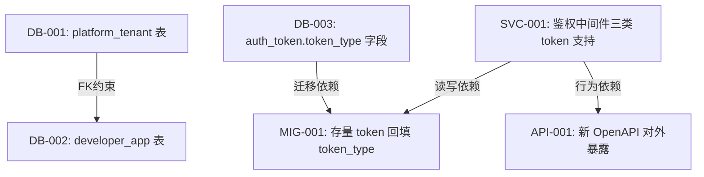

# 阶段六：依赖 DAG + 分批计划 执行指导

## 输入信息

**必须入参**：
- 阶段五最终变更清单（含条目 ID）
- 部署约束：是否支持停机窗口；是否允许功能降级；是否有分批上线要求

## 目标要求

**任务**：分析变更项间的依赖关系，产出依赖 DAG 和分批计划

**目标**：spec-execute 可按批次独立上线，每批完成后系统处于完整可用状态

**特性要求**：
- 每条 DAG 边有依赖类型标注（FK约束/行为依赖/迁移依赖）
- 存量数据迁移批次在「读逻辑已支持新格式」的批次之后
- 每批有至少一种技术回滚方案
- 任意两批间的系统状态描述可被客观验证（不能只说「系统可用」，要写具体验证方法）

## 工作依据

### 依赖关系判断方法

对每对变更项 (A, B)，判断是否存在 A → B 的依赖边：

**问三个问题**：若 A 未上线，B 上线后：
- **编译通过吗？**（FK 约束：B 引用了 A 的表/字段）
- **运行时行为正确吗？**（行为依赖：B 的逻辑依赖 A 的功能已存在）
- **数据语义一致吗？**（迁移依赖：B 的数据操作依赖 A 已建立的数据结构语义）

三问任一回答为「否」→ A → B 有依赖边

**常见依赖类型**：

| 依赖类型 | 触发条件 | 示例 |
|---|---|---|
| FK约束 | B 引用了 A 的表，且有外键约束 | `developer_app` 表 → `platform_tenant` 表 |
| 行为依赖 | B 的代码逻辑调用了 A 提供的能力 | 新 OpenAPI 路由 → 鉴权中间件（三类 token 支持）|
| 迁移依赖 | B 的数据迁移操作依赖 A 提供的字段/语义 | 存量 token 回填 `token_type` → A 先在 token 表建立 `token_type` 字段 |
| 读写依赖 | 数据迁移（写新格式）必须在读逻辑（能读新格式）上线后 | 存量迁移批次 → 中间件升级批次 |

---

### 分批原则

**核心约束**：每批上线后，旧功能不降级

**操作指导**：
- 新增字段设为 NULLABLE（不强制非空），旧代码不传时不报错
- 新路由/接口用特性开关控制，默认关闭
- 新鉴权逻辑对旧 token 保持兼容（并存不互斥）

**数据迁移批次的特殊规则**：
- 存量数据迁移（写新格式）**必须**在「读逻辑支持新格式」的批次**之后**
- 禁止把「删除旧字段」放在同批次迁移中（删除是不可逆操作，应独立成批）

**回滚方案三类**：
- **部署回滚**：重新部署上一版本的应用代码（适用于逻辑变更）
- **特性开关**：通过配置关闭新功能（适用于新路由/新能力）
- **数据回滚脚本**：反向操作迁移（仅当数据操作可逆时可用，需在迁移时预先准备）

---

### 并行判断

**可以并行的情况**：两个变更项之间三问均为「是」（无依赖边）

**常见可并行的变更**：
- 文档更新 + DDL 脚本准备
- 不同模块的新增表（无互相 FK 引用）
- 新接口文档生成 + 鉴权逻辑内部联调（未对公网开放前）

**不可并行的典型**：
- 任何有 FK 约束的表创建顺序
- 「鉴权支持新 token 类型」与「对外暴露新 OpenAPI」
- 「读逻辑升级」与「存量数据迁移」

## 产出格式

```markdown
## 依赖关系 DAG



---

## 分批计划

| 批次 | 变更条目 | 该批完成后系统状态 | 验证方法 | 回滚方案 |
|---|---|---|---|---|
| Batch 1 | DB-001, DB-002, DB-003（可空扩展）| DB schema 已扩展，业务行为与 Batch 0 完全一致；新表无流量 | 旧接口回归测试全通过；新表存在但为空 | 删除新建表/字段（未有业务数据写入） |
| Batch 2 | SVC-001（鉴权中间件三类 token）| 系统可解析三类 token；旧 token 仍完全有效；新类型 token 仅受控环境签发 | 旧 token 发 /openapi/* 得到正确响应；新类型 token 仅在测试租户可用 | 部署回滚 + 停止新类型 token 签发 |
| Batch 3 | MIG-001（存量 token 回填）| 数据与中间件语义一致；`token_type` 字段非空率 100% | SELECT count(*) WHERE token_type IS NULL = 0 | 回滚脚本：将 token_type 恢复为 NULL |
| Batch 4 | API-001（新 OpenAPI 对外暴露）| 规范能力完整对外可用 | 新类型 token 调用 /openapi/* 可正常返回 | 网关关闭路由 + 特性开关 |
```
