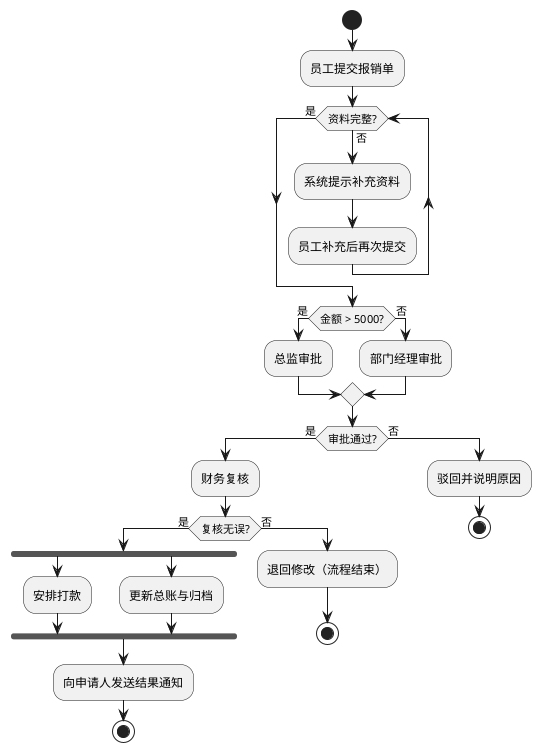
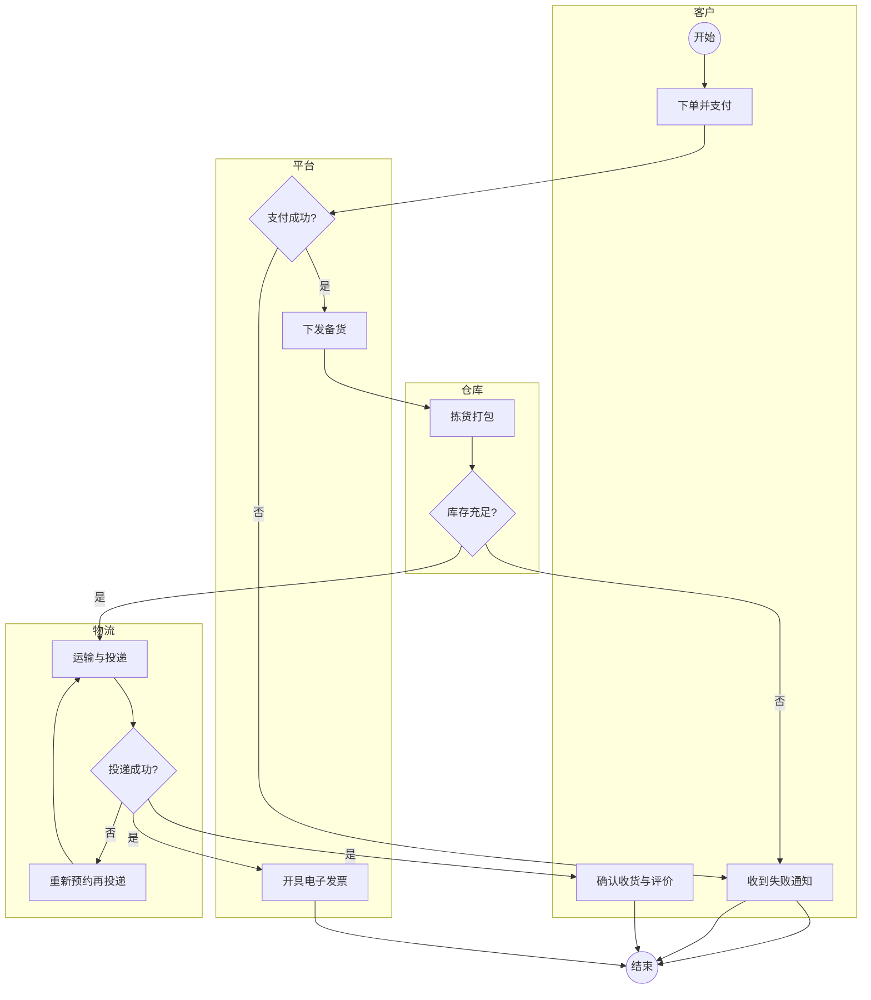
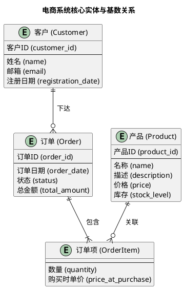
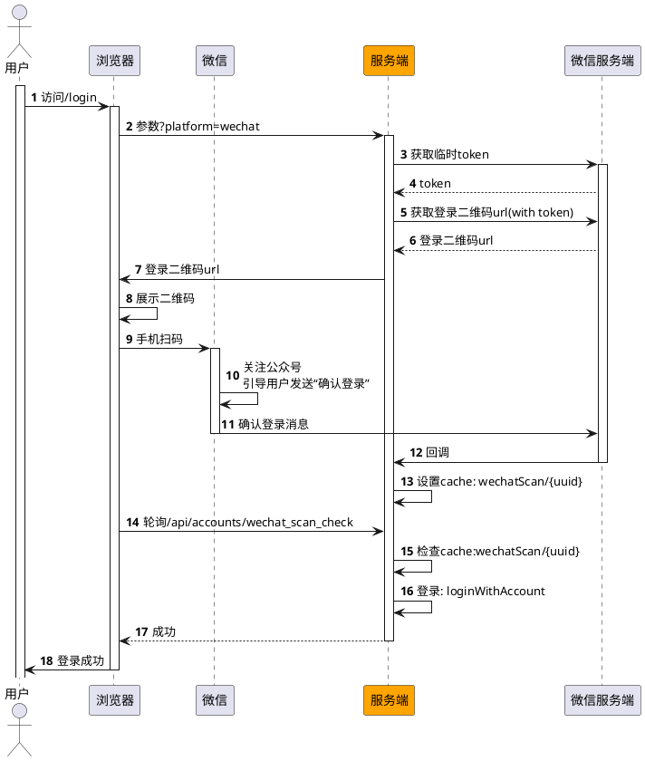

# 技术系分设计目标

在系分过程中思考业务需求实现过程中必要的，绕不开的问题。

相比其他方式，写成文档，能更高效地沟通交流：

- 大幅降低沟通成本，避免将在会议中一遍遍地对齐大家的认知

- 能够让其他人 review

- 能够让自己理清楚完整的思路，避免做到一半发现走错路了

# 技术系分设计模板

## 需求理解

这个需求解决什么问题？为谁解决？

系分一开始，我们就要想清楚这些问题。

通常产品的PRD中，会详细解释这些，所以我们不需要在系分中详细阐述，但我们要确保自己已经准确理解了 —— 这一点很重要，因为后续的很多技术决策和 trade-off ，都建立在此基础上。

## 整体设计

在这个环节，不要陷入到具体细节问题中，如果遇到一些细节问题，可以先记下来，在「详细设计」部分再去关注

### 业务流程图

通过流程图可以将业务里的复杂逻辑描述地非常清楚，示例



除了上面这种基础的流程图，有时候也可以用泳道图，这里是一个示例


### 数据模型设计

人天生就会识别世界上的“事物”——人、桌子、汽车、公司、国家、星球。甚至是抽象的概念，如“爱情”、“正义”、“责任”，我们也会将其“实体化”以便讨论。

而实体不是孤立的，它们之间存在着各种关系——人“拥有”汽车，公司“雇佣”员工，员工“属于”某个部门，地球“围绕”太阳旋转。

你会发现，无论领域多么不同，这种“实体-关系”的框架都能抓住其最核心的结构，让所有人一下子同频。

所以，这个阶段重点思考3个关键问题：

1. 业务中涉及到了哪些“实体”？

2. 这些实体各自具备哪些“属性”？

3. 这些实体之间的“关系”是什么？


思考清楚后，若需要，可以用 ER 图（Entity–Relationship）会出来，如：



### 数据库设计(若需要)

这一阶段，我们要想清楚，前面设计的数据模型，怎么在数据库中存储。

要从数据一致性、完整性、查询效率等角度设计数据表结构，包括有哪些字段，使用什么类型。

以及增加必要的索引和约束，提升查询效率和数据准确性。

这一阶段，我们可以直接写出完整的 DDL (Data Definition Language)

另外也有可能涉及到对已有表的变更，DDL 中也需要包含这部分。


示例：

```sql
CREATE TABLE `user_mobile_verifications` (
  `id` bigint(20) NOT NULL AUTO_INCREMENT COMMENT 'id',
  `user_id` bigint NOT NULL COMMENT '用户id',
  `mobile` varchar(50) comment '用于二要素认证的手机号码',
  `status` tinyint NOT NULL DEFAULT 0 comment '认证状态', -- 0:未认证/1:认证成功/2:认证失败
  `is_consistent` tinyint comment '认证结果', -- 0:不一致/1:一致/2:查无
  `basic_carrier` varchar(50) comment '运营商名称', -- 中国移动/中国联通/中国电信
  `created_at` timestamp NOT NULL DEFAULT CURRENT_TIMESTAMP COMMENT '创建时间',
  `updated_at` timestamp NULL COMMENT '修改时间',
  PRIMARY KEY (`id`),
  UNIQUE KEY `uk_user_id` (`user_id`)
) DEFAULT CHARACTER SET=utf8mb4 COMMENT='用户运营商二要素认证记录';
```

### 时序图

时序图，用来描述技术链路执行过程中，多个参与者（对象/服务/系统）之间随时间发生的交互与消息顺序（谁在何时调用谁、响应如何返回），可以将复杂的系统间交互变得非常清晰。

示例：



### API 设计

需要清晰地定义出 HTTP API，包括：

- API 清晰的功能描述

- HTTP Method、URL

- 入参：类型、格式、取值范围、枚举、默认值、是否必填

- 响应

当我一个人包揽前后端的工作时，我倾向于直接使用Typescript来定义入参和响应，这样文档里的代码，可以直接在开发的时候使用（而且Typescript的类型定义语法也比较简单，其他技术栈的同学读起来阻力也不大）

##### 例子：获取申诉流程token

`GET /api/accounts/appeal/token`

```typescript
interface Params {
  oldMobile: string // 旧手机号
	newMobile: string; // 新手机号
  code: string; // 验证码
}

interface Result {
  success: boolean;
  token?: string; // 成功时传，token
  message?: string; // 失败时传，错误原因
}
```


## 详细设计

在整体设计的过程中，我们可能会想到一些具体的问题，建议避免过早地被具体问题给困住，钻入牛角尖。

可以都先记录下来，在完成整体设计后再去做详细的设计。

在详细设计阶段，我们可能会去考虑：

- 关键技术点如何实现

- 性能方面的问题，是不是需要做一些缓存等优化手段

- 是否需要一些配置或功能开关

- 流量问题，限流机制

- 异常情况、边界case

- 需要防范哪些潜在的攻击

- 数据安全问题

- 黑、白名单机制


详细设计中，我会更加关注技术层面的实现，写一些伪代码，甚至是完整代码（最终开发的时候会直接copy这里的代码）

## 埋点与监控(若需要)

### 埋点(若需要)

埋点这个事，产品可能会去定义有哪些点位，想看什么数据指标，但是具体的每个点位的参数怎么设计，可能还是需要技术同学来。

另外，也有可能产品没有考虑这部分，我也习惯在这里考虑下，然后主动找产品看是否要加上，毕竟埋点可能是我们了解用户和真实使用情况的最科学的手段了。

示例：

| **事件** | **参数** |
| --- | --- |
| **触发双因子认证** | - 触发原因（异地/多次失败/境外IP） - 用户id - 第一次登录方式 |
| **双因子认证失败** （第二次登录失败） | - 触发原因（异地/多次失败/境外IP） - 用户id - 第一次登录方式 - 第二次登录方式 |
| **双因子认证登录成功** | - 触发原因（异地/多次失败/境外IP） - 用户id - 第一次登录方式 - 第二次登录方式 |


### 监控(若需要)

监控是为了尽早发现问题，前端要做，后端也要做。

通常，前后端都有通用的监控，比如前端对白屏率、js 报错的监控，后端对API失败、流量的监控。

除此之外，还有：

- 业务层面——对业务关键流程的监控，比如XX成功率、XX失败率等等
- 稳定性层面——某业务流程的异常流量波动等

## 发布计划

代码写完、测完没问题了，也千万不要松懈，历史经验教训说明，发布变更的过程也很重要。

### 发布操作单

在这个阶段，我们要考虑

- 发布依赖：上下游系统的依赖，前后端依赖等等

- 灰度策略：百分比灰度、白名单灰度、分几批、什么情况下推进到下一批

然后拟定具体的发布操作单，要具体到每一个操作，比如后台配置个什么开关，数据库变更，每一步的放量计划等

示例：

- [ ] 配置告警「每 5 分钟触发双因子认证数量」
- [ ] 后台`2fa_gray`设置为 0
- [ ] 灰度阶段，验证钉钉登录正常
- [ ] 系统全量发布
- [ ] 观察 10 分钟无异常反馈后，开启 2fa 灰度
  - [ ] 后台`2fa_gray`设置为 10
  - [ ] `enable_login_risk`设置为`false`
- [ ] 根据后台数据和用户反馈逐步放量
  - [ ] 30%
  - [ ] 50%
  - [ ] 100%


### 回滚策略(若需要)

制定好一个回滚策略，万一故障发生了，能更快止血。

我们要考虑：

- 触发条件：什么时候回滚

- 回滚层级：功能层面的回滚（通过功能开关）、部署层面的回滚等

- 回滚的具体操作


示例：

- [ ] 后台`2fa_gray`设置为 0，`enable_login_risk`设置为`true`
- [ ] 若依然无法止血，直接回滚系统

## 测试用例(若需要)

如果是完全自测，建议在系分的时候整理一下测试用例，这个时候思路是最清晰的，不容易遗漏，可以使用大纲任务列表形式，简单地列明各种可能的分支，在后续的自测中逐个测到。

示例：
- [ ] 第一次登录
  - [ ] 成功，触发 2FA
    - [ ] 认证成功
    - [ ] 认证超时，重新登录
    - [ ] 失败，需要重新登录
  - [ ] 成功，不触发 2FA
  - [ ] 失败 
    - [ ] 下一次登录，需要额外输入验证码
    - [ ] 连续失败 5 次，封禁 5 分钟

## 待确认问题(若需要)

在编写系分的过程中，如果发现有哪些内容可能后续还需要讨论和调整，或者发现有任何的疑虑，都可以记录在这里。

# 接下来会提供产品功能的需求说明，请按照上述说明完成`${功能}技术系分.md`文档